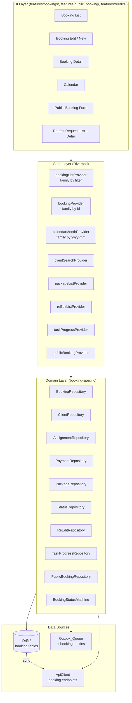
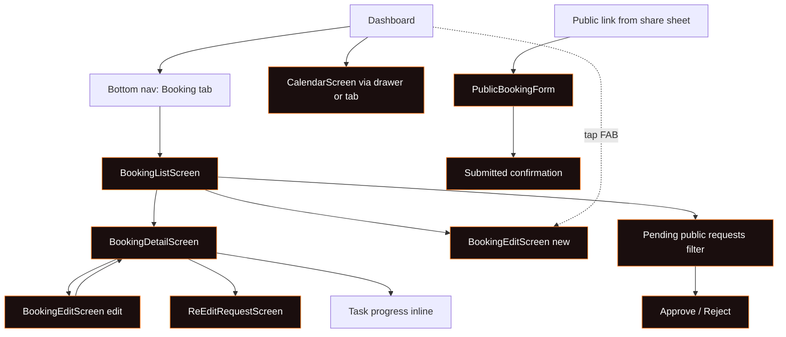
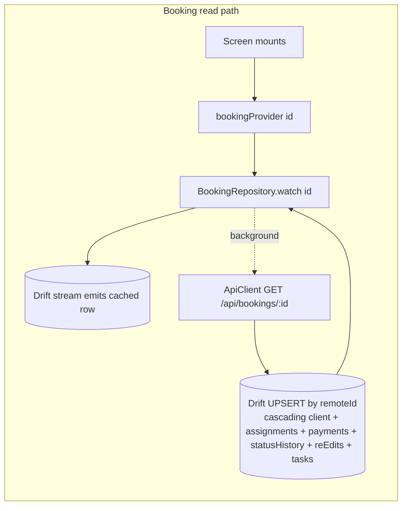
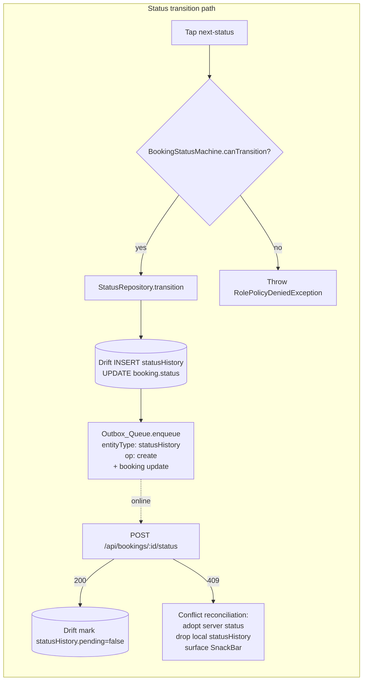
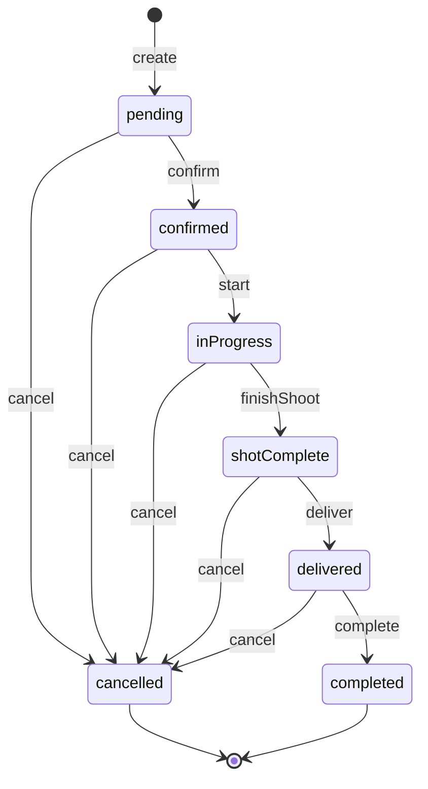
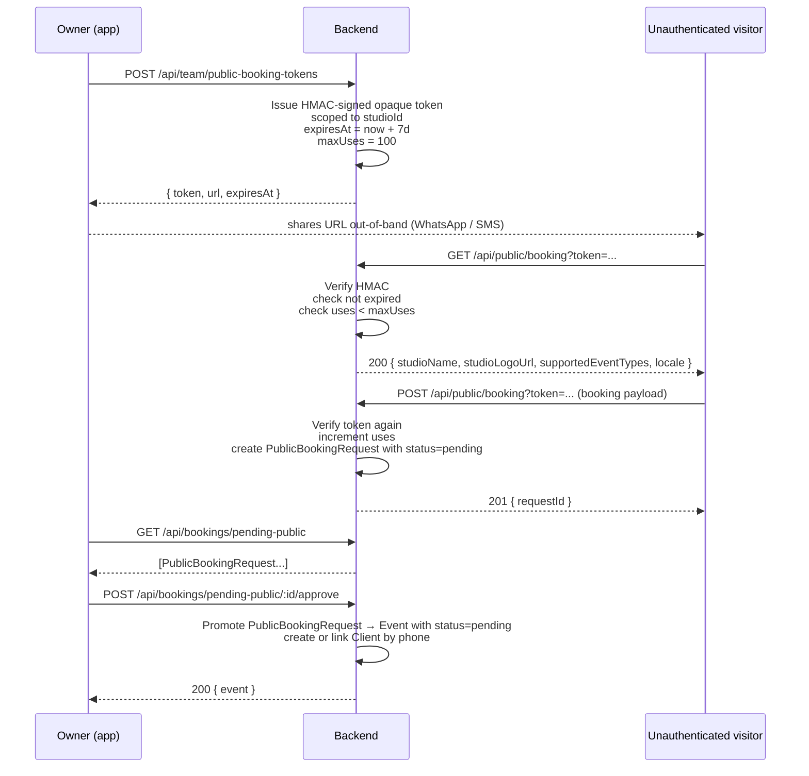
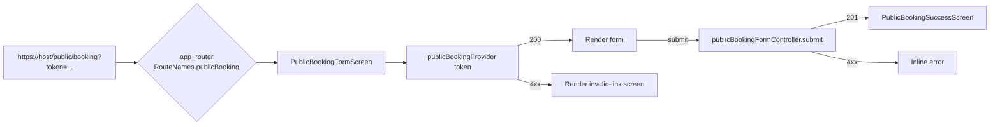

# Design Document: Bookings Module

> **Spec:** `bookings-module` · **Workflow:** Requirements-First · **Artifacts:** High-Level Design + Low-Level Design
> **Source of truth:** `Clicker_Pro_Architecture_v6_2.html` — MOD-07, MOD-08, MOD-09 + Booking Detail, Public Booking, Re-edit, Task Progress
> **Stack:** Flutter 3.12+ · Dart · Riverpod 2.5 · Drift (SQLite) · Node.js + Prisma 5 backend
> **Builds on:** `foundation-mvp` (ApiClient, SecureStore, Outbox, Drift, RolePolicy, ARB, Dark Luxury Lens theme)
> **Theme contract:** `lib/theme/app_colors.dart` and `lib/theme/app_theme.dart` are NOT redesigned. Inter via `google_fonts`. No new color tokens; only existing AppColors usage. Soft 1-px borders, gradient surfaces, no glow.

---

## Overview

The Bookings Module is the first real business workflow plugged into the Foundation MVP runtime. After Foundation shipped the backbone (auth, profile, settings, dashboard, ARB, Drift, Outbox, RolePolicy, theme), this slice fills in the operational core: list every Event, create or edit one, advance its status, schedule the team, log payments, accept public booking requests, manage re-edit rounds, track per-staff progress, and keep all of it working offline.

The slice covers MOD-07 (Booking List), MOD-08 (Booking Create/Edit), MOD-09 (Calendar View) plus four screens not numbered in the architecture document — Booking Detail, Public Client Booking Form, Re-edit Request Screen, and the per-staff progress section embedded in Booking Detail. Eight new Drift tables (Bookings, Clients, Assignments, Payments, Packages, StatusHistory, ReEditRequests, TaskProgress) plug into the existing AppDatabase. Eight new repositories plug into the existing provider tree. Eight new ARB namespace blocks plug into the existing `app_en.arb` / `app_bn.arb`. The existing Outbox_Queue gains seven new entity types; its retry semantics, conflict tiers, and force-logout behavior are inherited unchanged.

No new color tokens, no new fonts, no new state widgets, no new logger, no new ApiClient — only new tables, new domain models, new repositories, new providers, new screens, and new ARB keys.

The slice covers nine architecture-aligned concerns:

| Concern | Architecture | Owner |
|---|---|---|
| MOD-07 Booking List | Phase 2 — Operations | `features/bookings/` |
| MOD-08 Booking Create/Edit | Phase 2 — Operations | `features/bookings/` |
| MOD-09 Calendar View | Phase 2 — Operations | `features/bookings/` |
| Booking Detail | Phase 2 — Operations | `features/bookings/` |
| Status Flow State Machine | Phase 2 — Operations | `core/booking_status/` |
| Public Client Booking Form | Phase 2 — Operations | `features/public_booking/` |
| Re-edit Request | Phase 2 — Post-delivery | `features/reedits/` |
| Task Progress | Phase 2 — Operations | `features/bookings/` |
| Offline-first sync extensions | Phase 1 — Cross-cutting | `core/sync/` |

---

# Part A — High-Level Design

## Architecture

### Layered Architecture (extending Foundation MVP)



**Hard rules (carried over from Foundation MVP):**
- UI never imports `ApiClient` or `AppDatabase` directly. UI talks to providers; providers talk to repositories; repositories choose between Drift, ApiClient, and Outbox.
- Reads are local-first with background remote refresh (read-through cache).
- Writes commit to Drift before any network call (Property 5 — offline-write durability).
- Tier A entities use last-write-wins by `updatedAt`. StatusHistory is append-only (Tier C).

### Module Map

| Module | Owns | Source |
|---|---|---|
| `core/booking_status/` | Pure `BookingStatusMachine` (transitions, cancel rules) | New |
| `features/bookings/` | List, Edit, Detail, Calendar screens + Booking, Client, Assignment, Payment, Package, Status, ReEdit, TaskProgress repositories | New |
| `features/public_booking/` | Public Booking Form (unauthenticated) + PublicBookingRepository | New |
| `features/reedits/` | Re-edit Request List + Detail screens (Owner/Manager/Editor view) | New |
| `core/db/tables/` (extension) | 8 new Drift tables | Extends Foundation |
| `core/db/daos/` (extension) | 8 new DAOs | Extends Foundation |
| `core/sync/outbox_worker.dart` (extension) | New entity types: `booking`, `client`, `assignment`, `payment`, `package`, `statusHistory`, `reEditRequest`, `taskProgress` | Extends Foundation |
| `core/role/` (extension) | 18 new Capability values | Extends Foundation |
| `lib/l10n/` (extension) | `bookings.*` keys in `app_en.arb` and `app_bn.arb` | Extends Foundation |

### Screen List & Navigation



### State Management Strategy

| Provider | Type | Source | Rebuild trigger |
|---|---|---|---|
| `bookingListProvider(filter)` | `StreamProvider.family` | `BookingRepository.watchList(filter)` | Drift query stream emits |
| `bookingProvider(id)` | `StreamProvider.family` | `BookingRepository.watch(id)` | Drift row stream emits |
| `calendarMonthProvider(yyyymm)` | `StreamProvider.family` | `BookingRepository.watchMonth(yyyymm)` | Drift query stream emits |
| `clientSearchProvider(query)` | `FutureProvider.autoDispose.family` | `ClientRepository.searchByPhone(query)` | Re-fetch on input change |
| `packageListProvider` | `StreamProvider` | `PackageRepository.watchAll()` | Drift query stream emits |
| `reEditListProvider(eventId)` | `StreamProvider.family` | `ReEditRepository.watchByEvent(id)` | Drift query stream emits |
| `taskProgressProvider(eventId)` | `StreamProvider.family` | `TaskProgressRepository.watchByEvent(id)` | Drift query stream emits |
| `publicBookingProvider(token)` | `FutureProvider.family` | `PublicBookingRepository.peek(token)` | Read-once at form mount |
| `pendingPublicBookingsProvider` | `StreamProvider` | `PublicBookingRepository.watchPending()` | Drift query stream emits |
| `bookingFilterProvider` | `StateProvider` | UI-only | UI dispatches |
| `bookingSearchProvider` | `StateProvider<String>` (debounced via controller) | UI-only | Text input |

The `RolePolicy` cache is invalidated on role change (already in Foundation MVP). Booking-specific capabilities resolve through the same `Role_Policy.can(Capability)` API.

### Offline-First Sync Strategy for Bookings

```mermaid
graph LR
    subgraph WriteFlow[Booking write path]
        UI[UI submits Booking save] --> P[bookingNotifier.save]
        P --> R[BookingRepository.save]
        R --> D1[(Drift UPSERT<br/>pending=true<br/>updatedAt=now)]
        D1 --> Q[Outbox_Queue.enqueue<br/>entityType: booking<br/>op: create|update]
        Q -.online.-> API[ApiClient POST /api/bookings<br/>or PATCH /api/bookings/:id]
        API --> D2[(Drift UPDATE<br/>pending=false<br/>remoteId<br/>updatedAt=server.updatedAt)]
    end
```





Sync rules per entity type (carries Tier A/B/C from Requirement 15):

| Entity | Tier | Conflict | Local id strategy |
|---|---|---|---|
| Booking (Event) | A | last-write-wins by `updatedAt` | UUID local; `remoteId` set on first sync |
| Client | A | last-write-wins by `updatedAt` | UUID local; phone is also unique key |
| Assignment | A | last-write-wins by `updatedAt` | UUID local |
| Payment | A | last-write-wins by `updatedAt` | UUID local |
| Package | A | last-write-wins by `updatedAt` | UUID local; scoped to studio |
| StatusHistory | C | append-only; never modified | UUID local; remote `id` filled on sync |
| ReEditRequest | A (request meta) | last-write-wins by `updatedAt` | UUID local |
| ReEditRequest status entries | C | append-only | UUID local |
| TaskProgress | A | last-write-wins by `updatedAt` | composite key `(eventId, userId)` |
| PublicBookingToken | B | server-wins | server-issued opaque string |
| PublicBookingRequest | A on owner-side; immutable on visitor-side | last-write-wins by `updatedAt` for owner approve/reject | server-issued id |

### Status Flow State Machine



Permission gate (per Requirement 3.4–3.7):

| Role | Forward transitions (3.1) | Cancel transition (3.2) |
|---|---|---|
| Owner | ✓ | ✓ |
| Both | ✓ | ✓ |
| Manager | ✓ | ✗ |
| Freelancer | ✗ | ✗ |

The state machine is implemented as a pure function `canTransition(role, fromStatus, toStatus) -> bool`; the `Status_Repository` and the backend's `statusController` both call it server-side and client-side. Server-side is the source of truth — the backend re-runs the same predicate and returns 409 if its current status disagrees with the supplied `fromStatus`.

### Public Booking Token Security Model



**Token guarantees:**
- HMAC-signed opaque string. Server is the only signer/verifier; the client treats it as unparseable opaque data.
- `expiresAt` enforced server-side (default 7 days; configurable on issuance).
- `maxUses` enforced server-side (default 100; soft cap to deter scraping).
- The Public Booking Form is unauthenticated — it does NOT carry a bearer token. The HMAC token IS its only credential.
- Public Booking Requests live in their own table on the backend (and a dedicated `PublicBookingRequestsTable` in Drift mirrored only for the Owner's pending list). They never become real Events until Owner approves.
- Rejected requests transition to `rejected` and persist for 30 days (server retention) for audit.
- The Owner-side POST for approve/reject IS authenticated and capability-gated (`approvePublicBooking`).

### Conflict Resolution Rules (formal)

Per Requirement 15:

```
function reconcile(local, remote):
  if entity_tier == TierA:
    if remote.updatedAt > local.updatedAt:    # server newer
      keep_remote;  drop_local_mutation;  notify_user_reload
    elif remote.updatedAt == local.updatedAt: # tie
      apply_local;  bump_both
    else:                                     # local newer
      apply_local;  replace_remote
  elif entity_tier == TierB:
    keep_remote;  ignore_any_local_write
  elif entity_tier == TierC:
    append_local;  do_not_modify_existing_rows
```

Status-409 is a special case: server reports `currentStatus`; client must adopt it and drop the local pending status mutation. The dropped mutation is logged via `AppLogger.w('status', '409 conflict, adopted server status: $serverStatus')` so a developer can investigate.

### Visual Design Notes (theme contract — DO NOT redesign)

All booking surfaces inherit Dark Luxury Lens via existing `AppColors` and `AppTheme`. Specific reuses:

| Element | Token | Notes |
|---|---|---|
| Screen background | `AppColors.voidBlack` | Same as Dashboard |
| Card surface | `AppColors.surface1` | Existing card style |
| Surface gradient | `AppColors.gradientSurface` | Existing |
| Primary accent | `AppColors.orange` (`signalOrange` alias) | CTA, FAB, status badge for `confirmed`/`inProgress` |
| Gold accent | `AppColors.gold` | Status badge for `shotComplete`/`delivered`, premium package label |
| Indigo accent | `AppColors.indigo` | Status badge for `pending` |
| Error red | `AppColors.error` | Status badge for `cancelled`, validation errors |
| Success | `AppColors.success` (existing token) | Status badge for `completed` |
| Border | `AppColors.border` | 1-px soft border on cards and inputs |
| Body text | `Theme.of(context).textTheme.bodyMedium` (Inter) | No new font |
| Numerals | `formatNumber(n, lang, bnNumerals)` from Foundation MVP | Bengali digits when locale=bn AND toggle on |

Status badge contract (per Requirement 1.13):

| Status | Background | Foreground |
|---|---|---|
| `pending` | `AppColors.indigo.withOpacity(0.18)` | `AppColors.indigo` |
| `confirmed` | `AppColors.orange.withOpacity(0.18)` | `AppColors.orange` |
| `inProgress` | `AppColors.orange` | `AppColors.voidBlack` |
| `shotComplete` | `AppColors.gold.withOpacity(0.22)` | `AppColors.gold` |
| `delivered` | `AppColors.gold` | `AppColors.voidBlack` |
| `completed` | `AppColors.success.withOpacity(0.22)` | `AppColors.success` |
| `cancelled` | `AppColors.error.withOpacity(0.18)` | `AppColors.error` |

No glow effects. No new shadow tokens. Card elevation matches existing Foundation MVP cards.

---

# Part B — Low-Level Design

## Proposed File / Folder Structure

Extends the Foundation MVP feature-first layout. New folders highlighted with `★`.

```
lib/
├── core/
│   ├── booking_status/                                   ★
│   │   ├── booking_status.dart                           ★ (enum + helpers)
│   │   └── booking_status_machine.dart                   ★ (pure transition predicate)
│   ├── db/
│   │   ├── tables/
│   │   │   ├── bookings_table.dart                       ★
│   │   │   ├── clients_table.dart                        ★
│   │   │   ├── assignments_table.dart                    ★
│   │   │   ├── payments_table.dart                       ★
│   │   │   ├── packages_table.dart                       ★
│   │   │   ├── status_history_table.dart                 ★
│   │   │   ├── re_edit_requests_table.dart               ★
│   │   │   ├── task_progress_table.dart                  ★
│   │   │   └── public_booking_requests_table.dart        ★
│   │   ├── daos/
│   │   │   ├── bookings_dao.dart                         ★
│   │   │   ├── clients_dao.dart                          ★
│   │   │   ├── assignments_dao.dart                      ★
│   │   │   ├── payments_dao.dart                         ★
│   │   │   ├── packages_dao.dart                         ★
│   │   │   ├── status_history_dao.dart                   ★
│   │   │   ├── re_edit_requests_dao.dart                 ★
│   │   │   ├── task_progress_dao.dart                    ★
│   │   │   └── public_booking_requests_dao.dart          ★
│   │   └── app_database.dart                             (extended @DriftDatabase tables list)
│   ├── role/
│   │   ├── capability.dart                               (extended enum: 18 new values)
│   │   └── role_policy.dart                              (extended _matrix bindings)
│   ├── sync/
│   │   └── outbox_worker.dart                            (extended entity-type switch + serializers)
│   └── format/
│       └── booking_format.dart                           ★ (date+time, money, payout, percentage)
├── l10n/
│   ├── app_en.arb                                        (extended — bookings.* keys)
│   └── app_bn.arb                                        (extended — bookings.* keys)
└── features/
    ├── bookings/
    │   ├── data/                                         ★
    │   │   ├── booking_api.dart
    │   │   ├── client_api.dart
    │   │   ├── assignment_api.dart
    │   │   ├── payment_api.dart
    │   │   ├── package_api.dart
    │   │   ├── status_api.dart
    │   │   ├── re_edit_api.dart
    │   │   ├── task_progress_api.dart
    │   │   ├── booking_repository_impl.dart
    │   │   ├── client_repository_impl.dart
    │   │   ├── assignment_repository_impl.dart
    │   │   ├── payment_repository_impl.dart
    │   │   ├── package_repository_impl.dart
    │   │   ├── status_repository_impl.dart
    │   │   ├── re_edit_repository_impl.dart
    │   │   ├── task_progress_repository_impl.dart
    │   │   └── booking_serializers.dart                  (toJson/fromJson per entity)
    │   ├── domain/                                       ★
    │   │   ├── booking.dart
    │   │   ├── booking_filter.dart
    │   │   ├── booking_status.dart                       (re-export from core/booking_status)
    │   │   ├── event_type.dart
    │   │   ├── shift.dart
    │   │   ├── client.dart
    │   │   ├── assignment.dart
    │   │   ├── assignment_role.dart
    │   │   ├── payment.dart
    │   │   ├── payment_kind.dart
    │   │   ├── package.dart
    │   │   ├── status_transition.dart
    │   │   ├── status_history_entry.dart
    │   │   ├── re_edit_request.dart
    │   │   ├── re_edit_status.dart
    │   │   ├── task_progress.dart
    │   │   ├── booking_repository.dart                   (interfaces)
    │   │   ├── client_repository.dart
    │   │   ├── assignment_repository.dart
    │   │   ├── payment_repository.dart
    │   │   ├── package_repository.dart
    │   │   ├── status_repository.dart
    │   │   ├── re_edit_repository.dart
    │   │   └── task_progress_repository.dart
    │   ├── application/                                  ★
    │   │   ├── booking_list_controller.dart
    │   │   ├── booking_edit_controller.dart
    │   │   ├── booking_detail_controller.dart
    │   │   ├── calendar_controller.dart
    │   │   ├── client_search_controller.dart
    │   │   ├── package_picker_controller.dart
    │   │   ├── re_edit_controller.dart
    │   │   └── task_progress_controller.dart
    │   └── presentation/                                 ★
    │       ├── booking_list_screen.dart
    │       ├── booking_edit_screen.dart
    │       ├── booking_detail_screen.dart
    │       ├── calendar_screen.dart
    │       ├── re_edit_request_screen.dart
    │       ├── widgets/
    │       │   ├── booking_list_row.dart
    │       │   ├── booking_filter_bar.dart
    │       │   ├── booking_status_badge.dart
    │       │   ├── status_timeline.dart
    │       │   ├── client_picker_field.dart
    │       │   ├── package_picker_field.dart
    │       │   ├── assignments_editor.dart
    │       │   ├── payment_summary_card.dart
    │       │   ├── re_edit_card.dart
    │       │   ├── task_progress_section.dart
    │       │   ├── calendar_month_grid.dart
    │       │   └── day_events_sheet.dart
    │       └── dialogs/
    │           ├── new_client_dialog.dart
    │           ├── cancel_booking_dialog.dart
    │           ├── share_public_link_dialog.dart
    │           └── re_edit_request_form.dart
    └── public_booking/                                   ★
        ├── data/
        │   ├── public_booking_api.dart
        │   └── public_booking_repository_impl.dart
        ├── domain/
        │   ├── public_booking_token.dart
        │   ├── public_booking_request.dart
        │   └── public_booking_repository.dart
        ├── application/
        │   └── public_booking_form_controller.dart
        └── presentation/
            ├── public_booking_form_screen.dart
            ├── public_booking_success_screen.dart
            └── pending_public_bookings_section.dart
```

> **Migration note:** the existing `lib/screens/bookings_screen.dart`, `lib/screens/calendar_screen.dart`, and `lib/screens/finance_screen.dart` (placeholder) stubs are deleted in the cleanup wave once the new feature folders are wired through the central app router.

## Drift Schema Additions

All new tables plug into the existing `@DriftDatabase` annotation in `core/db/app_database.dart`. Schema version bumps from 1 → 2; a Drift migration runs on first launch after upgrade.

```dart
// core/db/tables/bookings_table.dart
class BookingsTable extends Table {
  TextColumn get id => text()();                                      // local UUID
  TextColumn get remoteId => text().nullable()();
  TextColumn get studioId => text()();                                // owner.id for Owner/Both/Manager; self.id for Freelancer
  TextColumn get createdByUserId => text()();
  TextColumn get title => text().withLength(min: 1, max: 120)();
  TextColumn get eventType => text()();                               // wedding|holud|birthday|corporate|preWedding|other
  DateTimeColumn get date => dateTime()();
  TextColumn get startTime => text()();                               // HH:mm
  TextColumn get endTime => text()();                                 // HH:mm
  TextColumn get shift => text()();                                   // day|night|both
  TextColumn get venue => text().nullable()();
  BoolColumn get outdoor => boolean().withDefault(const Constant(false))();
  TextColumn get brideName => text().nullable()();
  TextColumn get groomName => text().nullable()();
  TextColumn get clientId => text().references(ClientsTable, #id).nullable()();
  TextColumn get packageId => text().references(PackagesTable, #id).nullable()();
  RealColumn get customPrice => real().nullable()();                  // when no package
  RealColumn get coverageHours => real().nullable()();
  RealColumn get extraHourRate => real().nullable()();
  TextColumn get driveLink => text().nullable()();
  TextColumn get clientRequirementsJson => text().nullable()();       // freeform JSON blob
  TextColumn get notes => text().nullable()();
  TextColumn get chiefPhotographerUserId => text().nullable()();
  RealColumn get chiefHours => real().nullable()();
  BoolColumn get hidePaymentFromTeam => boolean().withDefault(const Constant(false))();
  TextColumn get status => text().withDefault(const Constant('pending'))();
  DateTimeColumn get createdAt => dateTime().withDefault(currentDateAndTime)();
  DateTimeColumn get updatedAt => dateTime().withDefault(currentDateAndTime)();
  BoolColumn get pending => boolean().withDefault(const Constant(false))();
  @override Set<Column> get primaryKey => {id};
}

// core/db/tables/clients_table.dart
class ClientsTable extends Table {
  TextColumn get id => text()();
  TextColumn get remoteId => text().nullable()();
  TextColumn get studioId => text()();
  TextColumn get name => text().withLength(min: 1, max: 80)();
  TextColumn get phone => text()();
  TextColumn get email => text().nullable()();
  TextColumn get address => text().nullable()();
  DateTimeColumn get dob => dateTime().nullable()();
  DateTimeColumn get anniversary => dateTime().nullable()();
  DateTimeColumn get createdAt => dateTime().withDefault(currentDateAndTime)();
  DateTimeColumn get updatedAt => dateTime().withDefault(currentDateAndTime)();
  BoolColumn get pending => boolean().withDefault(const Constant(false))();
  @override Set<Column> get primaryKey => {id};
  @override List<Set<Column>> get uniqueKeys => [{studioId, phone}];
}

// core/db/tables/assignments_table.dart
class AssignmentsTable extends Table {
  TextColumn get id => text()();
  TextColumn get remoteId => text().nullable()();
  TextColumn get bookingId => text().references(BookingsTable, #id)();
  TextColumn get userId => text()();                                  // staff
  TextColumn get role => text()();                                    // photographer|cinematographer|editor|assistant|drone
  RealColumn get payout => real().withDefault(const Constant(0.0))();
  TextColumn get notes => text().nullable()();
  DateTimeColumn get createdAt => dateTime().withDefault(currentDateAndTime)();
  DateTimeColumn get updatedAt => dateTime().withDefault(currentDateAndTime)();
  BoolColumn get pending => boolean().withDefault(const Constant(false))();
  @override Set<Column> get primaryKey => {id};
}

// core/db/tables/payments_table.dart
class PaymentsTable extends Table {
  TextColumn get id => text()();
  TextColumn get remoteId => text().nullable()();
  TextColumn get bookingId => text().references(BookingsTable, #id)();
  TextColumn get kind => text()();                                    // advance|due|extra
  RealColumn get amount => real()();
  TextColumn get method => text().nullable()();                       // cash|bank|bkash|nagad|other
  TextColumn get note => text().nullable()();
  DateTimeColumn get paidAt => dateTime().nullable()();
  DateTimeColumn get createdAt => dateTime().withDefault(currentDateAndTime)();
  DateTimeColumn get updatedAt => dateTime().withDefault(currentDateAndTime)();
  BoolColumn get pending => boolean().withDefault(const Constant(false))();
  @override Set<Column> get primaryKey => {id};
}

// core/db/tables/packages_table.dart
class PackagesTable extends Table {
  TextColumn get id => text()();
  TextColumn get remoteId => text().nullable()();
  TextColumn get studioId => text()();
  TextColumn get name => text().withLength(min: 1, max: 80)();
  RealColumn get basePrice => real()();
  RealColumn get coverageHours => real().nullable()();
  RealColumn get extraHourRate => real().nullable()();
  TextColumn get inclusionsJson => text().nullable()();               // freeform JSON list
  DateTimeColumn get createdAt => dateTime().withDefault(currentDateAndTime)();
  DateTimeColumn get updatedAt => dateTime().withDefault(currentDateAndTime)();
  BoolColumn get pending => boolean().withDefault(const Constant(false))();
  @override Set<Column> get primaryKey => {id};
}

// core/db/tables/status_history_table.dart
// Tier C: append-only. No update path. updatedAt is unused; use createdAt.
class StatusHistoryTable extends Table {
  TextColumn get id => text()();                                      // local UUID
  TextColumn get remoteId => text().nullable()();
  TextColumn get bookingId => text().references(BookingsTable, #id)();
  TextColumn get fromStatus => text()();
  TextColumn get toStatus => text()();
  TextColumn get changedByUserId => text()();
  TextColumn get note => text().nullable()();
  DateTimeColumn get at => dateTime()();
  BoolColumn get pending => boolean().withDefault(const Constant(false))();
  @override Set<Column> get primaryKey => {id};
}

// core/db/tables/re_edit_requests_table.dart
class ReEditRequestsTable extends Table {
  TextColumn get id => text()();
  TextColumn get remoteId => text().nullable()();
  TextColumn get bookingId => text().references(BookingsTable, #id)();
  IntColumn get round => integer()();                                 // 1, 2, 3, ...
  TextColumn get editorUserId => text().nullable()();
  DateTimeColumn get deadline => dateTime()();
  TextColumn get referenceImageUrlsJson => text().nullable()();       // up to 10
  TextColumn get notes => text().nullable()();
  TextColumn get status => text().withDefault(const Constant('pending'))(); // pending|inProgress|done|rejected
  TextColumn get requestedByUserId => text()();
  DateTimeColumn get requestedAt => dateTime().withDefault(currentDateAndTime)();
  DateTimeColumn get updatedAt => dateTime().withDefault(currentDateAndTime)();
  BoolColumn get pending => boolean().withDefault(const Constant(false))();
  @override Set<Column> get primaryKey => {id};
  @override List<Set<Column>> get uniqueKeys => [{bookingId, round}];
}

// core/db/tables/task_progress_table.dart
// Composite key (bookingId, userId) — only one progress row per (event, staff) pair.
class TaskProgressTable extends Table {
  TextColumn get bookingId => text().references(BookingsTable, #id)();
  TextColumn get userId => text()();
  IntColumn get percentage => integer()();                            // 0-100
  TextColumn get note => text().nullable()();
  DateTimeColumn get updatedAt => dateTime().withDefault(currentDateAndTime)();
  BoolColumn get pending => boolean().withDefault(const Constant(false))();
  @override Set<Column> get primaryKey => {bookingId, userId};
}

// core/db/tables/public_booking_requests_table.dart
// Owner-side mirror of pending public requests (for offline visibility of pending list).
// The visitor-side submission is fire-and-forget; nothing local on visitor's device.
class PublicBookingRequestsTable extends Table {
  TextColumn get id => text()();                                      // server-issued
  TextColumn get studioId => text()();
  TextColumn get title => text()();
  TextColumn get eventType => text()();
  DateTimeColumn get date => dateTime()();
  TextColumn get startTime => text()();
  TextColumn get endTime => text()();
  TextColumn get shift => text()();
  TextColumn get venue => text().nullable()();
  TextColumn get brideName => text().nullable()();
  TextColumn get groomName => text().nullable()();
  TextColumn get clientName => text()();
  TextColumn get clientPhone => text()();
  TextColumn get clientEmail => text().nullable()();
  TextColumn get notes => text().nullable()();
  TextColumn get status => text().withDefault(const Constant('pending'))(); // pending|approved|rejected
  DateTimeColumn get submittedAt => dateTime()();
  DateTimeColumn get updatedAt => dateTime().withDefault(currentDateAndTime)();
  @override Set<Column> get primaryKey => {id};
}
```

```dart
// core/db/app_database.dart  (extended)
@DriftDatabase(tables: [
  // Foundation MVP tables
  UsersTable,
  UserPreferencesTable,
  NotificationPreferencesTable,
  GearItemsTable,
  TeamInvitesTable,
  OutboxTable,
  // Bookings module — new
  BookingsTable,
  ClientsTable,
  AssignmentsTable,
  PaymentsTable,
  PackagesTable,
  StatusHistoryTable,
  ReEditRequestsTable,
  TaskProgressTable,
  PublicBookingRequestsTable,
])
class AppDatabase extends _$AppDatabase {
  AppDatabase() : super(_openConnection());
  @override int get schemaVersion => 2;

  @override
  MigrationStrategy get migration => MigrationStrategy(
    onUpgrade: (m, from, to) async {
      if (from == 1 && to >= 2) {
        await m.createAll();   // creates only the new tables
      }
    },
  );
}
```

## Data Models

```dart
// features/bookings/domain/booking.dart
class Booking {
  final String id;
  final String? remoteId;
  final String studioId;
  final String createdByUserId;
  final String title;
  final EventType eventType;
  final DateTime date;
  final String startTime;
  final String endTime;
  final Shift shift;
  final String? venue;
  final bool outdoor;
  final String? brideName;
  final String? groomName;
  final String? clientId;
  final String? packageId;
  final double? customPrice;
  final double? coverageHours;
  final double? extraHourRate;
  final String? driveLink;
  final Map<String, dynamic>? clientRequirements;
  final String? notes;
  final String? chiefPhotographerUserId;
  final double? chiefHours;
  final bool hidePaymentFromTeam;
  final BookingStatus status;
  final DateTime createdAt;
  final DateTime updatedAt;
  final bool pending;

  Booking({...});
  Booking copyWith({...});
  Map<String, dynamic> toJson();
  factory Booking.fromJson(Map<String, dynamic> json);
}

// features/bookings/domain/event_type.dart
enum EventType { wedding, holud, birthday, corporate, preWedding, other;
  bool get requiresBrideGroom => this == wedding || this == holud;
}

// features/bookings/domain/booking_status.dart  (re-exports core/booking_status)
enum BookingStatus { pending, confirmed, inProgress, shotComplete, delivered, completed, cancelled }

// features/bookings/domain/shift.dart
enum Shift { day, night, both }

// features/bookings/domain/client.dart
class Client {
  final String id;
  final String? remoteId;
  final String studioId;
  final String name;
  final String phone;
  final String? email;
  final String? address;
  final DateTime? dob;
  final DateTime? anniversary;
  final DateTime createdAt;
  final DateTime updatedAt;
  final bool pending;
  // toJson, fromJson, copyWith
}

// features/bookings/domain/assignment.dart
class Assignment {
  final String id;
  final String? remoteId;
  final String bookingId;
  final String userId;
  final AssignmentRole role;
  final double payout;
  final String? notes;
  // toJson, fromJson, copyWith, createdAt, updatedAt, pending
}

enum AssignmentRole { photographer, cinematographer, editor, assistant, drone }

// features/bookings/domain/payment.dart
class Payment {
  final String id;
  final String? remoteId;
  final String bookingId;
  final PaymentKind kind;
  final double amount;
  final String? method;
  final String? note;
  final DateTime? paidAt;
  // toJson, fromJson, copyWith, createdAt, updatedAt, pending
}

enum PaymentKind { advance, due, extra }

// features/bookings/domain/package.dart
class Package {
  final String id;
  final String? remoteId;
  final String studioId;
  final String name;
  final double basePrice;
  final double? coverageHours;
  final double? extraHourRate;
  final List<String>? inclusions;
  // toJson, fromJson, copyWith, createdAt, updatedAt, pending
}

// features/bookings/domain/status_history_entry.dart
class StatusHistoryEntry {
  final String id;
  final String? remoteId;
  final String bookingId;
  final BookingStatus fromStatus;
  final BookingStatus toStatus;
  final String changedByUserId;
  final String? note;
  final DateTime at;
  final bool pending;
}

// features/bookings/domain/re_edit_request.dart
class ReEditRequest {
  final String id;
  final String? remoteId;
  final String bookingId;
  final int round;
  final String? editorUserId;
  final DateTime deadline;
  final List<String>? referenceImageUrls;
  final String? notes;
  final ReEditStatus status;
  final String requestedByUserId;
  final DateTime requestedAt;
  final DateTime updatedAt;
  final bool pending;

  bool get isOverdue =>
      (status == ReEditStatus.pending || status == ReEditStatus.inProgress) &&
      deadline.isBefore(DateTime.now());
}

enum ReEditStatus { pending, inProgress, done, rejected }

// features/bookings/domain/task_progress.dart
class TaskProgress {
  final String bookingId;
  final String userId;
  final int percentage;     // 0-100
  final String? note;
  final DateTime updatedAt;
  final bool pending;
}

// features/bookings/domain/booking_filter.dart
class BookingFilter {
  final DateTime? from;
  final DateTime? to;
  final Set<BookingStatus> statuses;
  final Set<EventType> types;
  final String? clientId;
  final String? search;
  final BookingSort sort;
  const BookingFilter({...});
  bool get isEmpty => from == null && to == null && statuses.isEmpty && types.isEmpty && clientId == null && (search == null || search!.isEmpty);
}

enum BookingSort { dateDesc, dateAsc, createdAtDesc, clientNameAsc }

// features/public_booking/domain/public_booking_token.dart
class PublicBookingToken {
  final String token;
  final String studioName;
  final String? studioLogoUrl;
  final List<EventType> supportedEventTypes;
  final String locale;             // 'en' | 'bn'
  final DateTime expiresAt;
}

// features/public_booking/domain/public_booking_request.dart
class PublicBookingRequest {
  final String id;
  final String studioId;
  final String title;
  final EventType eventType;
  final DateTime date;
  final String startTime;
  final String endTime;
  final Shift shift;
  final String? venue;
  final String? brideName;
  final String? groomName;
  final String clientName;
  final String clientPhone;
  final String? clientEmail;
  final String? notes;
  final PublicBookingRequestStatus status;
  final DateTime submittedAt;
  final DateTime updatedAt;
}

enum PublicBookingRequestStatus { pending, approved, rejected }
```

## Components and Interfaces

The Bookings Module exposes its capabilities through nine Repository contracts, eight API classes, one pure state-machine helper, and one filter-criteria value object. Each repository owns one domain entity (or a small cluster of related entities), follows the Foundation MVP read-through cache pattern, and integrates with the existing `Outbox_Queue` for offline writes.

| Component | Purpose | Key methods |
|---|---|---|
| `BookingRepository` | Booking (Event) reads, watches, paginated list, save, delete, role-scoped query, refresh from remote | `watchList`, `watch`, `watchMonth`, `getById`, `fetchPage`, `refreshFromRemote`, `save`, `delete` |
| `ClientRepository` | Client CRUD, phone-prefix autocomplete, refresh from remote | `searchByPhone`, `getByPhone`, `watch`, `save`, `refreshFromRemote` |
| `AssignmentRepository` | Assignment CRUD per booking, role-gated | `watchByBooking`, `add`, `update`, `remove` |
| `PaymentRepository` | Payment CRUD per booking, aggregate computation | `watchByBooking`, `aggregateForBooking`, `add`, `update`, `remove` |
| `PackageRepository` | Package CRUD, scoped to studio | `watchAll`, `save`, `remove`, `refreshFromRemote` |
| `StatusRepository` | StatusHistory append + transition gating via `BookingStatusMachine` | `watchHistory`, `transition` |
| `ReEditRepository` | ReEditRequest CRUD, status transitions | `watchByBooking`, `nextRoundFor`, `request`, `updateStatus` |
| `TaskProgressRepository` | TaskProgress upsert keyed by (bookingId, userId) | `watchByBooking`, `watchOwn`, `upsert` |
| `PublicBookingRepository` | Token issuance, visitor-side peek + submit, owner-side approve / reject | `issueToken`, `peek`, `submit`, `watchPending`, `approve`, `reject` |
| `BookingStatusMachine` (helper) | Pure transition predicate (no side effects) | `isAllowedTransition`, `canRoleApply`, `canTransition`, `nextForward` |
| `BookingFilter` (value object) | Filter criteria for list / month queries | `from`, `to`, `statuses`, `types`, `clientId`, `search`, `sort`, `isEmpty` |

Repositories are constructor-injected with `ApiClient`, `AppDatabase`, and (for `BookingRepository`) the `Outbox_Queue` access. Their interface declarations live in `features/bookings/domain/`; their implementations live in `features/bookings/data/`. Each is exposed via a `Provider<T>` in `core/providers.dart`.

```dart
// features/bookings/domain/booking_repository.dart
abstract class BookingRepository {
  /// Local-first watch with role scope applied.
  Stream<List<Booking>> watchList(BookingFilter filter, {required RolePolicy policy, required String currentUserId, required int page, int pageSize = 20});
  Stream<Booking?> watch(String localId);
  Stream<List<Booking>> watchMonth(int year, int month, {required RolePolicy policy, required String currentUserId});

  Future<Booking> getById(String localId);
  Future<List<Booking>> fetchPage(BookingFilter filter, {required int page, int pageSize = 20});
  Future<void> refreshFromRemote({BookingFilter? filter, String? singleEventId});

  Future<Booking> save(Booking booking, {required RolePolicy policy});                  // create or update
  Future<void> delete(String localId, {required RolePolicy policy});
}

// features/bookings/domain/client_repository.dart
abstract class ClientRepository {
  Future<List<Client>> searchByPhone(String prefix);
  Future<Client?> getByPhone(String phone);
  Stream<Client?> watch(String localId);
  Future<Client> save(Client client);                                                    // upsert
  Future<void> refreshFromRemote();
}

// features/bookings/domain/assignment_repository.dart
abstract class AssignmentRepository {
  Stream<List<Assignment>> watchByBooking(String bookingId);
  Future<void> add(Assignment a, {required RolePolicy policy});
  Future<void> update(Assignment a, {required RolePolicy policy});
  Future<void> remove(String assignmentId, {required RolePolicy policy});
}

// features/bookings/domain/payment_repository.dart
abstract class PaymentRepository {
  Stream<List<Payment>> watchByBooking(String bookingId);
  Future<({double advance, double due, double extra, double total})> aggregateForBooking(String bookingId);
  Future<void> add(Payment p, {required RolePolicy policy});
  Future<void> update(Payment p, {required RolePolicy policy});
  Future<void> remove(String paymentId, {required RolePolicy policy});
}

// features/bookings/domain/package_repository.dart
abstract class PackageRepository {
  Stream<List<Package>> watchAll();
  Future<Package> save(Package p, {required RolePolicy policy});
  Future<void> remove(String packageId, {required RolePolicy policy});
  Future<void> refreshFromRemote();
}

// features/bookings/domain/status_repository.dart
abstract class StatusRepository {
  Stream<List<StatusHistoryEntry>> watchHistory(String bookingId);
  /// Verifies BookingStatusMachine.canTransition(role, from, to) before writing.
  /// Throws StatusTransitionDeniedException on invalid transition or insufficient role.
  /// Throws StatusConflictException on server 409.
  Future<void> transition({
    required String bookingId,
    required BookingStatus expectedFrom,
    required BookingStatus to,
    required String changedByUserId,
    required RolePolicy policy,
    String? note,
  });
}

// features/bookings/domain/re_edit_repository.dart
abstract class ReEditRepository {
  Stream<List<ReEditRequest>> watchByBooking(String bookingId);
  Future<int> nextRoundFor(String bookingId);                                            // max(round) + 1, or 1
  Future<ReEditRequest> request({
    required String bookingId,
    required int round,
    required String? editorUserId,
    required DateTime deadline,
    required List<String>? referenceImageUrls,
    required String? notes,
    required String requestedByUserId,
    required RolePolicy policy,
  });
  Future<void> updateStatus({
    required String reEditId,
    required ReEditStatus toStatus,
    required RolePolicy policy,
    required String currentUserId,
  });
}

// features/bookings/domain/task_progress_repository.dart
abstract class TaskProgressRepository {
  Stream<List<TaskProgress>> watchByBooking(String bookingId);
  Stream<TaskProgress?> watchOwn({required String bookingId, required String userId});
  /// Upsert keyed by (bookingId, userId).
  Future<void> upsert({
    required String bookingId,
    required String userId,
    required int percentage,
    required String? note,
    required RolePolicy policy,
  });
}

// features/public_booking/domain/public_booking_repository.dart
abstract class PublicBookingRepository {
  /// Owner-side: issues a token for the current studio.
  Future<({String url, String token, DateTime expiresAt})> issueToken({required RolePolicy policy});

  /// Visitor-side: peeks at token validity without authentication.
  Future<PublicBookingToken> peek(String token);

  /// Visitor-side: submits a booking request.
  Future<String> submit({required String token, required PublicBookingRequest payload});

  /// Owner-side: pending requests for current studio.
  Stream<List<PublicBookingRequest>> watchPending();
  Future<void> refreshPending();

  Future<Booking> approve(String requestId, {required RolePolicy policy});
  Future<void> reject(String requestId, {required RolePolicy policy});
}
```

## Booking Status Machine

```dart
// core/booking_status/booking_status_machine.dart
class BookingStatusMachine {
  /// Allowed forward transitions.
  static const Map<BookingStatus, BookingStatus> _forward = {
    BookingStatus.pending: BookingStatus.confirmed,
    BookingStatus.confirmed: BookingStatus.inProgress,
    BookingStatus.inProgress: BookingStatus.shotComplete,
    BookingStatus.shotComplete: BookingStatus.delivered,
    BookingStatus.delivered: BookingStatus.completed,
  };

  /// Statuses from which cancel is allowed.
  static const Set<BookingStatus> _cancellableFrom = {
    BookingStatus.pending,
    BookingStatus.confirmed,
    BookingStatus.inProgress,
    BookingStatus.shotComplete,
    BookingStatus.delivered,
  };

  static bool isAllowedTransition(BookingStatus from, BookingStatus to) {
    if (to == BookingStatus.cancelled) return _cancellableFrom.contains(from);
    return _forward[from] == to;
  }

  static bool canRoleApply(UserRole role, BookingStatus from, BookingStatus to) {
    if (role == UserRole.freelancer) return false;     // Requirement 3.7
    if (to == BookingStatus.cancelled && role == UserRole.manager) return false; // Requirement 3.6
    return true;
  }

  /// Single composite predicate.
  static bool canTransition(UserRole role, BookingStatus from, BookingStatus to) =>
      isAllowedTransition(from, to) && canRoleApply(role, from, to);

  /// Used by UI to render only the next forward action.
  static BookingStatus? nextForward(BookingStatus from) => _forward[from];
}
```

## Capability Extensions

```dart
// core/role/capability.dart  (extended — 18 new entries)
enum Capability {
  // Foundation MVP capabilities (unchanged):
  editStudioBranding,
  editGearInventory,
  joinAnotherStudio,
  viewFinancials,
  viewTeamSection,
  toggleDistribution,
  toggleVat,
  changeRole,
  generateTeamInvite,
  deleteOwnAccount,

  // Bookings module — new
  viewAllBookings,
  viewAssignedBookings,
  viewOwnBookings,
  createBooking,
  editBooking,
  deleteBooking,
  advanceBookingStatus,
  cancelBooking,
  viewBookingPayments,
  viewBookingPayouts,
  editBookingPayments,
  editAssignment,
  toggleHidePayment,
  generatePublicBookingToken,
  approvePublicBooking,
  requestReEdit,
  assignReEdit,
  updateTaskProgress,
}
```

```dart
// core/role/role_policy.dart  (extended — bookings bindings appended to _matrix)
//
// Owner: every booking-specific capability
// Both: every booking-specific capability
// Manager: viewAssignedBookings, createBooking, editBooking, advanceBookingStatus,
//          viewBookingPayments (subject to Hide_Payment_Flag),
//          viewBookingPayouts (subject to Hide_Payment_Flag),
//          editAssignment, requestReEdit, updateTaskProgress
// Freelancer: viewOwnBookings, updateTaskProgress, requestReEdit (own only)
//
// Additional matrix entries added to _matrix (only the booking ones shown):
static const _bookingMatrixAdditions = <Capability, Set<UserRole>>{
  Capability.viewAllBookings:               {UserRole.owner, UserRole.both},
  Capability.viewAssignedBookings:          {UserRole.owner, UserRole.both, UserRole.manager},
  Capability.viewOwnBookings:               {UserRole.owner, UserRole.freelancer, UserRole.both, UserRole.manager},
  Capability.createBooking:                 {UserRole.owner, UserRole.both, UserRole.manager},
  Capability.editBooking:                   {UserRole.owner, UserRole.both, UserRole.manager},
  Capability.deleteBooking:                 {UserRole.owner, UserRole.both},
  Capability.advanceBookingStatus:          {UserRole.owner, UserRole.both, UserRole.manager},
  Capability.cancelBooking:                 {UserRole.owner, UserRole.both},
  Capability.viewBookingPayments:           {UserRole.owner, UserRole.both, UserRole.manager},
  Capability.viewBookingPayouts:            {UserRole.owner, UserRole.both, UserRole.manager},
  Capability.editBookingPayments:           {UserRole.owner, UserRole.both},
  Capability.editAssignment:                {UserRole.owner, UserRole.both, UserRole.manager},
  Capability.toggleHidePayment:             {UserRole.owner, UserRole.both},
  Capability.generatePublicBookingToken:    {UserRole.owner, UserRole.both},
  Capability.approvePublicBooking:          {UserRole.owner, UserRole.both},
  Capability.requestReEdit:                 {UserRole.owner, UserRole.both, UserRole.manager, UserRole.freelancer},
  Capability.assignReEdit:                  {UserRole.owner, UserRole.both, UserRole.manager},
  Capability.updateTaskProgress:            {UserRole.owner, UserRole.both, UserRole.manager, UserRole.freelancer},
};
```

> **Important**: `viewBookingPayments` and `viewBookingPayouts` for Manager are STILL gated by the per-event `Hide_Payment_Flag`. The capability matrix says "Manager is allowed to see payments in general"; the Hide_Payment_Flag overrides it per Event. The check sites (`booking_detail_screen`, `booking_list_row`) must combine both: `policy.can(viewBookingPayments) && !(role == manager && booking.hidePaymentFromTeam)`. Freelancers always see only their own assignment payout, regardless of Hide_Payment_Flag.

## Provider Tree Extensions

```dart
// core/providers.dart  (extended — only new lines shown)

// Apis
final bookingApiProvider     = Provider((ref) => BookingApi(ref.read(apiClientProvider)));
final clientApiProvider      = Provider((ref) => ClientApi(ref.read(apiClientProvider)));
final assignmentApiProvider  = Provider((ref) => AssignmentApi(ref.read(apiClientProvider)));
final paymentApiProvider     = Provider((ref) => PaymentApi(ref.read(apiClientProvider)));
final packageApiProvider     = Provider((ref) => PackageApi(ref.read(apiClientProvider)));
final statusApiProvider      = Provider((ref) => StatusApi(ref.read(apiClientProvider)));
final reEditApiProvider      = Provider((ref) => ReEditApi(ref.read(apiClientProvider)));
final taskProgressApiProvider = Provider((ref) => TaskProgressApi(ref.read(apiClientProvider)));
final publicBookingApiProvider = Provider((ref) => PublicBookingApi(ref.read(apiClientProvider)));

// Repositories
final bookingRepositoryProvider = Provider<BookingRepository>((ref) => BookingRepositoryImpl(...));
final clientRepositoryProvider = Provider<ClientRepository>((ref) => ClientRepositoryImpl(...));
final assignmentRepositoryProvider = Provider<AssignmentRepository>((ref) => AssignmentRepositoryImpl(...));
final paymentRepositoryProvider = Provider<PaymentRepository>((ref) => PaymentRepositoryImpl(...));
final packageRepositoryProvider = Provider<PackageRepository>((ref) => PackageRepositoryImpl(...));
final statusRepositoryProvider = Provider<StatusRepository>((ref) => StatusRepositoryImpl(...));
final reEditRepositoryProvider = Provider<ReEditRepository>((ref) => ReEditRepositoryImpl(...));
final taskProgressRepositoryProvider = Provider<TaskProgressRepository>((ref) => TaskProgressRepositoryImpl(...));
final publicBookingRepositoryProvider = Provider<PublicBookingRepository>((ref) => PublicBookingRepositoryImpl(...));

// UI providers
final bookingFilterProvider   = StateProvider<BookingFilter>((_) => const BookingFilter());
final bookingSearchProvider   = StateProvider<String>((_) => '');
final bookingSortProvider     = StateProvider<BookingSort>((_) => BookingSort.dateDesc);
final bookingListPageProvider = StateProvider<int>((_) => 0);
final calendarVisibleMonthProvider = StateProvider<DateTime>((_) => DateTime.now());

// Stream providers
final bookingListProvider = StreamProvider.family<List<Booking>, BookingFilter>((ref, filter) {
  final policy = ref.watch(rolePolicyProvider);
  final user = ref.watch(currentUserProvider).value;
  final page = ref.watch(bookingListPageProvider);
  if (user == null) return const Stream.empty();
  return ref.watch(bookingRepositoryProvider).watchList(filter, policy: policy, currentUserId: user.id, page: page);
});

final bookingProvider = StreamProvider.family<Booking?, String>(
  (ref, id) => ref.watch(bookingRepositoryProvider).watch(id));

final calendarMonthProvider = StreamProvider.family<List<Booking>, DateTime>((ref, ym) {
  final policy = ref.watch(rolePolicyProvider);
  final user = ref.watch(currentUserProvider).value;
  if (user == null) return const Stream.empty();
  return ref.watch(bookingRepositoryProvider).watchMonth(ym.year, ym.month, policy: policy, currentUserId: user.id);
});

final clientSearchProvider = FutureProvider.autoDispose.family<List<Client>, String>(
  (ref, q) => ref.watch(clientRepositoryProvider).searchByPhone(q));

final packageListProvider = StreamProvider<List<Package>>(
  (ref) => ref.watch(packageRepositoryProvider).watchAll());

final reEditListProvider = StreamProvider.family<List<ReEditRequest>, String>(
  (ref, id) => ref.watch(reEditRepositoryProvider).watchByBooking(id));

final taskProgressProvider = StreamProvider.family<List<TaskProgress>, String>(
  (ref, id) => ref.watch(taskProgressRepositoryProvider).watchByBooking(id));

final pendingPublicBookingsProvider = StreamProvider<List<PublicBookingRequest>>(
  (ref) => ref.watch(publicBookingRepositoryProvider).watchPending());
```

## Remote API Contract

The Foundation MVP `ApiClient` is the single HTTP entry point. All bookings APIs add typed methods on dedicated `*Api` classes (one per entity). Below is the wire contract; all endpoints return JSON, accept `Bearer` tokens (except public booking visitor-side), and surface 4xx/5xx as `ApiException`.

| Method | Path | Body | Response | Authenticated |
|---|---|---|---|---|
| GET | `/api/bookings` | query: `from, to, status[], type[], clientId, search, sort, page, pageSize` | `200 { items: Event[], page, total }` | Yes |
| GET | `/api/bookings/:id` | — | `200 { event, client, assignments[], payments[], package?, statusHistory[], reEditRequests[], taskProgress[] }` | Yes |
| POST | `/api/bookings` | full Event payload | `201 { event }` | Yes |
| PATCH | `/api/bookings/:id` | partial Event | `200 { event }` | Yes |
| DELETE | `/api/bookings/:id` | — | `204` | Yes |
| POST | `/api/bookings/:id/status` | `{ toStatus, fromStatus, note? }` | `200 { event, statusHistoryEntry }` (`409` on status conflict) | Yes |
| GET | `/api/clients` | query: `studioId?, page, pageSize` | `200 { items: Client[] }` | Yes |
| GET | `/api/clients/search?phone=` | query: `phone` (prefix) | `200 { items: Client[] }` | Yes |
| POST | `/api/clients` | Client payload | `201 { client }` | Yes |
| PATCH | `/api/clients/:id` | partial Client | `200 { client }` | Yes |
| POST | `/api/bookings/:id/assignments` | Assignment payload | `201 { assignment }` | Yes |
| PATCH | `/api/bookings/:id/assignments/:assignmentId` | partial Assignment | `200 { assignment }` | Yes |
| DELETE | `/api/bookings/:id/assignments/:assignmentId` | — | `204` | Yes |
| POST | `/api/bookings/:id/payments` | Payment payload | `201 { payment }` | Yes |
| PATCH | `/api/bookings/:id/payments/:paymentId` | partial Payment | `200 { payment }` | Yes |
| DELETE | `/api/bookings/:id/payments/:paymentId` | — | `204` | Yes |
| GET | `/api/packages` | — | `200 { items: Package[] }` | Yes |
| POST | `/api/packages` | Package payload | `201 { package }` | Yes |
| PATCH | `/api/packages/:id` | partial Package | `200 { package }` | Yes |
| DELETE | `/api/packages/:id` | — | `204` | Yes |
| POST | `/api/bookings/:id/reedits` | ReEditRequest payload | `201 { reEditRequest }` | Yes |
| GET | `/api/bookings/:id/reedits` | — | `200 { items: ReEditRequest[] }` | Yes |
| PATCH | `/api/reedits/:reEditId/status` | `{ toStatus }` | `200 { reEditRequest }` | Yes |
| POST | `/api/bookings/:id/task-progress` | `{ percentage, note? }` (upsert keyed by current user) | `200 { taskProgress }` | Yes |
| GET | `/api/bookings/:id/task-progress` | — | `200 { items: TaskProgress[] }` | Yes |
| POST | `/api/team/public-booking-tokens` | `{ expiresInDays?, maxUses? }` | `201 { token, url, expiresAt }` | Yes (Owner/Both) |
| GET | `/api/public/booking?token=` | — | `200 { studioName, studioLogoUrl?, supportedEventTypes, locale, expiresAt }` | **No (token only)** |
| POST | `/api/public/booking?token=` | PublicBookingRequest payload | `201 { requestId }` | **No (token only)** |
| GET | `/api/bookings/pending-public` | — | `200 { items: PublicBookingRequest[] }` | Yes (Owner/Both) |
| POST | `/api/bookings/pending-public/:requestId/approve` | — | `200 { event }` | Yes (Owner/Both) |
| POST | `/api/bookings/pending-public/:requestId/reject` | `{ reason? }` | `200 { request }` | Yes (Owner/Both) |

Each API class (e.g. `BookingApi`) wraps `ApiClient` calls, parses the JSON via `Booking.fromJson`-family factories, and re-throws structured exceptions. Example skeleton:

```dart
// features/bookings/data/booking_api.dart
class BookingApi {
  final ApiClient _client;
  BookingApi(this._client);

  Future<({List<Booking> items, int page, int total})> list(BookingFilter f, {int page = 0, int pageSize = 20}) async {
    final r = await _client.get('/api/bookings', query: _filterToQuery(f, page, pageSize));
    final items = (r['items'] as List).map((e) => Booking.fromJson(e as Map<String, dynamic>)).toList();
    return (items: items, page: r['page'] as int, total: r['total'] as int);
  }

  Future<BookingDetailEnvelope> get(String remoteId) async { /* ... */ }
  Future<Booking> create(Booking b) async { /* POST /api/bookings */ }
  Future<Booking> patch(String remoteId, Map<String, dynamic> partial) async { /* ... */ }
  Future<void> delete(String remoteId) async { /* DELETE ... */ }

  Future<({Booking event, StatusHistoryEntry entry})> transitionStatus({
    required String remoteId,
    required BookingStatus from,
    required BookingStatus to,
    String? note,
  }) async {
    try {
      final r = await _client.post('/api/bookings/$remoteId/status',
          body: {'fromStatus': from.name, 'toStatus': to.name, 'note': note});
      return (event: Booking.fromJson(r['event']), entry: StatusHistoryEntry.fromJson(r['statusHistoryEntry']));
    } on ApiException catch (e) {
      if (e.statusCode == 409) throw StatusConflictException(serverStatus: BookingStatus.values.byName(e.bodyJson?['serverStatus'] ?? 'pending'));
      rethrow;
    }
  }
}
```

## Outbox Worker Extensions

The Foundation MVP `OutboxWorker` already iterates pending items by ID order, applies exponential backoff, and respects the 5-failure manual-retry cutoff. The extension here adds new entity types to its dispatch switch and registers serializers.

```dart
// core/sync/outbox_worker.dart  (extension switch — only new branches shown)
Future<void> _drain(OutboxItem item) async {
  switch (item.entityType) {
    // Foundation entities (unchanged):
    case 'user':                  await _drainUser(item); break;
    case 'gear':                  await _drainGear(item); break;
    case 'preferences':           await _drainPreferences(item); break;
    case 'notificationPrefs':     await _drainNotifPrefs(item); break;

    // Bookings module — new
    case 'booking':               await _drainBooking(item); break;
    case 'client':                await _drainClient(item); break;
    case 'assignment':            await _drainAssignment(item); break;
    case 'payment':               await _drainPayment(item); break;
    case 'package':               await _drainPackage(item); break;
    case 'statusHistory':         await _drainStatusHistory(item); break;        // tier C
    case 'reEditRequest':         await _drainReEditRequest(item); break;
    case 'reEditStatus':          await _drainReEditStatus(item); break;         // tier C status entries
    case 'taskProgress':          await _drainTaskProgress(item); break;
    case 'publicBookingApprove':  await _drainPublicApprove(item); break;
    case 'publicBookingReject':   await _drainPublicReject(item); break;
  }
}
```

Per-entity drain rules:

- **Tier A drains** (`booking`, `client`, `assignment`, `payment`, `package`, `reEditRequest` meta, `taskProgress`):
  1. Read pending row from Drift.
  2. Call corresponding API method (`POST` for op=create, `PATCH` for op=update, `DELETE` for op=delete).
  3. On 2xx: update local row, set `pending=false`, set `remoteId`, set `updatedAt = server.updatedAt`. Reconcile per Tier A rules in §HLD Conflict Resolution.
  4. On 5xx / network: bump attempts, schedule retry with exponential backoff.
  5. On 4xx (other than 409): mark as manual-retry, surface error in sync indicator.

- **Tier C drains** (`statusHistory`, `reEditStatus`):
  1. Read pending row from Drift.
  2. POST to corresponding append endpoint.
  3. On 2xx: set `pending=false`, set `remoteId`. Never overwrite an existing row.
  4. On 409 (status only): drop the local statusHistory row, refresh booking from remote (server's status is authoritative), surface a non-blocking SnackBar.

- **Owner-side public booking actions** (`publicBookingApprove`, `publicBookingReject`):
  1. POST the action.
  2. On 2xx: update or remove the local `PublicBookingRequestsTable` row. If approve, also upsert the resulting Booking into `BookingsTable`.
  3. On 4xx: mark as manual-retry.

## ARB Extensions (sample keys)

The ARB files gain a `bookings.*` namespace block. Sample subset:

```json
// app_en.arb (additions, abbreviated)
{
  "@@locale": "en",
  "bookings_title": "Bookings",
  "bookings_filter_all": "All",
  "bookings_filter_pending": "Pending",
  "bookings_filter_confirmed": "Confirmed",
  "bookings_filter_in_progress": "In Progress",
  "bookings_filter_shot_complete": "Shot Complete",
  "bookings_filter_delivered": "Delivered",
  "bookings_filter_completed": "Completed",
  "bookings_filter_cancelled": "Cancelled",
  "bookings_search_hint": "Search by title, client, phone, venue",
  "bookings_empty_title": "No bookings yet",
  "bookings_empty_subtitle": "Tap + to create your first booking.",
  "bookings_new": "New Booking",
  "bookings_field_title": "Title",
  "bookings_field_event_type": "Event type",
  "bookings_field_date": "Date",
  "bookings_field_start_time": "Start time",
  "bookings_field_end_time": "End time",
  "bookings_field_shift": "Shift",
  "bookings_field_venue": "Venue",
  "bookings_field_outdoor": "Outdoor",
  "bookings_field_bride_name": "Bride name",
  "bookings_field_groom_name": "Groom name",
  "bookings_field_client": "Client",
  "bookings_field_package": "Package",
  "bookings_field_custom_price": "Custom price",
  "bookings_field_coverage_hours": "Coverage hours",
  "bookings_field_extra_hour_rate": "Extra hour rate",
  "bookings_field_drive_link": "Drive link",
  "bookings_field_notes": "Notes",
  "bookings_field_chief_photographer": "Chief photographer",
  "bookings_field_chief_hours": "Chief hours",
  "bookings_field_hide_payment_from_team": "Hide payment from team",
  "bookings_assignments": "Assignments",
  "bookings_status_advance": "Advance status",
  "bookings_status_cancel": "Cancel booking",
  "bookings_status_cancel_reason": "Cancellation reason",
  "bookings_re_edit_request": "Request Re-edit",
  "bookings_my_progress": "My progress",
  "bookings_all_progress": "All progress",
  "bookings_payment_advance": "Advance",
  "bookings_payment_due": "Due",
  "bookings_payment_extra": "Extra",
  "bookings_payment_total": "Total",
  "bookings_validation_title_required": "Title is required",
  "bookings_validation_end_time_after_start": "End time must be after start time",
  "bookings_validation_drive_link_invalid": "Drive link must be a Google Drive or Docs URL",
  "bookings_status_conflict_message": "Status changed elsewhere. Please reload."
}
```

```json
// app_bn.arb (additions, abbreviated)
{
  "@@locale": "bn",
  "bookings_title": "বুকিং",
  "bookings_filter_all": "সব",
  "bookings_filter_pending": "অপেক্ষমান",
  "bookings_filter_confirmed": "নিশ্চিত",
  "bookings_filter_in_progress": "চলমান",
  "bookings_filter_shot_complete": "শুট শেষ",
  "bookings_filter_delivered": "ডেলিভার্ড",
  "bookings_filter_completed": "সম্পন্ন",
  "bookings_filter_cancelled": "বাতিল",
  "bookings_search_hint": "শিরোনাম, ক্লায়েন্ট, ফোন, ভেন্যু দিয়ে খুঁজুন",
  ...
}
```

## Format Helper Extensions

```dart
// core/format/booking_format.dart
class BookingFormat {
  /// Money formatting that respects Bengali numerals when locale=bn AND toggle is on.
  static String money(num amount, {required String lang, required bool bnNumerals, String currencySymbol = '\u09F3' /* ৳ Bengali Taka sign */}) {
    final base = NumberFormat.decimalPattern(lang).format(amount);
    final digitsApplied = (lang == 'bn' && bnNumerals)
        ? base.replaceAllMapped(RegExp(r'\d'), (m) => String.fromCharCode(0x09E6 + int.parse(m[0]!)))
        : base;
    return '$currencySymbol $digitsApplied';
  }

  /// Percentage rendering, e.g. "৬৫%" for bn+bnNumerals or "65%" for en.
  static String percent(int p, {required String lang, required bool bnNumerals}) {
    final s = (lang == 'bn' && bnNumerals)
        ? p.toString().replaceAllMapped(RegExp(r'\d'), (m) => String.fromCharCode(0x09E6 + int.parse(m[0]!)))
        : p.toString();
    return '$s%';
  }

  /// Date+time render for booking timeline.
  static String dateTime(DateTime dt, {required String lang}) =>
      DateFormat.yMMMd(lang).add_jm().format(dt.toLocal());

  /// Relative time within 24 hours, otherwise absolute.
  static String relative(DateTime dt, {required String lang, DateTime? now}) {
    final n = now ?? DateTime.now();
    final diff = n.difference(dt);
    if (diff.inHours.abs() < 24) {
      // Use intl's RelativeDateTime once Dart adds it; for now hand-roll EN/BN labels via ARB.
      return _relativeShort(diff, lang);
    }
    return dateTime(dt, lang: lang);
  }
}
```

## Public Booking Form (visitor-side)

The Public Booking Form is its own micro-feature. Its provider tree is **completely separate** from the authenticated tree:

- It does NOT depend on `sessionControllerProvider`.
- It does NOT depend on `currentUserProvider`.
- It does NOT depend on `rolePolicyProvider`.
- It DOES depend on `apiClientProvider` (which simply does not inject a Bearer token when none is present in `SecureStore` — already established Foundation behavior).
- The route `RouteNames.publicBooking` is registered as **non-auth-guarded** in `app_router.dart`.

The form's `publicBookingFormController` validates fields locally then calls `PublicBookingRepository.submit(token, payload)`. On success, it routes to `PublicBookingSuccessScreen` (a static thank-you page that does not query the authenticated tree).



## Wiring the Module into the App Shell

- **Bottom nav**: the existing `Booking` tab (already present per Foundation MVP MOD-05) routes to `RouteNames.bookings → BookingListScreen`.
- **Drawer**: add a `Calendar` entry under the Operations section that routes to `RouteNames.calendar → CalendarScreen`. (Calendar is also accessible from a calendar icon in the Booking List app bar.)
- **FAB**: the central FAB on Dashboard already invokes a "New Booking" stub. This module replaces the stub with `Navigator.pushNamed(RouteNames.bookingNew)`.
- **Route table** (`core/navigation/route_names.dart` extended):
  ```dart
  // existing
  static const bookings = 'bookings';
  // new
  static const calendar = 'calendar';
  static const bookingNew = 'bookingNew';
  static const bookingEdit = 'bookingEdit';
  static const bookingDetail = 'bookingDetail';
  static const reEditRequests = 'reEditRequests';
  static const publicBooking = 'publicBooking';
  static const publicBookingSuccess = 'publicBookingSuccess';
  static const pendingPublicBookings = 'pendingPublicBookings';
  ```
- **Auth guard**: every booking route is auth-guarded EXCEPT `publicBooking` and `publicBookingSuccess`.


## Correctness Properties

*A property is a characteristic or behavior that should hold true across all valid executions of a system — essentially, a formal statement about what the system should do. Properties serve as the bridge between human-readable specifications and machine-verifiable correctness guarantees.*

The properties below are derived from the prework analysis. Each is universally quantified over its inputs, references the requirements it validates, and corresponds to an automated test task in `tasks.md`. Property tests use `glados` (or hand-rolled generators) and run a minimum of 100 iterations.

### Property 1: BookingStatusMachine soundness

*For any* `(role: UserRole, from: BookingStatus, to: BookingStatus)` triple, `BookingStatusMachine.canTransition(role, from, to)` returns `true` if and only if the transition is enumerated in the forward map at Requirement 3.1 OR is a cancel transition allowed by Requirement 3.2 AND the role is permitted to apply it per Requirements 3.4 through 3.7. Equivalently: the function is exhaustively the conjunction of `_forward[from] == to OR (to == cancelled AND from in _cancellableFrom)` AND `(role != freelancer) AND NOT (to == cancelled AND role == manager)`.

**Validates: Requirements 3.1, 3.2, 3.3, 3.4, 3.5, 3.6, 3.7**

### Property 2: Role-scoped booking visibility

*For any* fixture of `(users: List<User>, bookings: List<Booking>, assignments: List<Assignment>)` AND any `currentUser` in `users`, the result of `BookingRepository.watchList(filter, policy: RolePolicy(currentUser.role), currentUserId: currentUser.id)` returns exactly the set of bookings whose role-scope predicate evaluates to `true` for `currentUser`: Owner/Both → all bookings whose `studioId == currentUser.id` OR (currentUser is Both, all assigned); Manager → bookings with `studioId == currentUser.ownerId` AND (`createdBy == currentUser.id` OR an Assignment exists for currentUser); Freelancer → bookings with `createdBy == currentUser.id` OR an Assignment exists for currentUser.

**Validates: Requirements 1.1, 11.5**

### Property 3: Hide_Payment_Flag enforcement

*For any* `(role: UserRole, hidePaymentFromTeam: bool)` pair AND any non-null `Booking` and `Assignment` set, the predicate `shouldShowPayment(role, hidePaymentFromTeam)` used by Booking_Detail_Screen and Booking_List_Screen returns `true` if and only if `Role_Policy(role).can(viewBookingPayments) AND NOT (role == manager AND hidePaymentFromTeam == true)`. Freelancers always see only their own assignment payout regardless of the flag (other staff payouts are filtered out at the data layer).

**Validates: Requirements 5.3, 5.4, 11.3**

### Property 4: Assignments scope per role

*For any* `Booking` with arbitrary `Assignments` AND any `currentUser` in `{Owner, Both, Manager, Freelancer}`, the result of the assignments-list filter on Booking_Detail_Screen returns: Owner / Both / Manager → all assignments for that Booking; Freelancer → only assignments whose `userId == currentUser.id`.

**Validates: Requirements 11.4**

### Property 5: Booking offline-write durability

*For any* entity type `T` in `{booking, client, assignment, payment, package, reEditRequest, taskProgress}` AND any valid mutation `(op: create | update | delete, payload)` invoked while the network call fails (network exception, timeout, or 5xx), the corresponding repository (a) commits the change to the local Drift store with `pending == true` BEFORE the network call AND (b) enqueues exactly one `OutboxItem` with `entityType == T`, the local entity id, the operation, and the JSON payload. The local change is intact after the network failure.

**Validates: Requirements 10.1, 10.2** (and via parameterization, the offline behavior of 2.3, 7.3, 8.3)

### Property 6: Status-conflict 409 reconciliation

*For any* triple `(localFromStatus, localToStatus, serverCurrentStatus)` where the server returns HTTP 409 with `serverCurrentStatus != localFromStatus`, the Outbox_Worker drains the local pending status mutation by (a) discarding the local pending `StatusHistoryEntry` row, (b) updating the local `Booking.status` to `serverCurrentStatus`, and (c) emitting a non-blocking conflict signal that the user reload the Event. The local store ends in `Booking.status == serverCurrentStatus` AND no orphan `StatusHistoryEntry` row remains for the dropped transition.

**Validates: Requirements 3.11, 10.8**

### Property 7: Append-only entity tier (Tier C)

*For any* `Tier C` entity type (`statusHistory`, `reEditStatus`) AND any sequence of remote drains that include rows for the same entity, NO existing local row is ever modified or deleted by the drain. New remote rows are appended; identical rows are deduplicated by `remoteId`. The total set of local rows for that entity over time is monotonically non-decreasing (modulo dedupe).

**Validates: Requirements 10.7, 15.4, 15.9**

### Property 8: Last-write-wins by updatedAt (Tier A)

*For any* `Tier A` entity AND any `(local: Row, remote: Row)` pair where both share the same `remoteId`, the `reconcile(local, remote)` function picks the row whose `updatedAt` is strictly newer; on a tie (`local.updatedAt == remote.updatedAt`), the local row wins AND both `updatedAt` values are advanced to the same new server timestamp on next drain.

**Validates: Requirements 10.6, 15.5, 15.6, 15.7**

### Property 9: Round-trip serialization

*For any* domain entity `E` in `{Booking, Client, Assignment, Payment, Package, StatusHistoryEntry, ReEditRequest, TaskProgress, PublicBookingRequest}` AND any valid instance `e` of `E`, the equality `E.fromJson(e.toJson()) == e` holds (where `==` is structural equality via `copyWith`/value semantics). This ensures the wire format and the domain representation are bidirectionally consistent.

**Validates: Requirements 13.2, 13.3, 13.4, 13.7, 13.9, 13.10, 13.11, 13.12, 13.13, 13.14**

### Property 10: Public Booking Token validity gate

*For any* token state in `{valid, expired, exhausted-uses, malformed, server-revoked}`, calling `PublicBookingRepository.peek(token)` returns successfully ONLY for the `valid` state AND throws or returns a typed error for every other state; the Public_Booking_Form renders the form ONLY on a successful peek AND renders an invalid-link screen otherwise. Submission of the form `submit(token, payload)` succeeds ONLY when the token state at submission time is `valid`.

**Validates: Requirements 6.3, 6.4**

### Property 11: Capability gating round-trip (booking-specific)

*For any* `(role: UserRole, capability: Capability)` pair where `capability` is one of the 18 booking-specific capabilities defined in Requirement 11.1, `Role_Policy(role).can(capability)` is true if and only if the static matrix entry `_matrix[capability]` contains `role`. Additionally, for any booking action (create, edit, status-transition, cancel, delete, assign, request-reedit, update-task-progress, generate-public-token, approve-public-booking, etc.) invoked via its repository, calling the action with a denied role throws `RolePolicyDeniedException` BEFORE any network or local-write side effect.

**Validates: Requirements 11.1, 11.2, 11.6**

### Property 12: Bengali numerals coverage on bookings

*For any* numeric value rendered by Booking_List_Screen, Booking_Edit_Screen, Booking_Detail_Screen, Calendar_Screen, ReEdit_Request_Screen, or Public_Booking_Form WHILE `locale == 'bn'` AND the Bengali numerals toggle is true, the resulting display string contains digits exclusively in the Unicode range U+09E6 through U+09EF (inclusive) in the digit positions, AND contains zero ASCII digits (U+0030 through U+0039) in those positions. The `BookingFormat.money`, `BookingFormat.percent`, and `formatNumber` helpers all satisfy this property for any non-negative numeric input.

**Validates: Requirements 1.11, 4.8, 5.10, 7.9, 8.6, 9.6, 12.4**

---

## Error Handling

| Scenario | Detection | Response | Recovery |
|---|---|---|---|
| Network unreachable / timeout / 5xx during booking save | `SocketException` / `TimeoutException` / `ApiException(5xx)` in repository | Local Drift row stays with `pending=true`; Outbox_Queue carries the mutation; OfflineBanner shown | Auto-retry via Outbox_Worker on connectivity return |
| 401 Unauthorized on any booking endpoint | `ApiException(401)` from `ApiClient` | Foundation MVP force-logout signal flips session to null; route to Login | User logs in again; queued booking mutations resume on re-authentication |
| 403 Forbidden (role mismatch, server-side) | `ApiException(403)` | Surface non-blocking SnackBar with `Role_Policy` denied message | User retries with the appropriate role |
| 409 Conflict on status transition | `ApiException(409)` with `serverStatus` payload | Property 6 reconciliation: drop local, adopt server status, surface SnackBar with reload affordance | Tap reload → `BookingRepository.refreshFromRemote(singleEventId: ...)` |
| 409 Conflict on Tier A optimistic update | `ApiException(409)` | Property 8 reconciliation: server timestamp newer → drop local, surface SnackBar | User reloads the Event |
| Validation error (client-side) | `Form.validate` returns false | Inline field-level error text per ARB key | User corrects |
| Drive link malformed | Validator returns false (Property-tested) | Inline error: "Drive link must be a Google Drive or Docs URL" | User corrects |
| Public booking token invalid / expired / exhausted | `peek` returns error | Render invalid-link screen with request-new-link instruction | User asks studio for a fresh link |
| Public booking submitted offline | `connectivityProvider == false` at submit time | Inline error: "An internet connection is required to submit this request" — no local enqueue | Reconnect and resubmit |
| ReEdit request before shotComplete | `Role_Policy.can(requestReEdit) AND status NOT IN {shotComplete, delivered, completed}` | Hide the Request Re-edit control; if invoked anyway, throw `IllegalStatusException` | User waits for the booking to reach shotComplete |
| Outbox 5-failure cutoff (booking entities) | Foundation MVP cutoff applies | Mark item `manual_retry`, surface error in top-bar sync indicator | User taps "retry" in sync indicator overflow |
| Drift schema migration v1 → v2 fails | Migration throws | Crash-safe `RootGate` shows ErrorState with "Reset App Data" button | Reinstall — last resort |

---

## Testing Strategy

### Unit (mandatory at this slice)
- `BookingStatusMachine` — exhaustive over the cartesian product `BookingStatus × BookingStatus × UserRole`, covering Property 1.
- `RolePolicy` — exhaustive over the 18 new booking-specific Capabilities × every UserRole, covering Property 11.
- Domain serializers (`Booking.toJson/fromJson`, etc.) — round-trip per Property 9, plus targeted edge cases (null nullable fields, empty collections, max-length strings).
- `BookingFormat.money`, `BookingFormat.percent`, `BookingFormat.dateTime` — locale-aware output with Bengali-numerals substitution per Property 12.
- `BookingFilter` semantics — empty filter returns all, every filter combo returns the documented subset.
- `ReEditRepository.nextRoundFor` — monotonicity (max+1 always returned).
- `PaymentRepository.aggregateForBooking` — `(advance + due + extra) == total` for any non-empty payment set.

### Property-based (mandatory; minimum 100 iterations per property)
- 12 properties listed in Correctness Properties section above.
- Each property test is tagged with `Feature: bookings-module, Property N: <title>` per Foundation MVP testing convention.
- Generators are built per-domain-entity in `test/bookings/generators/`, mirroring the structure of `test/foundation/generators/` from Foundation MVP. Generators handle edge cases: empty strings, max lengths, null nullables, very large collections, special-character titles, leap-day dates, midnight time boundaries, deeply-nested clientRequirements JSON.

### Widget
- `BookingListRow` golden test for each `BookingStatus` (7 statuses) in EN and BN locales.
- `BookingStatusBadge` golden for each status.
- `BookingListScreen` widget test for role-scoped rendering (Owner / Manager / Freelancer fixtures).
- `BookingEditScreen` widget test: bride/groom field appears only for `wedding`/`holud`; validators block submit; Hide_Payment_Flag toggle visibility.
- `BookingDetailScreen` widget test: payment summary visibility per (role, hidePaymentFromTeam).
- `CalendarScreen` golden for a fixed month with a known booking distribution.
- `PublicBookingFormScreen` widget test: invalid token renders error screen; valid token renders form; offline submit shows inline error.
- `StatusTimeline` widget test: pending indicator shown on outbox-queued transition; cancellation row red.

### Integration
- Booking lifecycle end-to-end: create offline → reconnect → drain → status transitions → re-edit request → mark done → completed. Run on Android emulator with backend on `10.0.2.2:5000`. (1–2 representative scenarios; not 100 iterations.)
- 401 force-logout from `GET /api/bookings` mid-session routes to Login.
- Public booking flow: Owner issues token → visitor opens public link → submits → Owner approves → Event appears in list. (1 happy-path run.)
- Status 409 reconciliation: client posts `pending → confirmed` while server is already at `confirmed`; client adopts server state. (1 scenario.)
- Backend controller activation smoke test: `GET /api/bookings`, `POST /api/bookings`, `PATCH /api/bookings/:id`, `POST /api/bookings/:id/status` each respond with 2xx for valid input on a seeded database. (1–3 examples per endpoint.)

### Performance
- Booking list with 200 cached Events emits result within 200ms (Requirement 1.4).
- Calendar month view with 100 bookings renders in <16ms per frame (single frame budget).
- Drift query benchmark: `bookingsDao.watchList(filter)` with 1,000 rows in the table emits within 50ms.

### Property Test Configuration
- Library: `glados` (added as `dev_dependency` in this slice).
- Iterations: 100 per property; `glados` default seed; deterministic via fixed seed in CI.
- Tag format on each test: `Feature: bookings-module, Property N: <property text>` as the test description string AND a comment immediately above the test.

---

## Performance Considerations

- Drift queries are filtered by `studioId` and `(createdByUserId | assignment_userId)` indexes added in the schema migration; expected query time <50ms for 1,000 Events.
- `bookingListProvider(filter)` re-queries on filter change; we rely on Drift's stream debouncing under hood plus a 300ms search debounce in the UI.
- Calendar month query caches the visible month in Drift; month transitions trigger a single SQL query bounded by `date >= monthStart AND date < nextMonthStart`.
- Outbox drain runs on a single worker; each booking-related entity drain takes <500ms (single HTTP request); 5-failure cutoff prevents runaway retries.
- Public Booking peek is a single GET; the visitor-side form has no offline cache by design (Requirement 6.11).
- ARB lookups O(1) hash; no measurable cost over Foundation MVP baseline.
- `BookingStatusBadge` renders a single `Container` with theme-derived colors; <1ms per render.

---

## Security Considerations

- Bearer token attached on every authenticated booking endpoint by Foundation MVP `ApiClient` interceptor.
- Public Booking Token is HMAC-signed server-side; client treats it as opaque. Token leak risk is bounded by `expiresAt` (default 7 days) and `maxUses` (default 100). Owner can revoke a token by issuing a new one and dropping the old (Phase 2 follow-up — out of scope for this slice).
- Public Booking Form runs without bearer token; the `?token=` query param is the only credential. Token validation happens server-side on every request; the client never inspects the token's payload.
- `Hide_Payment_Flag` enforcement is double-gated: client UI hides payment fields per Property 3, AND the server's `bookingController` filters payment fields out of the response payload for Manager users when `hidePaymentFromTeam == true`. Defense in depth.
- Capability checks happen client-side (`Role_Policy.can`) AND server-side (each controller enforces role via middleware). Client-side checks prevent UI exposure; server-side checks prevent direct API abuse.
- Drive link validation rejects any URL whose host is not `drive.google.com` or `docs.google.com`. This is a phishing mitigation for Manager / Freelancer users who tap drive links.
- Cancellation reasons are user-supplied free text (length 1–500); they are HTML-escaped on render via Flutter's `Text` widget which does not interpret HTML.
- Client phone numbers and emails are PII. They are stored in Drift unencrypted (matches Foundation MVP token-storage profile). **TODO Phase 3:** migrate the Drift database to an encrypted SQLite backend (`sqlcipher_flutter_libs`) when finance data lands.

---

## Dependencies

No new top-level dependencies required for this slice — every dependency is already present in `pubspec.yaml` from Foundation MVP. The slice adds `glados` as a dev dependency for property-based tests:

```yaml
dev_dependencies:
  glados: ^1.1.7
```

The existing dependencies used by this module:

- `flutter_riverpod: ^2.5.1` — provider tree
- `drift: ^2.20.0` and `drift_dev: ^2.20.0` — local DB
- `connectivity_plus: ^6.0.0` — offline detection
- `intl: ^0.20.2` — date/time/number formatting
- `google_fonts: ^8.1.0` — Inter + Noto Sans Bengali
- `http: ^1.6.0` — via `ApiClient`
- `flutter_markdown: ^0.7.4` — already in tree (legal screens); not used by bookings.

`url_launcher` MAY be needed to open the Drive link in the device browser. If not already in the tree, add it:
```yaml
dependencies:
  url_launcher: ^6.3.0
```

---

## Out of Scope

- Real-time push notifications for booking events (Phase 4 / FCM).
- Booking duplication / "save as new" (deferred to Phase 2.5).
- Booking templates (deferred to Phase 2.5).
- Owner-side Team Management screen for managing studio team members (deferred to Phase 2.5; this slice surfaces only the existing Foundation MVP `Generate Invite` action).
- Calendar drag-and-drop reschedule (deferred to Phase 3).
- Multi-day events (start date != end date — every Event in this slice is single-day).
- Recurring events (deferred indefinitely).
- Finance reconciliation, invoices, GST reports (Phase 3 — Finance module).
- Per-Assignment task progress percentage (this slice keys TaskProgress on `(eventId, userId)`, NOT `(eventId, userId, assignmentId)`; if a staff member has two assignments on the same Event, both share one progress row. Architecture v6.2 documents this simplification; multi-assignment progress is a Phase 2.5 follow-up).
- Public Booking Token revocation UI (issuance only this slice).
- Photo / video attachments on bookings (drive link is the placeholder for now).
- Re-edit reference image upload to studio storage (URLs only this slice; uploads land in Phase 3 with the Asset module).
- ReEditStatus history timeline (only the latest status is persisted in this slice; full audit lands in Phase 2.5).

This Bookings Module design is the contract every booking-related feature plugs into for the rest of Phase 2.
