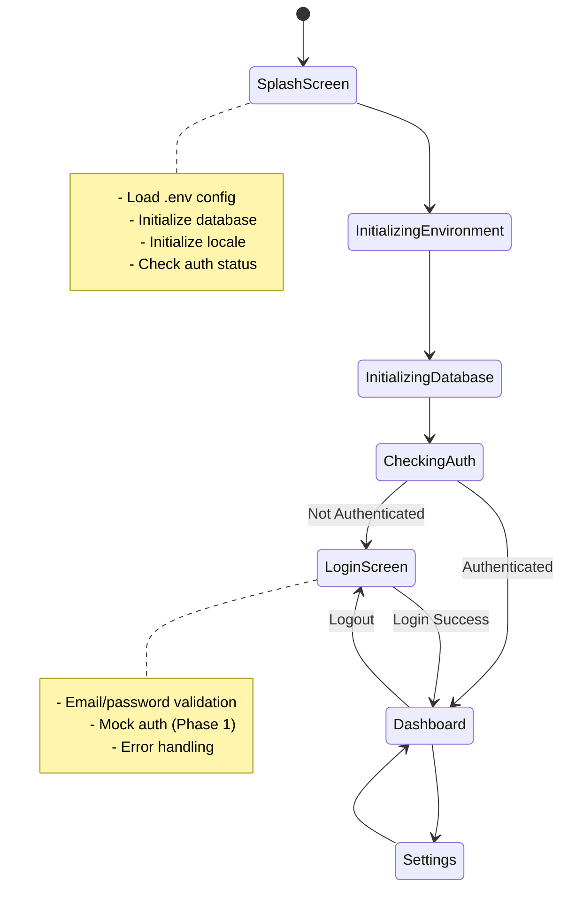
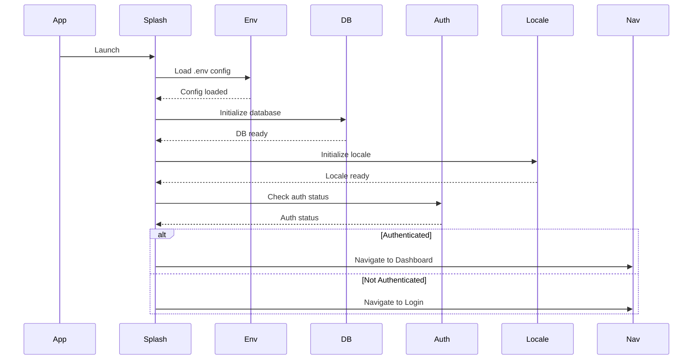
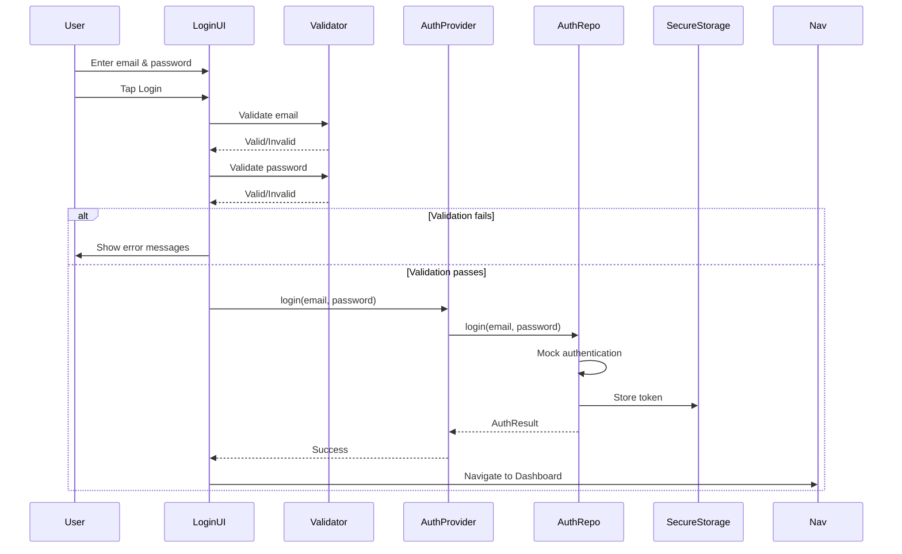

# Design Document: ClickerPro v12 Phase 1 Implementation

## Overview

ClickerPro v12 Phase 1 establishes the foundational architecture for a professional photography studio management platform targeting Bangladesh's photography industry. This phase implements core systems that enable offline-first operation, bilingual support (English/Bengali), and a premium dark-themed user experience optimized for low-light studio environments.

### Design Philosophy

1. **Offline-First Architecture**: All features must work without internet connectivity, with background sync when available through outbox pattern
2. **Premium Visual Experience**: Deep Ocean dark theme (#020810 background, #00FFD1 teal accents) with glass morphism effects optimized for photography studios
3. **Cultural Adaptation**: Full Bengali language support with Noto Sans Bengali typography and locale-aware formatting
4. **Clean Architecture**: Feature-based structure with clear separation between presentation, application, domain, and data layers following Flutter best practices
5. **State Management**: Riverpod 2.5+ for reactive, testable state management and dependency injection
6. **Type Safety**: Strong typing with immutable data models and compile-time safety guarantees throughout the codebase

### Technology Stack

- **Framework**: Flutter 3.12+ with Material Design 3
- **State Management**: Riverpod 2.5+ (Provider pattern for global state)
- **Local Database**: Drift (SQLite) with reactive queries and type-safe DAOs
- **Secure Storage**: Flutter Secure Storage for authentication tokens
- **Key-Value Store**: SharedPreferences for simple preferences (via KvStore wrapper)
- **Networking**: Custom ApiClient with HTTP package and automatic token injection
- **Connectivity**: connectivity_plus package for network monitoring
- **Internationalization**: Flutter's built-in i18n with ARB files (English/Bengali)
- **Typography**: Google Fonts (Raleway, DM Sans, Space Mono, Noto Sans Bengali)
- **Environment Config**: flutter_dotenv for .env-based configuration
- **Testing**: flutter_test for unit/widget tests, integration test framework

### Key Design Decisions

1. **Drift over Hive/Isar**: Drift chosen for robust SQL support, type-safe queries, reactive streams, and proven migration system
2. **Riverpod over Bloc**: Riverpod provides better compile-time safety, simpler testing, and more ergonomic dependency injection
3. **Feature-Based Architecture**: Code organized by business capability (auth, bookings, settings) rather than technical layer (controllers, models)
4. **Theme-First Design**: Deep Ocean theme system drives all visual decisions through centralized AppColors, AppText, and AppDecorations
5. **Backend-Ready Auth**: Production-ready authentication flow with AuthRepository abstraction allowing seamless transition from development to production
6. **Outbox Sync Pattern**: Queued sync operations for offline-first booking and data modifications
7. **Centralized Navigation**: AppRouter with RouteNames constants for type-safe navigation across the app

## Architecture


### System Architecture Diagram

```mermaid
graph TB
    subgraph "Presentation Layer"
        UI[Widgets & Screens]
        Theme[Theme System<br/>AppColors, AppText, AppDecorations]
        L10n[AppLocalizations<br/>en/bn ARB files]
    end
    
    subgraph "Application Layer - Riverpod Providers"
        AuthCtrl[AuthController<br/>SessionNotifier]
        LangCtrl[LanguageController]
        OnboardCtrl[OnboardingController]
        BookingProv[BookingProviders]
        OutboxWorker[OutboxWorker<br/>Sync Engine]
    end
    
    subgraph "Domain Layer"
        AuthRepo[AuthRepository]
        UserRepo[UserRepository]
        PrefRepo[PreferencesRepository]
        BookingRepo[BookingRepository]
        LegalRepo[LegalRepository]
    end
    
    subgraph "Data Layer"
        ApiClient[ApiClient<br/>HTTP + Token Injection]
        LocalDB[(AppDatabase<br/>Drift SQLite)]
        SecureStore[(SecureStore<br/>Flutter Secure Storage)]
        KvStore[(KvStore<br/>SharedPreferences)]
        ConnMonitor[Connectivity Monitor]
    end
    
    subgraph "Core Infrastructure"
        Router[AppRouter<br/>Route Table]
        Logger[AppLogger]
        EnvConfig[AppConfig<br/>.env loader]
    end
    
    UI --> AuthCtrl
    UI --> LangCtrl
    UI --> Theme
    UI --> L10n
    UI --> Router
    
    AuthCtrl --> AuthRepo
    LangCtrl --> PrefRepo
    OnboardCtrl --> KvStore
    BookingProv --> BookingRepo
    OutboxWorker --> BookingRepo
    OutboxWorker --> ConnMonitor
    
    AuthRepo --> ApiClient
    AuthRepo --> LocalDB
    AuthRepo --> SecureStore
    
    UserRepo --> ApiClient
    UserRepo --> LocalDB
    
    BookingRepo --> LocalDB
    BookingRepo --> ApiClient
    
    PrefRepo --> LocalDB
    PrefRepo --> KvStore
    
    LegalRepo --> ApiClient
    
    Router --> AuthCtrl
    
    EnvConfig -.-> ApiClient
    Logger -.-> LocalDB
    
    style UI fill:#00FFD1,stroke:#020810,color:#020810
    style LocalDB fill:#0A1D35,stroke:#00FFD1
    style SecureStore fill:#0A1D35,stroke:#00FFD1
    style ApiClient fill:#0A1D35,stroke:#FFD166
```



### Feature-Based Folder Structure

The actual implementation follows this structure (existing codebase):

```
lib/
├── core/                         # Core infrastructure (cross-cutting concerns)
│   ├── booking_status/          # Booking status enums and utilities
│   ├── db/                      # Drift database setup
│   │   ├── app_database.dart    # Main database class with tables
│   │   ├── app_database.g.dart  # Generated Drift code
│   │   └── tables/              # Table definitions
│   ├── env/
│   │   └── app_config.dart      # Environment configuration loader
│   ├── format/                  # Date/time/number formatters
│   ├── logging/                 # Logging infrastructure
│   │   └── app_logger.dart      # Centralized logger
│   ├── navigation/
│   │   ├── app_router.dart      # Route generator with lensPageRoute
│   │   └── route_names.dart     # Route name constants
│   ├── network/
│   │   └── api_client.dart      # HTTP client with token injection
│   ├── role/                    # User role enums and permissions
│   ├── storage/
│   │   ├── kv_store.dart        # SharedPreferences wrapper
│   │   └── secure_store.dart    # Flutter Secure Storage wrapper
│   ├── sync/                    # Outbox sync pattern
│   └── providers.dart           # Root provider aggregation
│
├── features/                     # Feature modules (domain-driven)
│   ├── auth/
│   │   ├── presentation/
│   │   │   ├── login_screen.dart
│   │   │   ├── register_screen.dart
│   │   │   ├── forgot_password_screen.dart
│   │   │   └── manager_invite_screen.dart
│   │   ├── application/
│   │   │   ├── auth_controller.dart       # StateNotifier for auth state
│   │   │   └── session_notifier.dart      # Session management
│   │   ├── domain/
│   │   │   ├── models/
│   │   │   │   ├── user.dart              # User domain model
│   │   │   │   ├── session.dart
│   │   │   │   └── login_result.dart
│   │   │   ├── auth_repository.dart       # Repository interface
│   │   │   └── team_invite_repository.dart
│   │   └── data/
│   │       ├── auth_api.dart              # API client for auth endpoints
│   │       ├── auth_repository_impl.dart  # Repository implementation
│   │       ├── team_invite_api.dart
│   │       └── team_invite_repository_impl.dart
│   │
│   ├── bookings/
│   │   ├── presentation/
│   │   │   ├── booking_list_screen.dart
│   │   │   ├── booking_detail_screen.dart
│   │   │   ├── booking_edit_screen.dart
│   │   │   └── calendar_screen.dart
│   │   ├── application/
│   │   │   ├── booking_providers.dart     # Booking state providers
│   │   │   └── outbox_worker_provider.dart
│   │   ├── domain/
│   │   │   ├── models/
│   │   │   │   ├── booking.dart
│   │   │   │   ├── outbox_entry.dart
│   │   │   │   └── booking_status.dart
│   │   │   └── booking_repository.dart
│   │   └── data/
│   │       ├── booking_api.dart
│   │       ├── booking_repository_impl.dart
│   │       └── outbox_worker.dart         # Background sync engine
│   │
│   ├── dashboard/
│   │   └── presentation/
│   │       └── dashboard_screen.dart       # Main dashboard UI
│   │
│   ├── onboarding/
│   │   ├── presentation/
│   │   │   ├── splash_screen.dart          # Animated splash with routing
│   │   │   ├── language_picker_screen.dart
│   │   │   └── onboarding_intro_screen.dart
│   │   └── application/
│   │       └── onboarding_controller.dart  # Onboarding completion flag
│   │
│   ├── profile/
│   │   ├── presentation/
│   │   │   ├── profile_screen.dart
│   │   │   └── delete_account_screen.dart
│   │   ├── domain/
│   │   │   └── user_repository.dart
│   │   └── data/
│   │       ├── user_api.dart
│   │       └── user_repository_impl.dart
│   │
│   ├── settings/
│   │   ├── presentation/
│   │   │   └── settings_screen.dart
│   │   ├── application/
│   │   │   └── language_controller.dart    # Locale management provider
│   │   ├── domain/
│   │   │   └── preferences_repository.dart
│   │   └── data/
│   │       └── preferences_repository_impl.dart
│   │
│   ├── legal/
│   │   ├── presentation/
│   │   │   ├── privacy_screen.dart
│   │   │   ├── terms_screen.dart
│   │   │   └── data_export_screen.dart
│   │   ├── domain/
│   │   │   └── legal_repository.dart
│   │   └── data/
│   │       ├── legal_api.dart
│   │       └── legal_repository_impl.dart
│   │
│   ├── public_booking/              # Public booking flow (tokenized)
│   ├── notifications/               # Notification center
│   ├── chat/                        # Chat module (future)
│   ├── expenses/                    # Finance module
│   ├── reports/                     # Reports module
│   ├── gear/                        # Gear tracking
│   ├── rent/                        # Rental management
│   ├── team/                        # Team management
│   ├── help/                        # Help & support
│   └── push/                        # Push notification handling
│
├── shared/                          # Shared widgets and utilities
│   ├── states/                      # Common state classes
│   └── widgets/                     # Reusable UI components
│       ├── glass_card.dart          # (to be implemented per spec)
│       ├── tinted_glass_card.dart   # (to be implemented per spec)
│       └── offline_banner.dart      # (to be implemented per spec)
│
├── theme/                           # Theme system (Deep Ocean)
│   ├── app_colors.dart              # ✓ Deep Ocean palette implemented
│   ├── app_theme.dart               # ✓ Typography, spacing, decorations
│   └── app_strings.dart             # Common UI strings
│
├── widgets/                         # Legacy widget location
│   ├── metric_card.dart             # Dashboard metric cards
│   ├── quick_action_button.dart     # Dashboard quick actions
│   ├── weather_card.dart            # Weather widget
│   ├── announcement_card.dart       # Announcements
│   ├── responsive_frame.dart        # Responsive layout wrapper
│   └── weekday_strip.dart           # Calendar weekday strip
│
├── l10n/                            # Internationalization
│   ├── app_en.arb                   # ✓ English translations
│   ├── app_bn.arb                   # ✓ Bengali translations
│   ├── app_localizations.dart       # ✓ Generated localizations
│   ├── app_localizations_en.dart    # ✓ Generated English
│   └── app_localizations_bn.dart    # ✓ Generated Bengali
│
├── screens/                         # Legacy screen location (being migrated)
│   ├── login_screen.dart            # (migrate to features/auth)
│   ├── register_screen.dart         # (migrate to features/auth)
│   ├── dashboard_screen.dart        # (migrate to features/dashboard)
│   └── settings_screen.dart         # (migrate to features/settings)
│
├── app.dart                         # ✓ ClickerProApp MaterialApp root
└── main.dart                        # ✓ Entry point with .env loading

.env                                 # Environment configuration (gitignored)
.env.example                         # Template for environment variables
pubspec.yaml                         # Dependencies and asset configuration
l10n.yaml                            # Localization configuration
analysis_options.yaml                # Linting rules
```

**Migration Notes:**
- Some screens in `lib/screens/` are being migrated to feature folders
- `lib/widgets/` contains legacy widgets; new shared components go in `lib/shared/widgets/`
- All new code follows feature-based structure under `lib/features/`

### Architectural Layers

#### 1. Presentation Layer
- **Responsibility**: UI rendering, user interaction, visual feedback
- **Components**: Screens, widgets, animations
- **Dependencies**: Application layer providers, theme system, localization
- **Rules**: 
  - No direct database or storage access
  - All state accessed through providers
  - Widgets should be const where possible
  - Business logic delegated to application layer

#### 2. Application Layer
- **Responsibility**: State management, use case orchestration, presentation logic
- **Components**: Riverpod providers, state notifiers
- **Dependencies**: Domain layer services and models
- **Rules**:
  - Providers expose reactive state streams
  - Coordinate between domain services
  - Handle loading/error states for UI
  - No UI code (widgets) in this layer

#### 3. Domain Layer
- **Responsibility**: Business logic, domain models, repository interfaces
- **Components**: Models, service interfaces, value objects
- **Dependencies**: No external dependencies (pure Dart)
- **Rules**:
  - Immutable data classes
  - Business rules and validations
  - Repository interfaces (implemented in data layer)
  - Framework-agnostic

#### 4. Data Layer
- **Responsibility**: Data persistence, external data sources, repository implementations
- **Components**: Drift database, secure storage, shared preferences, API clients
- **Dependencies**: Domain layer interfaces
- **Rules**:
  - Implements domain repository interfaces
  - Handles data mapping (DTO ↔ Domain model)
  - Manages transactions and caching
  - Error handling and retry logic

## Components and Interfaces

### Theme System Components

#### AppColors (Implemented)

**Location**: `lib/theme/app_colors.dart`

**Purpose**: Single source of truth for Deep Ocean color palette with backward compatibility

**Implementation Highlights**:
```dart
class AppColors {
  // 🌊 Deep Ocean Void Black Surfaces
  static const Color voidBlack = Color(0xFF020810);      // Main background
  static const Color voidLight = Color(0xFF0A111A);      // Elevated surface
  static const Color voidElevated = Color(0xFF141C26);   // More elevated
  
  // 💎 Teal Primary Accent (replaces orange in v6.2)
  static const Color teal = Color(0xFF00FFD1);
  static const Color tealLight = Color(0xFF66FFDF);
  static const Color tealSoft = Color(0x1F00FFD1);       // 12% opacity
  static const Color tealGlow = Color(0x3300FFD1);       // 20% opacity border
  
  // Backward compatibility aliases
  static const Color accent = teal;
  static const Color orange = teal;  // Legacy name mapped to teal
  
  // 🟡 Lens Gold Secondary
  static const Color gold = Color(0xFFFFD166);
  static const Color goldSoft = Color(0x26FFD166);
  
  // 💜 Purple Tertiary
  static const Color purple = Color(0xFFA78BFA);
  
  // 🤍 Film Whites (Text)
  static const Color film = Color(0xFFF5F2EE);          // Primary text
  static const Color filmDim = Color(0xFFB8B5B1);       // Secondary text
  static const Color filmMuted = Color(0xFF7A7873);     // Tertiary text
  
  // 🟢🔴 Semantic Colors
  static const Color green = Color(0xFF34D399);         // Mint/success
  static const Color yellow = Color(0xFFFFD166);        // Warning
  static const Color red = Color(0xFFFF6B6B);           // Coral/error
  
  // 🪟 Glass Morphism Surfaces
  static const Color glass = Color(0x0AFFFFFF);         // 4% white card bg
  static const Color glassBorder = Color(0x0FFFFFFF);   // 6% white border
  static const Color glassHover = Color(0x14FFFFFF);    // 8% white hover
  static const Color hairline = Color(0x0AFFFFFF);      // 4% divider
  
  // Topbar and bottom nav surfaces
  static const Color topbarBg = Color(0xB3020810);      // 70% void
  static const Color topbarBorder = Color(0x3300FFD1);  // 20% teal
  static const Color bottomNavBg = Color(0xD9020810);   // 85% void
  
  // Helper methods for glass decorations
  static BoxDecoration glassCardDecoration({double radius = 14, Color? tint});
  static BoxDecoration iconWrapDecoration(Color tint, {double radius = 10});
  static BoxDecoration pillChipDecoration({Color? tint});
}
```

**Design Rationale**:
- Maintains backward compatibility with v6.1 orange-based theme
- Centralizes all color decisions to prevent drift
- Provides semantic names (success, warning, error) mapped to actual colors
- Glass morphism constants ensure consistent transparency across UI

#### AppText (Implemented)

**Location**: `lib/theme/app_theme.dart`

**Purpose**: Typography system with three font families per Deep Ocean spec

**Font Family Strategy**:
- **Brand/Display**: Raleway (Google Fonts) - for numbers, headings, emphasis
- **Body/Sans**: DM Sans (Google Fonts) - for body text, UI labels
- **Mono/Labels**: Space Mono (Google Fonts) - for uppercase section titles, technical labels
- **Bengali Fallback**: Noto Sans Bengali (automatic fallback)

**Implementation Highlights**:
```dart
class AppText {
  // Brand/Display styles (Raleway)
  static TextStyle get brand => TextStyle(
    fontFamily: GoogleFonts.raleway().fontFamily,
    fontSize: 22,
    fontWeight: FontWeight.w600,
    color: AppColors.film,
    height: 1.1,
    letterSpacing: 0.5,
  );
  
  static TextStyle get metricValue => TextStyle(
    fontFamily: GoogleFonts.raleway().fontFamily,
    fontSize: 36,
    fontWeight: FontWeight.w600,
    color: AppColors.film,
    height: 1.0,
    letterSpacing: -0.5,  // Tighter for large numbers
  );
  
  // Body styles (DM Sans)
  static TextStyle get body => TextStyle(
    fontFamily: GoogleFonts.dmSans().fontFamily,
    fontSize: 14,
    color: AppColors.film,
    height: 1.5,  // Comfortable reading line height
  );
  
  static TextStyle get bodyDim => TextStyle(
    fontFamily: GoogleFonts.dmSans().fontFamily,
    fontSize: 13,
    color: AppColors.filmDim,
    height: 1.5,
  );
  
  // Mono styles (Space Mono) - uppercase section headers
  static TextStyle get sectionTitle => TextStyle(
    fontFamily: GoogleFonts.spaceMono().fontFamily,
    fontSize: 13,
    fontWeight: FontWeight.w500,
    color: AppColors.teal,
    height: 1.2,
    letterSpacing: 1.95,  // Wide tracking for uppercase
  );
  
  static TextStyle get metricLabel => TextStyle(
    fontFamily: GoogleFonts.spaceMono().fontFamily,
    fontSize: 10,
    fontWeight: FontWeight.w500,
    color: AppColors.filmDim,
    height: 1.2,
    letterSpacing: 1.0,
  );
}
```

**Usage Examples**:
- `metricValue`: Dashboard stats (e.g., "42" bookings)
- `brand`: Screen titles, feature names
- `body`: Main content text, descriptions
- `sectionTitle`: "UPCOMING BOOKINGS", "QUICK ACTIONS"
- `metricLabel`: "TOTAL", "PENDING", "REVENUE"

#### AppSpacing and AppRadius (Implemented)

**Location**: `lib/theme/app_theme.dart`

**Purpose**: Consistent 4px-based spacing scale and border radius tokens

```dart
class AppSpacing {
  static const double xs = 4;     // Minimal gaps
  static const double sm = 8;     // Compact spacing
  static const double md = 12;    // Default spacing
  static const double lg = 16;    // Comfortable spacing
  static const double xl = 20;    // Generous spacing
  static const double xxl = 24;   // Section spacing
  static const double xxxl = 32;  // Major section spacing
}

class AppRadius {
  static const double sm = 8;     // Small components
  static const double md = 10;    // Default components
  static const double lg = 14;    // Large components (cards)
  static const double xl = 16;    // Extra large
  static const double pill = 999; // Fully rounded (chips, buttons)
}
```

#### AppDecorations (Implemented)

**Location**: `lib/theme/app_theme.dart`

**Purpose**: Reusable BoxDecoration builders for glass morphism effects

```dart
class AppDecorations {
  static BoxDecoration glassCard({double radius = AppRadius.lg, Color? tint}) {
    return BoxDecoration(
      color: tint ?? AppColors.glass,
      borderRadius: BorderRadius.circular(radius),
      border: Border.all(color: AppColors.glassBorder, width: 1),
    );
  }
  
  static BoxDecoration tintedGlassCard({
    required Color tint,
    double radius = AppRadius.lg,
  }) {
    return BoxDecoration(
      color: tint,
      borderRadius: BorderRadius.circular(radius),
      border: Border.all(color: AppColors.glassBorder, width: 1),
    );
  }
  
  static BoxDecoration iconWrap(Color tint, {double radius = AppRadius.md}) {
    return BoxDecoration(
      color: tint,
      borderRadius: BorderRadius.circular(radius),
    );
  }
  
  static BoxDecoration pillChip({Color? tint}) {
    return BoxDecoration(
      color: tint ?? AppColors.glass,
      borderRadius: BorderRadius.circular(AppRadius.pill),
      border: Border.all(color: AppColors.glassBorder, width: 1),
    );
  }
}
```

#### AppTheme (Implemented)

**Location**: `lib/theme/app_theme.dart`

**Purpose**: Constructs ThemeData for Deep Ocean theme

```dart
class AppTheme {
  static ThemeData dark() {
    final base = ThemeData.dark();
    final dmSansTextTheme = GoogleFonts.dmSansTextTheme(base.textTheme);
    
    return ThemeData(
      brightness: Brightness.dark,
      scaffoldBackgroundColor: AppColors.voidBlack,
      primaryColor: AppColors.teal,
      colorScheme: const ColorScheme.dark(
        primary: AppColors.teal,
        secondary: AppColors.gold,
        surface: AppColors.voidLight,
        error: AppColors.red,
        onPrimary: AppColors.voidBlack,
        onSecondary: AppColors.voidBlack,
        onSurface: AppColors.film,
      ),
      textTheme: dmSansTextTheme.copyWith(
        bodyMedium: dmSansTextTheme.bodyMedium?.copyWith(
          color: AppColors.film,
          fontSize: 14,
          height: 1.5,
        ),
        bodySmall: dmSansTextTheme.bodySmall?.copyWith(
          color: AppColors.filmDim,
          fontSize: 13,
          height: 1.5,
        ),
        titleMedium: dmSansTextTheme.titleMedium?.copyWith(
          color: AppColors.film,
          fontWeight: FontWeight.w600,
        ),
      ),
      splashColor: AppColors.tealSoft,
      highlightColor: AppColors.tealSoft,
      dividerColor: AppColors.hairline,
    );
  }
}
```

**Integration Point**:
```dart
// In app.dart
MaterialApp(
  theme: AppTheme.dark(),  // Applied globally
  // ...
)
```


### Authentication System Components

#### AuthController / SessionNotifier (Implemented)

**Location**: `lib/features/auth/application/auth_controller.dart`, `session_notifier.dart`

**Purpose**: Manages authentication state and exposes auth operations through Riverpod

**Key State Classes**:
```dart
// Session represents the current auth state
class Session {
  final User? user;
  final String? token;
  final bool isAuthenticated;
  final DateTime? expiresAt;
  
  const Session({
    this.user,
    this.token,
    this.isAuthenticated = false,
    this.expiresAt,
  });
  
  bool get isExpired => expiresAt != null && DateTime.now().isAfter(expiresAt!);
}

// SessionNotifier exposes reactive session stream
class SessionNotifier extends StateNotifier<AsyncValue<Session>> {
  final AuthRepository _repository;
  
  SessionNotifier(this._repository) : super(const AsyncValue.loading()) {
    _init();
  }
  
  Future<void> _init() async {
    try {
      // Attempt to restore session from secure storage
      final session = await _repository.restoreSession();
      state = AsyncValue.data(session);
    } catch (e, st) {
      state = AsyncValue.error(e, st);
    }
  }
  
  Future<void> login(String email, String password) async {
    state = const AsyncValue.loading();
    try {
      final session = await _repository.login(email, password);
      state = AsyncValue.data(session);
    } catch (e, st) {
      state = AsyncValue.error(e, st);
    }
  }
  
  Future<void> logout() async {
    await _repository.logout();
    state = const AsyncValue.data(Session());  // Unauthenticated session
  }
  
  Future<void> refreshToken() async {
    // Token refresh logic
  }
}
```

**Provider Exposure**:
```dart
// In auth_controller.dart
final sessionProvider = StateNotifierProvider<SessionNotifier, AsyncValue<Session>>((ref) {
  return SessionNotifier(ref.read(authRepositoryProvider));
});

// Convenience providers
final currentUserProvider = Provider<User?>((ref) {
  return ref.watch(sessionProvider).value?.user;
});

final isAuthenticatedProvider = Provider<bool>((ref) {
  return ref.watch(sessionProvider).value?.isAuthenticated ?? false;
});
```

**Usage in Screens**:
```dart
// In login_screen.dart
final session = ref.watch(sessionProvider);

session.when(
  data: (session) {
    if (session.isAuthenticated) {
      // Navigate to dashboard
      Navigator.pushReplacementNamed(context, RouteNames.dashboard);
    }
  },
  loading: () => CircularProgressIndicator(),
  error: (err, stack) => Text('Login failed: $err'),
);
```

#### AuthRepository Interface (Implemented)

**Location**: `lib/features/auth/domain/auth_repository.dart`

**Purpose**: Defines contract for authentication operations

```dart
abstract class AuthRepository {
  /// Authenticate user with email and password
  Future<Session> login(String email, String password);
  
  /// Register new user account
  Future<Session> register({
    required String email,
    required String password,
    required String name,
    required String role,
  });
  
  /// Restore session from secure storage
  Future<Session> restoreSession();
  
  /// Logout and clear session
  Future<void> logout();
  
  /// Refresh authentication token
  Future<Session> refreshToken();
  
  /// Send password reset email
  Future<void> sendPasswordReset(String email);
  
  /// Verify password reset token
  Future<bool> verifyResetToken(String token);
  
  /// Complete password reset
  Future<void> resetPassword(String token, String newPassword);
}
```

#### AuthRepositoryImpl (Implemented)

**Location**: `lib/features/auth/data/auth_repository_impl.dart`

**Purpose**: Production implementation with backend API integration

**Key Features**:
- Stores tokens in SecureStore (Flutter Secure Storage)
- Caches user profile in Drift database
- Handles token expiration and automatic refresh
- Provides error mapping from API to domain exceptions

```dart
class AuthRepositoryImpl implements AuthRepository {
  final AuthApi _api;
  final AppDatabase _db;
  final SecureStore _secureStore;
  
  AuthRepositoryImpl({
    required AuthApi api,
    required AppDatabase db,
    required SecureStore secureStore,
  }) : _api = api, _db = db, _secureStore = secureStore;
  
  @override
  Future<Session> login(String email, String password) async {
    // Call backend API
    final response = await _api.login(email: email, password: password);
    
    // Store token securely
    await _secureStore.write(key: 'auth_token', value: response.token);
    
    // Cache user in database
    await _db.usersDao.insertUser(response.user);
    
    return Session(
      user: response.user,
      token: response.token,
      isAuthenticated: true,
      expiresAt: response.expiresAt,
    );
  }
  
  @override
  Future<Session> restoreSession() async {
    final token = await _secureStore.read(key: 'auth_token');
    if (token == null) {
      return const Session();  // Not authenticated
    }
    
    // Validate token with backend
    try {
      final profile = await _api.getProfile();
      return Session(
        user: profile,
        token: token,
        isAuthenticated: true,
      );
    } catch (e) {
      // Token invalid/expired
      await logout();
      return const Session();
    }
  }
  
  @override
  Future<void> logout() async {
    await _secureStore.delete(key: 'auth_token');
    await _db.usersDao.clearCurrentUser();
  }
  
  void dispose() {
    // Cleanup resources
  }
}
```

#### AuthApi (Implemented)

**Location**: `lib/features/auth/data/auth_api.dart`

**Purpose**: HTTP client for authentication endpoints

```dart
class AuthApi {
  final ApiClient _client;
  
  AuthApi(this._client);
  
  Future<LoginResponse> login({
    required String email,
    required String password,
  }) async {
    final response = await _client.post(
      '/auth/login',
      body: {'email': email, 'password': password},
    );
    return LoginResponse.fromJson(response);
  }
  
  Future<User> getProfile() async {
    final response = await _client.get('/auth/profile');
    return User.fromJson(response);
  }
  
  Future<void> logout() async {
    await _client.post('/auth/logout');
  }
  
  // Additional methods: register, forgotPassword, resetPassword, etc.
}
```

#### ApiClient (Implemented)

**Location**: `lib/core/network/api_client.dart`

**Purpose**: Centralized HTTP client with automatic token injection and error handling

**Key Features**:
- Injects auth token from SecureStore on every request
- Handles 401 responses by triggering logout
- Provides timeout configuration
- Maps HTTP errors to domain exceptions

```dart
class ApiClient {
  final String baseUrl;
  final SecureStore secureStore;
  final http.Client _httpClient;
  
  ApiClient({
    required this.baseUrl,
    required this.secureStore,
  }) : _httpClient = http.Client();
  
  Future<Map<String, dynamic>> get(String endpoint) async {
    final url = Uri.parse('$baseUrl$endpoint');
    final headers = await _buildHeaders();
    
    final response = await _httpClient
        .get(url, headers: headers)
        .timeout(const Duration(seconds: 30));
    
    return _handleResponse(response);
  }
  
  Future<Map<String, dynamic>> post(
    String endpoint, {
    Map<String, dynamic>? body,
  }) async {
    final url = Uri.parse('$baseUrl$endpoint');
    final headers = await _buildHeaders();
    
    final response = await _httpClient
        .post(url, headers: headers, body: jsonEncode(body))
        .timeout(const Duration(seconds: 30));
    
    return _handleResponse(response);
  }
  
  Future<Map<String, String>> _buildHeaders() async {
    final token = await secureStore.read(key: 'auth_token');
    return {
      'Content-Type': 'application/json',
      if (token != null) 'Authorization': 'Bearer $token',
    };
  }
  
  Map<String, dynamic> _handleResponse(http.Response response) {
    if (response.statusCode == 401) {
      // Token expired or invalid - trigger logout flow
      throw UnauthorizedException('Session expired');
    }
    
    if (response.statusCode >= 400) {
      throw ApiException(
        'HTTP ${response.statusCode}: ${response.body}',
        statusCode: response.statusCode,
      );
    }
    
    return jsonDecode(response.body) as Map<String, dynamic>;
  }
  
  void dispose() {
    _httpClient.close();
  }
}
```


### Navigation System Components

#### AppRouter (Implemented)

**Location**: `lib/core/navigation/app_router.dart`

**Purpose**: Centralized route table with consistent page transitions

**Key Features**:
- Named route resolution through `onGenerateRoute`
- Consistent "lens page route" animation (slide from right + fade)
- Graceful handling of unknown routes (shows "Coming soon" screen)
- Type-safe route arguments

```dart
class AppRouter {
  /// Hook for MaterialApp.onGenerateRoute
  static Route<dynamic> onGenerateRoute(RouteSettings settings) {
    switch (settings.name) {
      case RouteNames.splash:
        return lensPageRoute<void>(const SplashScreen());
      case RouteNames.login:
        return lensPageRoute<void>(const LoginScreen());
      case RouteNames.dashboard:
        return lensPageRoute<void>(const DashboardScreen());
      case RouteNames.bookingDetail:
        final id = settings.arguments;
        if (id is String && id.isNotEmpty) {
          return lensPageRoute<void>(BookingDetailScreen(bookingId: id));
        }
        return lensPageRoute<void>(_ComingSoonRoute(name: 'Booking detail'));
      // ... all other routes
      default:
        return lensPageRoute<void>(_ComingSoonRoute(name: _routeLabel(settings.name)));
    }
  }
  
  /// Standardized page transition: slide from right + fade
  /// Duration: 280ms forward, 200ms reverse
  /// Curve: Cubic(0.2, 0.8, 0.2, 1) for smooth deceleration
  static Route<T> lensPageRoute<T>(Widget page) {
    return PageRouteBuilder<T>(
      transitionDuration: const Duration(milliseconds: 280),
      reverseTransitionDuration: const Duration(milliseconds: 200),
      pageBuilder: (_, animation, secondaryAnimation) => page,
      transitionsBuilder: (_, anim, secondaryAnim, child) {
        final slide = Tween<Offset>(
          begin: const Offset(1, 0),
          end: Offset.zero,
        ).animate(CurvedAnimation(
          parent: anim,
          curve: const Cubic(0.2, 0.8, 0.2, 1),
          reverseCurve: Curves.easeIn,
        ));
        
        final fade = CurvedAnimation(
          parent: anim,
          curve: const Cubic(0.2, 0.8, 0.2, 1),
          reverseCurve: Curves.easeIn,
        );
        
        return SlideTransition(
          position: slide,
          child: FadeTransition(opacity: fade, child: child),
        );
      },
    );
  }
}
```

#### RouteNames (Implemented)

**Location**: `lib/core/navigation/route_names.dart`

**Purpose**: Type-safe route name constants

```dart
class RouteNames {
  RouteNames._();
  
  // Onboarding flow
  static const String splash = '/';
  static const String languagePicker = '/language-picker';
  static const String onboarding = '/onboarding';
  
  // Auth flow
  static const String login = '/login';
  static const String register = '/register';
  static const String forgot = '/forgot-password';
  static const String acceptInvite = '/accept-invite';
  
  // Main app
  static const String dashboard = '/dashboard';
  static const String bookings = '/bookings';
  static const String calendar = '/calendar';
  static const String bookingNew = '/bookings/new';
  static const String bookingEdit = '/bookings/edit';
  static const String bookingDetail = '/bookings/detail';
  
  // Settings & profile
  static const String profile = '/profile';
  static const String settings = '/settings';
  static const String privacy = '/privacy';
  static const String terms = '/terms';
  static const String dataExport = '/data-export';
  static const String deleteAccount = '/delete-account';
  static const String help = '/help';
  
  // Feature modules
  static const String finance = '/finance';
  static const String reports = '/reports';
  static const String notifications = '/notifications';
  static const String gear = '/gear';
  static const String rent = '/rent';
  static const String chat = '/chat';
  
  // Public booking (unauthenticated)
  static const String publicBooking = '/public-booking';
  static const String publicBookingSuccess = '/public-booking/success';
  static const String pendingPublicBookings = '/pending-public-bookings';
}
```

**Usage**:
```dart
// Type-safe navigation
Navigator.pushNamed(context, RouteNames.bookingDetail, arguments: bookingId);

// In AppRouter
case RouteNames.bookingDetail:
  final id = settings.arguments as String?;
  return lensPageRoute(BookingDetailScreen(bookingId: id));
```

#### Auth Guard Pattern

**Implementation**: Auth checking happens at two levels:

1. **Splash Screen**: Initial route decision based on onboarding completion and session restoration
2. **Protected Screens**: Individual screens check auth state via `sessionProvider`

```dart
// In any protected screen
@override
Widget build(BuildContext context, WidgetRef ref) {
  final session = ref.watch(sessionProvider);
  
  return session.when(
    data: (session) {
      if (!session.isAuthenticated) {
        // Redirect to login
        Future.microtask(() {
          Navigator.pushReplacementNamed(context, RouteNames.login);
        });
        return const SizedBox.shrink();
      }
      
      // Render protected content
      return Scaffold(...);
    },
    loading: () => const LoadingScreen(),
    error: (_, __) => const ErrorScreen(),
  );
}
```


### Database Components

#### AppDatabase (Implemented)

**Location**: `lib/core/db/app_database.dart`

**Purpose**: Drift-based SQLite database with type-safe DAOs and reactive queries

**Key Tables**:
- **Users**: Cached user profiles
- **Bookings**: Booking records with offline sync support
- **OutboxEntries**: Queue for pending sync operations
- **Preferences**: Key-value storage for app settings
- **ErrorLogs**: Application error logging

```dart
@DriftDatabase(tables: [
  Users,
  Bookings,
  OutboxEntries,
  Preferences,
  ErrorLogs,
])
class AppDatabase extends _$AppDatabase {
  AppDatabase() : super(_openConnection());
  
  @override
  int get schemaVersion => 1;
  
  @override
  MigrationStrategy get migration => MigrationStrategy(
    onCreate: (Migrator m) async {
      await m.createAll();
    },
    onUpgrade: (Migrator m, int from, int to) async {
      // Future schema migrations will go here
    },
  );
  
  static LazyDatabase _openConnection() {
    return LazyDatabase(() async {
      final dbFolder = await getApplicationDocumentsDirectory();
      final file = File(path.join(dbFolder.path, 'clicker_pro.db'));
      return NativeDatabase(file);
    });
  }
  
  // DAOs for table access
  UsersDao get usersDao => UsersDao(this);
  BookingsDao get bookingsDao => BookingsDao(this);
  OutboxDao get outboxDao => OutboxDao(this);
}
```

**Example Table Definition**:
```dart
class Bookings extends Table {
  IntColumn get id => integer().autoIncrement()();
  TextColumn get serverId => text().nullable()();  // Backend ID after sync
  TextColumn get clientId => text()();              // Local UUID
  TextColumn get clientName => text()();
  TextColumn get eventDate => text()();
  TextColumn get status => text()();
  TextColumn get packageType => text()();
  RealColumn get totalAmount => real()();
  BoolColumn get isSynced => boolean().withDefault(const Constant(false))();
  DateTimeColumn get createdAt => dateTime()();
  DateTimeColumn get updatedAt => dateTime()();
}
```

**Reactive Query Example**:
```dart
// In BookingsDao
Stream<List<Booking>> watchAllBookings() {
  return select(bookings).watch();
}

Stream<Booking?> watchBookingById(String id) {
  return (select(bookings)..where((b) => b.clientId.equals(id)))
    .watchSingleOrNull();
}
```

**Usage in Repository**:
```dart
class BookingRepositoryImpl implements BookingRepository {
  final AppDatabase _db;
  
  @override
  Stream<List<Booking>> watchBookings() {
    return _db.bookingsDao.watchAllBookings();
  }
  
  @override
  Future<Booking> createBooking(BookingInput input) async {
    final booking = Booking(
      clientId: const Uuid().v4(),
      clientName: input.clientName,
      eventDate: input.eventDate,
      status: 'pending',
      isSynced: false,
      createdAt: DateTime.now(),
      updatedAt: DateTime.now(),
    );
    
    await _db.bookingsDao.insertBooking(booking);
    return booking;
  }
}
```

#### SecureStore (Implemented)

**Location**: `lib/core/storage/secure_store.dart`

**Purpose**: Wrapper around Flutter Secure Storage for sensitive data

```dart
class SecureStore {
  final FlutterSecureStorage _storage = const FlutterSecureStorage(
    aOptions: AndroidOptions(encryptedSharedPreferences: true),
    iOptions: IOSOptions(accessibility: KeychainAccessibility.first_unlock),
  );
  
  Future<void> write({required String key, required String value}) async {
    await _storage.write(key: key, value: value);
  }
  
  Future<String?> read({required String key}) async {
    return await _storage.read(key: key);
  }
  
  Future<void> delete({required String key}) async {
    await _storage.delete(key: key);
  }
  
  Future<void> deleteAll() async {
    await _storage.deleteAll();
  }
}
```

**Stored Data**:
- `auth_token`: JWT authentication token
- `refresh_token`: Token refresh credential (future)
- Any other sensitive credentials

#### KvStore (Implemented)

**Location**: `lib/core/storage/kv_store.dart`

**Purpose**: Wrapper around SharedPreferences for simple key-value storage

```dart
class KvStore {
  SharedPreferences? _prefs;
  
  Future<void> _ensureInit() async {
    _prefs ??= await SharedPreferences.getInstance();
  }
  
  Future<void> setString(String key, String value) async {
    await _ensureInit();
    await _prefs!.setString(key, value);
  }
  
  Future<String?> getString(String key) async {
    await _ensureInit();
    return _prefs!.getString(key);
  }
  
  Future<void> setBool(String key, bool value) async {
    await _ensureInit();
    await _prefs!.setBool(key, value);
  }
  
  Future<bool?> getBool(String key) async {
    await _ensureInit();
    return _prefs!.getBool(key);
  }
  
  // Additional methods for int, double, List<String>
}
```

**Stored Data**:
- `onboarding_complete`: Boolean flag for onboarding status
- `selected_locale`: Language preference (en/bn)
- `theme_mode`: Theme preference (future - light/dark/system)
- Non-sensitive user preferences


### Localization Components

#### LanguageController (Implemented)

**Location**: `lib/features/settings/application/language_controller.dart`

**Purpose**: Manages active locale and persistence

```dart
class LanguageController extends StateNotifier<Locale> {
  final PreferencesRepository _prefsRepo;
  
  LanguageController(this._prefsRepo) : super(const Locale('en')) {
    _loadLocale();
  }
  
  Future<void> _loadLocale() async {
    final savedCode = await _prefsRepo.getLocale();
    if (savedCode != null) {
      state = Locale(savedCode);
    } else {
      // Detect device locale on first launch
      final deviceLocale = WidgetsBinding.instance.platformDispatcher.locale;
      state = deviceLocale.languageCode == 'bn' 
          ? const Locale('bn') 
          : const Locale('en');
      await _prefsRepo.saveLocale(state.languageCode);
    }
  }
  
  Future<void> setLocale(Locale locale) async {
    state = locale;
    await _prefsRepo.saveLocale(locale.languageCode);
  }
}

// Provider
final activeLocaleProvider = StateNotifierProvider<LanguageController, Locale>((ref) {
  return LanguageController(ref.read(preferencesRepositoryProvider));
});
```

#### AppLocalizations (Generated)

**Location**: `lib/l10n/app_localizations.dart` (generated from ARB files)

**Source Files**:
- `lib/l10n/app_en.arb`: English translations
- `lib/l10n/app_bn.arb`: Bengali translations

**Example ARB Structure**:
```json
// app_en.arb
{
  "@@locale": "en",
  "appTitle": "Clicker Pro",
  "loginTitle": "Welcome Back",
  "emailLabel": "Email",
  "passwordLabel": "Password",
  "loginButton": "Login",
  "emailError": "Invalid email format",
  "passwordError": "Password must be at least 8 characters",
  "dashboardTitle": "Dashboard",
  "upcomingBookings": "Upcoming Bookings",
  "totalRevenue": "Total Revenue"
}

// app_bn.arb
{
  "@@locale": "bn",
  "appTitle": "ক্লিকার প্রো",
  "loginTitle": "স্বাগতম",
  "emailLabel": "ইমেইল",
  "passwordLabel": "পাসওয়ার্ড",
  "loginButton": "লগইন",
  "emailError": "ইমেইল ফর্ম্যাট সঠিক নয়",
  "passwordError": "পাসওয়ার্ড কমপক্ষে ৮ অক্ষরের হতে হবে",
  "dashboardTitle": "ড্যাশবোর্ড",
  "upcomingBookings": "আসন্ন বুকিং",
  "totalRevenue": "মোট আয়"
}
```

**Usage in Widgets**:
```dart
// Import generated localizations
import 'package:clicker_pro/l10n/app_localizations.dart';

@override
Widget build(BuildContext context) {
  final l10n = AppLocalizations.of(context)!;
  
  return Text(l10n.dashboardTitle);  // "Dashboard" or "ড্যাশবোর্ড"
}
```

**Integration in MaterialApp**:
```dart
// In app.dart
MaterialApp(
  locale: ref.watch(activeLocaleProvider),  // Reactive locale
  localizationsDelegates: AppLocalizations.localizationsDelegates,
  supportedLocales: AppLocalizations.supportedLocales,  // [en, bn]
  // ...
)
```

**Fallback Behavior**:
- If translation key is missing in Bengali, falls back to English
- If device locale is not Bengali, defaults to English
- User can manually switch language in settings screen


### Connectivity Monitoring Components

#### ConnectivityProvider (Implemented)

**Location**: `lib/core/providers.dart`

**Purpose**: Streams network connectivity status for offline-first features

**Implementation**:
```dart
/// Streams `true` while the device has network connectivity
final connectivityProvider = StreamProvider<bool>((ref) {
  final connectivity = Connectivity();
  
  bool isOnline(List<ConnectivityResult> results) =>
      results.any((r) => r != ConnectivityResult.none);
  
  final controller = StreamController<bool>();
  
  // Check initial connectivity
  () async {
    final initial = await connectivity.checkConnectivity();
    if (!controller.isClosed) {
      controller.add(isOnline(initial));
    }
  }();
  
  // Listen to connectivity changes
  final subscription = connectivity.onConnectivityChanged.listen((results) {
    if (!controller.isClosed) {
      controller.add(isOnline(results));
    }
  });
  
  // Cleanup on provider disposal
  ref.onDispose(() {
    subscription.cancel();
    controller.close();
  });
  
  return controller.stream;
});
```

**Usage in Widgets**:
```dart
@override
Widget build(BuildContext context, WidgetRef ref) {
  final connectivity = ref.watch(connectivityProvider);
  
  return connectivity.when(
    data: (isOnline) => Column(
      children: [
        if (!isOnline) const OfflineBanner(),
        // Main content
      ],
    ),
    loading: () => const CircularProgressIndicator(),
    error: (_, __) => const SizedBox.shrink(),
  );
}
```

#### OutboxWorker (Implemented)

**Location**: `lib/features/bookings/data/outbox_worker.dart`

**Purpose**: Background sync engine for offline-first operations

**Key Concept**: Outbox pattern queues local changes for sync when connectivity returns

```dart
class OutboxWorker {
  final BookingRepository _repo;
  StreamSubscription<bool>? _connectivitySub;
  
  OutboxWorker(this._repo);
  
  /// Start watching connectivity and syncing outbox entries
  void start(Stream<bool> connectivityStream) {
    _connectivitySub = connectivityStream.listen((isOnline) async {
      if (isOnline) {
        await _processOutbox();
      }
    });
  }
  
  Future<void> _processOutbox() async {
    final pending = await _repo.getPendingOutboxEntries();
    
    for (final entry in pending) {
      try {
        await _syncEntry(entry);
        await _repo.markOutboxSynced(entry.id);
      } catch (e) {
        // Log error but continue with next entry
        print('Outbox sync failed for ${entry.id}: $e');
      }
    }
  }
  
  Future<void> _syncEntry(OutboxEntry entry) async {
    switch (entry.operation) {
      case 'create_booking':
        await _repo.syncBookingToBackend(entry.bookingId);
        break;
      case 'update_booking':
        await _repo.syncBookingToBackend(entry.bookingId);
        break;
      case 'delete_booking':
        await _repo.deleteBookingOnBackend(entry.bookingId);
        break;
    }
  }
  
  void dispose() {
    _connectivitySub?.cancel();
  }
}

// Provider
final outboxWorkerProvider = Provider<OutboxWorker>((ref) {
  final worker = OutboxWorker(ref.read(bookingRepositoryProvider));
  ref.onDispose(worker.dispose);
  return worker;
});
```

**Auto-Start Integration**:
```dart
// In app.dart
class _OutboxAutoStart extends ConsumerStatefulWidget {
  final Widget child;
  
  @override
  ConsumerState<_OutboxAutoStart> createState() => _OutboxAutoStartState();
}

class _OutboxAutoStartState extends ConsumerState<_OutboxAutoStart> {
  bool _started = false;
  final StreamController<bool> _connectivityController =
      StreamController<bool>.broadcast();
  
  @override
  void initState() {
    super.initState();
    WidgetsBinding.instance.addPostFrameCallback((_) {
      if (!mounted || _started) return;
      _started = true;
      
      // Start outbox worker with connectivity stream
      final worker = ref.read(outboxWorkerProvider);
      worker.start(_connectivityController.stream);
    });
  }
  
  @override
  Widget build(BuildContext context) {
    // Forward connectivity updates to worker
    ref.listen<AsyncValue<bool>>(connectivityProvider, (prev, next) {
      next.whenData((online) {
        if (!_connectivityController.isClosed) {
          _connectivityController.add(online);
        }
      });
    });
    
    return widget.child;
  }
}
```

**Offline-First Flow**:
1. User creates booking while offline
2. Booking saved to local database with `isSynced = false`
3. OutboxEntry created with operation `create_booking`
4. When connectivity returns, OutboxWorker processes queue
5. Booking synced to backend, `isSynced` set to `true`
6. OutboxEntry marked as synced


### Glass Morphism Components

These components implement the Deep Ocean glass morphism visual system. While the design patterns are established in `AppDecorations`, standalone widget implementations provide better reusability.

#### GlassCard (To Be Implemented)

**Location**: `lib/shared/widgets/glass_card.dart` (planned)

**Purpose**: Reusable card with glass morphism effect (4% white bg, 6% white border, 20px blur)

**Specification**:
```dart
class GlassCard extends StatelessWidget {
  final Widget child;
  final double? borderRadius;
  final EdgeInsetsGeometry? padding;
  final VoidCallback? onTap;
  
  const GlassCard({
    required this.child,
    this.borderRadius,
    this.padding,
    this.onTap,
    super.key,
  });
  
  @override
  Widget build(BuildContext context) {
    return ClipRRect(
      borderRadius: BorderRadius.circular(borderRadius ?? AppRadius.lg),
      child: BackdropFilter(
        filter: ImageFilter.blur(sigmaX: 20, sigmaY: 20),
        child: Container(
          padding: padding ?? const EdgeInsets.all(AppSpacing.md),
          decoration: BoxDecoration(
            color: AppColors.glass,              // 4% white
            borderRadius: BorderRadius.circular(borderRadius ?? AppRadius.lg),
            border: Border.all(
              color: AppColors.glassBorder,       // 6% white
              width: 1,
            ),
          ),
          child: Material(
            color: Colors.transparent,
            child: onTap != null
                ? InkWell(
                    onTap: onTap,
                    borderRadius: BorderRadius.circular(borderRadius ?? AppRadius.lg),
                    splashColor: AppColors.tealSoft,
                    child: child,
                  )
                : child,
          ),
        ),
      ),
    );
  }
}
```

**Usage Example**:
```dart
GlassCard(
  padding: const EdgeInsets.all(AppSpacing.lg),
  onTap: () => print('Card tapped'),
  child: Column(
    children: [
      Text('Upcoming Bookings', style: AppText.sectionTitle),
      const SizedBox(height: AppSpacing.sm),
      Text('15 bookings this week', style: AppText.body),
    ],
  ),
)
```

#### TintedGlassCard (To Be Implemented)

**Location**: `lib/shared/widgets/tinted_glass_card.dart` (planned)

**Purpose**: Glass card with custom tint color for semantic meanings (success, warning, error)

**Specification**:
```dart
class TintedGlassCard extends StatelessWidget {
  final Widget child;
  final Color tintColor;
  final double tintOpacity;
  final double? borderRadius;
  final EdgeInsetsGeometry? padding;
  
  const TintedGlassCard({
    required this.child,
    required this.tintColor,
    this.tintOpacity = 0.08,
    this.borderRadius,
    this.padding,
    super.key,
  });
  
  @override
  Widget build(BuildContext context) {
    return ClipRRect(
      borderRadius: BorderRadius.circular(borderRadius ?? AppRadius.lg),
      child: BackdropFilter(
        filter: ImageFilter.blur(sigmaX: 20, sigmaY: 20),
        child: Container(
          padding: padding ?? const EdgeInsets.all(AppSpacing.md),
          decoration: BoxDecoration(
            color: tintColor.withOpacity(tintOpacity),
            borderRadius: BorderRadius.circular(borderRadius ?? AppRadius.lg),
            border: Border.all(
              color: tintColor.withOpacity(tintOpacity * 1.5),
              width: 1,
            ),
          ),
          child: child,
        ),
      ),
    );
  }
}
```

**Usage Example**:
```dart
// Success notification
TintedGlassCard(
  tintColor: AppColors.green,
  tintOpacity: 0.12,
  child: Row(
    children: [
      Icon(Icons.check_circle, color: AppColors.green),
      const SizedBox(width: AppSpacing.sm),
      Text('Booking created successfully', style: AppText.body),
    ],
  ),
)

// Error notification
TintedGlassCard(
  tintColor: AppColors.red,
  tintOpacity: 0.12,
  child: Text('Failed to sync booking', style: AppText.body),
)
```

#### IconWrap (To Be Implemented)

**Location**: `lib/shared/widgets/icon_wrap.dart` (planned)

**Purpose**: Circular colored container for icons (used in quick actions, status indicators)

**Specification**:
```dart
class IconWrap extends StatelessWidget {
  final IconData icon;
  final Color tintColor;
  final double size;
  final double? borderRadius;
  
  const IconWrap({
    required this.icon,
    required this.tintColor,
    this.size = 40,
    this.borderRadius,
    super.key,
  });
  
  @override
  Widget build(BuildContext context) {
    return Container(
      width: size,
      height: size,
      decoration: BoxDecoration(
        color: tintColor,
        borderRadius: BorderRadius.circular(borderRadius ?? AppRadius.md),
      ),
      child: Icon(
        icon,
        color: AppColors.film,
        size: size * 0.5,
      ),
    );
  }
}
```

**Usage Example**:
```dart
IconWrap(
  icon: Icons.calendar_today,
  tintColor: AppColors.tealSoft,
  size: 48,
)
```

#### PillChip (To Be Implemented)

**Location**: `lib/shared/widgets/pill_chip.dart` (planned)

**Purpose**: Fully-rounded chip for tags, status badges, filters

**Specification**:
```dart
class PillChip extends StatelessWidget {
  final String label;
  final Color? tintColor;
  final VoidCallback? onTap;
  
  const PillChip({
    required this.label,
    this.tintColor,
    this.onTap,
    super.key,
  });
  
  @override
  Widget build(BuildContext context) {
    return Container(
      padding: const EdgeInsets.symmetric(
        horizontal: AppSpacing.md,
        vertical: AppSpacing.xs,
      ),
      decoration: BoxDecoration(
        color: tintColor ?? AppColors.glass,
        borderRadius: BorderRadius.circular(AppRadius.pill),
        border: Border.all(
          color: AppColors.glassBorder,
          width: 1,
        ),
      ),
      child: Material(
        color: Colors.transparent,
        child: InkWell(
          onTap: onTap,
          borderRadius: BorderRadius.circular(AppRadius.pill),
          child: Text(
            label.toUpperCase(),
            style: AppText.pillChip,
          ),
        ),
      ),
    );
  }
}
```

**Usage Example**:
```dart
Row(
  children: [
    PillChip(label: 'Pending', tintColor: AppColors.yellowSoft),
    const SizedBox(width: AppSpacing.sm),
    PillChip(label: 'Confirmed', tintColor: AppColors.greenSoft),
  ],
)
```

#### OfflineBanner (To Be Implemented)

**Location**: `lib/shared/widgets/offline_banner.dart` (planned)

**Purpose**: Sticky banner displayed at top when device is offline

**Specification**:
```dart
class OfflineBanner extends StatelessWidget {
  const OfflineBanner({super.key});
  
  @override
  Widget build(BuildContext context) {
    return Container(
      width: double.infinity,
      padding: const EdgeInsets.symmetric(
        horizontal: AppSpacing.lg,
        vertical: AppSpacing.sm,
      ),
      decoration: const BoxDecoration(
        color: AppColors.yellowSoft,
        border: Border(
          bottom: BorderSide(
            color: AppColors.yellow,
            width: 1,
          ),
        ),
      ),
      child: Row(
        mainAxisAlignment: MainAxisAlignment.center,
        children: [
          Icon(
            Icons.cloud_off,
            size: 16,
            color: AppColors.yellow,
          ),
          const SizedBox(width: AppSpacing.sm),
          Text(
            'You are offline. Changes will sync when online.',
            style: AppText.bodyDim.copyWith(
              color: AppColors.yellow,
              fontSize: 12,
            ),
          ),
        ],
      ),
    );
  }
}
```

**Implementation Note**: These widgets should be created in `lib/shared/widgets/` and exported through a barrel file for easy imports.


### Environment Configuration Components

#### EnvironmentConfig

**Purpose**: Loads and exposes environment variables

```dart
class EnvironmentConfig {
  static late String apiBaseUrl;
  static late bool enableAnalytics;
  static late String logLevel;
  static late bool enableCrashlytics;
  
  static Future<void> load() async {
    await dotenv.load(fileName: '.env');
    
    apiBaseUrl = dotenv.get('API_BASE_URL', fallback: 'http://localhost:3000');
    enableAnalytics = dotenv.get('ENABLE_ANALYTICS', fallback: 'false') == 'true';
    logLevel = dotenv.get('LOG_LEVEL', fallback: 'info');
    enableCrashlytics = dotenv.get('ENABLE_CRASHLYTICS', fallback: 'false') == 'true';
    
    _validate();
  }
  
  static void _validate() {
    // Validate required configurations
    if (apiBaseUrl.isEmpty) {
      throw ConfigException('API_BASE_URL is required');
    }
  }
  
  static bool get isDevelopment => logLevel == 'debug';
  static bool get isProduction => logLevel == 'error' || logLevel == 'critical';
}
```

## Data Models

### UserModel

**Purpose**: Represents authenticated user

```dart
enum UserRole { freelancer, owner, both, manager, webAdmin }

class UserModel {
  final String id;
  final String email;
  final String name;
  final UserRole role;
  final String? photoUrl;
  final DateTime? createdAt;
  
  const UserModel({
    required this.id,
    required this.email,
    required this.name,
    required this.role,
    this.photoUrl,
    this.createdAt,
  });
  
  factory UserModel.fromJson(Map<String, dynamic> json) {
    return UserModel(
      id: json['id'] as String,
      email: json['email'] as String,
      name: json['name'] as String,
      role: UserRole.values.byName(json['role'] as String),
      photoUrl: json['photo_url'] as String?,
      createdAt: json['created_at'] != null 
        ? DateTime.parse(json['created_at'] as String)
        : null,
    );
  }
  
  Map<String, dynamic> toJson() {
    return {
      'id': id,
      'email': email,
      'name': name,
      'role': role.name,
      'photo_url': photoUrl,
      'created_at': createdAt?.toIso8601String(),
    };
  }
}
```


### Validation Logic

#### EmailValidator

```dart
class EmailValidator {
  static const _emailRegex = r'^[a-zA-Z0-9._%+-]+@[a-zA-Z0-9.-]+\.[a-zA-Z]{2,}$';
  
  static bool isValid(String email) {
    if (email.isEmpty) return false;
    return RegExp(_emailRegex).hasMatch(email);
  }
  
  static String? validate(String? email) {
    if (email == null || email.isEmpty) {
      return 'Email is required';
    }
    if (!isValid(email)) {
      return 'Invalid email format';
    }
    return null;
  }
}
```

#### PasswordValidator

```dart
class PasswordValidator {
  static const minLength = 8;
  
  static bool isValid(String password) {
    return password.length >= minLength;
  }
  
  static String? validate(String? password) {
    if (password == null || password.isEmpty) {
      return 'Password is required';
    }
    if (password.length < minLength) {
      return 'Password must be at least $minLength characters';
    }
    return null;
  }
}
```


## Screen Flows

### Application Flow Diagram



### Splash Screen Initialization Sequence




### Login Flow Sequence



## Error Handling

### Error Hierarchy

```dart
// Base exception
abstract class AppException implements Exception {
  final String message;
  final String? code;
  final dynamic originalError;
  
  const AppException(this.message, {this.code, this.originalError});
  
  @override
  String toString() => message;
}

// Domain-specific exceptions
class AuthException extends AppException {
  const AuthException(String message, {String? code, dynamic originalError})
    : super(message, code: code, originalError: originalError);
}

class DatabaseException extends AppException {
  const DatabaseException(String message, {String? code, dynamic originalError})
    : super(message, code: code, originalError: originalError);
}

class ValidationException extends AppException {
  const ValidationException(String message, {String? code})
    : super(message, code: code);
}

class ConfigException extends AppException {
  const ConfigException(String message)
    : super(message);
}
```


### Global Error Handler

```dart
class GlobalErrorHandler {
  static final AppLogger _logger = AppLogger();
  
  static void initialize() {
    FlutterError.onError = (FlutterErrorDetails details) {
      _logger.error(
        'Flutter Error',
        error: details.exception,
        stackTrace: details.stack,
      );
      
      if (EnvironmentConfig.enableCrashlytics) {
        // TODO: Send to Firebase Crashlytics
      }
    };
    
    PlatformDispatcher.instance.onError = (error, stack) {
      _logger.critical(
        'Platform Error',
        error: error,
        stackTrace: stack,
      );
      
      if (EnvironmentConfig.enableCrashlytics) {
        // TODO: Send to Firebase Crashlytics
      }
      
      return true;
    };
  }
  
  static void handleError(Object error, StackTrace? stackTrace, {String? context}) {
    _logger.error(
      context ?? 'Unhandled Error',
      error: error,
      stackTrace: stackTrace,
    );
  }
}
```

### Logger Implementation

```dart
enum LogLevel { debug, info, warning, error, critical }

class AppLogger {
  final AppDatabase _db;
  
  AppLogger(this._db);
  
  void debug(String message, {Object? error, StackTrace? stackTrace}) {
    if (EnvironmentConfig.isDevelopment) {
      _log(LogLevel.debug, message, error: error, stackTrace: stackTrace);
    }
  }
  
  void info(String message, {Object? error, StackTrace? stackTrace}) {
    if (EnvironmentConfig.isDevelopment) {
      _log(LogLevel.info, message, error: error, stackTrace: stackTrace);
    }
  }
  
  void warning(String message, {Object? error, StackTrace? stackTrace}) {
    _log(LogLevel.warning, message, error: error, stackTrace: stackTrace);
  }
  
  void error(String message, {Object? error, StackTrace? stackTrace}) {
    _log(LogLevel.error, message, error: error, stackTrace: stackTrace);
  }
  
  void critical(String message, {Object? error, StackTrace? stackTrace}) {
    _log(LogLevel.critical, message, error: error, stackTrace: stackTrace);
  }
  
  void _log(LogLevel level, String message, {Object? error, StackTrace? stackTrace}) {
    // Console output
    print('[${level.name.toUpperCase()}] $message');
    if (error != null) print('Error: $error');
    if (stackTrace != null) print('Stack: $stackTrace');
    
    // Persist to database (async, don't block)
    _persistLog(level, message, error, stackTrace);
  }
  
  Future<void> _persistLog(LogLevel level, String message, Object? error, StackTrace? stackTrace) async {
    try {
      await _db.into(_db.errorLogs).insert(
        ErrorLogsCompanion.insert(
          level: level.name,
          message: message,
          stackTrace: Value(stackTrace?.toString()),
          timestamp: DateTime.now(),
        ),
      );
    } catch (e) {
      print('Failed to persist log: $e');
    }
  }
}
```


## Testing Strategy

### PBT Applicability Assessment

Property-based testing (PBT) is **NOT applicable** for this phase of implementation because:

1. **UI-Heavy Features**: Requirements 1-2 (theming), 3 (splash screen), 4 (login screen), 10 (responsive layout), 12 (glass morphism components) involve UI rendering and visual presentation, which are best tested with snapshot tests and widget tests

2. **Infrastructure Configuration**: Requirements 6 (database), 7 (navigation), 9 (error handling), 13 (connectivity monitoring), 14 (environment config) involve one-time setup, infrastructure wiring, and configuration validation - areas where example-based tests are more appropriate

3. **Authentication Flows**: Requirement 5 (auth system) involves mock authentication for Phase 1, which is better tested with integration tests and example-based scenarios

4. **Localization**: Requirement 8 (i18n) involves string lookups and locale switching - deterministic operations that don't benefit from randomized testing

5. **Architecture Standards**: Requirement 15 covers code quality patterns that are enforced through linters and code reviews

### Testing Approach

Given the UI-centric and infrastructure-heavy nature of Phase 1, the testing strategy will focus on:

#### 1. Unit Tests (Core Logic)
- **Validators**: Email and password validation logic
- **Models**: JSON serialization/deserialization
- **Utilities**: Logger, formatters, helpers
- **Target Coverage**: 80%+

Example test cases:
- `EmailValidator.isValid()` with valid/invalid formats
- `PasswordValidator.validate()` with various lengths
- `UserModel.fromJson()` with complete and partial data
- Theme color calculations and opacity values


#### 2. Widget Tests (UI Components)
- **Glass morphism widgets**: GlassCard, TintedGlassCard, IconWrap, PillChip
- **Form fields**: Email field, password field with validation display
- **Offline banner**: Connectivity status display
- **Theme switching**: Visual verification of theme changes
- **Target Coverage**: 70%+

Example test cases:
- GlassCard renders with correct blur and opacity
- Email field shows error message when validation fails
- Password field toggles between visible/hidden
- Offline banner appears when connectivity is lost
- Theme toggle updates all themed components

#### 3. Integration Tests (Feature Flows)
- **Splash screen initialization**: Full startup sequence
- **Login flow**: Email/password validation → authentication → navigation
- **Theme persistence**: Theme change → restart → theme restored
- **Locale persistence**: Language change → restart → language restored
- **Auth persistence**: Login → restart → still authenticated
- **Target Coverage**: Critical paths covered

Example test scenarios:
- User launches app → sees splash → navigates to login (not authenticated)
- User enters invalid email → sees error → corrects → login succeeds → navigates to dashboard
- User changes to Bengali → restarts app → sees Bengali text
- User logs in → closes app → reopens → still on dashboard
- User goes offline → sees offline banner → goes online → banner disappears


#### 4. Provider Tests (State Management)
- **AuthProvider**: Login, logout, auth state restoration
- **ThemeProvider**: Theme switching and persistence
- **LocaleProvider**: Locale switching and persistence
- **ConnectivityProvider**: Online/offline transitions
- **Target Coverage**: 90%+ (critical for app reliability)

Example test cases:
- AuthProvider emits authenticated state after successful login
- AuthProvider emits unauthenticated state after logout
- ThemeProvider persists theme selection to database
- LocaleProvider detects device locale on first launch
- ConnectivityProvider emits offline status when network lost

#### 5. Database Tests
- **Schema creation**: Tables created correctly on first launch
- **Migrations**: Schema changes applied correctly
- **Reactive queries**: Stream emits updates when data changes
- **Transactions**: Multiple operations succeed or fail atomically
- **Target Coverage**: 80%+

Example test cases:
- UserPreferences table accepts and retrieves theme preference
- ErrorLogs table persists log entries with all fields
- Reactive query emits new value when preference updated
- Transaction rolls back all changes on error

#### 6. Mock Authentication Tests
- **Mock validation**: Email/password rules enforced
- **Token generation**: Mock tokens created and stored
- **Token persistence**: Tokens survive app restart
- **Token expiration**: Expired tokens detected
- **Target Coverage**: 100% (critical security foundation)


### Test Organization

```
test/
├── unit/
│   ├── core/
│   │   ├── validators_test.dart
│   │   └── logger_test.dart
│   ├── models/
│   │   └── user_model_test.dart
│   └── utils/
│       └── formatters_test.dart
├── widget/
│   ├── glass_card_test.dart
│   ├── tinted_glass_card_test.dart
│   ├── email_field_test.dart
│   └── offline_banner_test.dart
├── integration/
│   ├── splash_flow_test.dart
│   ├── login_flow_test.dart
│   └── theme_persistence_test.dart
├── provider/
│   ├── auth_provider_test.dart
│   ├── theme_provider_test.dart
│   └── locale_provider_test.dart
└── database/
    ├── schema_test.dart
    └── reactive_queries_test.dart
```

### Testing Best Practices

1. **Arrange-Act-Assert Pattern**: Structure all tests with clear setup, action, and verification phases
2. **Test Isolation**: Each test should be independent and not rely on other tests
3. **Mock External Dependencies**: Use mocks for database, secure storage, and network
4. **Test Names**: Use descriptive names that explain what is being tested and expected outcome
5. **Coverage Goals**: Aim for 70%+ overall, 90%+ for critical business logic
6. **Continuous Testing**: Run tests on every commit via CI/CD

## Performance Considerations

### Startup Performance

**Target**: Splash screen should complete initialization within 3 seconds

**Optimizations**:
1. **Lazy Loading**: Load Google Fonts asynchronously, don't block startup
2. **Parallel Initialization**: Run database, environment, and locale initialization concurrently
3. **Connection Pooling**: Reuse database connections across the app
4. **Cached Queries**: Cache frequently accessed preferences in memory


```dart
// Parallel initialization example
Future<void> initializeApp() async {
  final results = await Future.wait([
    EnvironmentConfig.load(),
    _initDatabase(),
    _initLocale(),
  ]);
  
  // Then check auth (depends on database)
  await _checkAuthStatus();
}
```

### Runtime Performance

**Targets**:
- 60 FPS UI rendering
- < 100ms tap response time
- < 50ms theme switching
- < 16ms frame time

**Optimizations**:
1. **Const Constructors**: Use const for immutable widgets to avoid rebuilds
2. **Selective Rebuilds**: Use Riverpod's select() to rebuild only when specific state changes
3. **Image Caching**: Cache network images and optimize asset loading
4. **List Virtualization**: Use ListView.builder for long lists
5. **Backdrop Filter Optimization**: Limit glass morphism effects to visible areas

```dart
// Selective rebuild example
final themeMode = ref.watch(themeProvider.select((state) => state.mode));
// Only rebuilds when theme mode changes, not other theme properties
```

### Memory Management

**Targets**:
- < 150MB memory usage on average
- No memory leaks from subscriptions
- Efficient image memory usage

**Strategies**:
1. **Dispose Subscriptions**: Always cancel StreamSubscription in dispose()
2. **Weak References**: Use WeakReference for large cached objects
3. **Image Sizing**: Decode images at display size, not full resolution
4. **Database Cleanup**: Periodically clean old log entries


## Security Considerations

### Data Security

1. **Secure Token Storage**: Authentication tokens stored in Flutter Secure Storage (encrypted)
2. **Database Encryption**: Sensitive database fields encrypted using SQLCipher
3. **No Hardcoded Secrets**: All secrets loaded from .env (excluded from git)
4. **HTTPS Only**: All network requests use HTTPS
5. **Token Expiration**: Tokens have expiration timestamps and are validated

```dart
// Secure storage example
final secureStorage = FlutterSecureStorage(
  aOptions: AndroidOptions(encryptedSharedPreferences: true),
  iOptions: IOSOptions(accessibility: KeychainAccessibility.first_unlock),
);
```

### Input Validation

1. **Email Validation**: Regex-based format validation before submission
2. **Password Requirements**: Minimum 8 characters enforced
3. **SQL Injection Prevention**: Drift's parameterized queries prevent injection
4. **XSS Prevention**: No direct HTML rendering from user input

### Authentication Security

1. **Mock Auth Limitations**: Phase 1 uses mock authentication for development
   - No actual password hashing (Phase 2 will use bcrypt)
   - Tokens are mock strings (Phase 2 will use JWT)
   - No rate limiting (Phase 2 will add backend rate limiting)
2. **State Validation**: Auth state validated on every protected route access
3. **Automatic Logout**: Expired tokens trigger automatic logout
4. **Secure State Management**: Auth state never exposed directly, only through providers


## Accessibility Considerations

### Touch Targets

- **Minimum Size**: 48x48px for all interactive elements
- **Spacing**: Minimum 8px between adjacent touch targets
- **Visual Feedback**: Ripple effects on tap, hover states on desktop

### Contrast Ratios

- **Primary Text**: Film White (#F5F2EE) on Deep Ocean Background (#020810) = 15.8:1 ✓
- **Secondary Text**: Film Dim (#B8B5B1) on Deep Ocean Background = 11.2:1 ✓
- **Teal on Background**: Teal (#00FFD1) on Deep Ocean Background = 12.5:1 ✓
- **Glass Text**: Minimum 4.5:1 contrast maintained on glass surfaces

### Screen Reader Support

1. **Semantic Labels**: All interactive widgets have semantic labels
2. **Navigation Order**: Logical tab order for keyboard navigation
3. **Announcements**: Important state changes announced to screen readers
4. **Image Descriptions**: Alternative text for all meaningful images

```dart
Semantics(
  label: 'Login button',
  hint: 'Double tap to login',
  button: true,
  enabled: !isLoading,
  child: ElevatedButton(...),
)
```

### Internationalization Accessibility

1. **RTL Support**: Layout adapts for right-to-left languages (future)
2. **Font Scaling**: Respects system font size preferences
3. **Bengali Typography**: Proper font rendering for Bengali script
4. **Locale-Aware Formatting**: Dates, numbers, and times formatted per locale


## Deployment and Build Configuration

### Build Variants

#### Development
```bash
flutter run --debug --dart-define=ENV=development
```
- Debug mode enabled
- Verbose logging
- Mock authentication
- Hot reload enabled

#### Staging
```bash
flutter build apk --release --dart-define=ENV=staging
```
- Release mode
- Production-like environment
- Real API endpoints (when available)
- Crashlytics enabled

#### Production
```bash
flutter build apk --release --dart-define=ENV=production --obfuscate --split-debug-info=build/debug-info
```
- Release mode with obfuscation
- Error-only logging
- Real authentication (Phase 2+)
- Crashlytics enabled
- Code obfuscation for security

### Environment Files

**.env.development**
```
API_BASE_URL=http://localhost:3000
ENABLE_ANALYTICS=false
LOG_LEVEL=debug
ENABLE_CRASHLYTICS=false
```

**.env.production**
```
API_BASE_URL=https://api.clickerpro.bd
ENABLE_ANALYTICS=true
LOG_LEVEL=error
ENABLE_CRASHLYTICS=true
```


### CI/CD Pipeline

```yaml
# .github/workflows/flutter-ci.yml (example)
name: Flutter CI

on:
  push:
    branches: [ main, develop ]
  pull_request:
    branches: [ main, develop ]

jobs:
  test:
    runs-on: ubuntu-latest
    steps:
      - uses: actions/checkout@v3
      - uses: subosito/flutter-action@v2
        with:
          flutter-version: '3.12.0'
      - run: flutter pub get
      - run: flutter analyze
      - run: flutter test --coverage
      - run: flutter build apk --debug
      
  lint:
    runs-on: ubuntu-latest
    steps:
      - uses: actions/checkout@v3
      - uses: subosito/flutter-action@v2
      - run: flutter pub get
      - run: flutter analyze --fatal-infos --fatal-warnings
```

## Migration Path from Phase 1 to Phase 2

### Backend Integration

**Phase 1 (Current)**:
- Mock authentication with local validation
- No network calls
- Tokens stored but not validated against backend

**Phase 2 (Future)**:
1. Replace MockAuthRepositoryImpl with RealAuthRepositoryImpl
2. Add HTTP client service with retry logic
3. Implement JWT token validation
4. Add refresh token mechanism
5. Add backend error handling and mapping


### Data Synchronization

**Phase 1**: Pure offline operation

**Phase 2+**: Offline-first with background sync
1. Add sync queue table to database
2. Implement SyncService to handle background uploads
3. Add conflict resolution strategies
4. Implement optimistic updates with rollback

### Feature Expansion

**Phase 2 Additions**:
- Booking system (MOD-07 to MOD-12)
- Finance 4-Role system
- Package management
- Calendar integration

**Architecture Changes Required**:
- Add booking domain module
- Add finance domain module
- Extend navigation system for new screens
- Add sync providers for each module

## Risks and Mitigations

| Risk | Impact | Likelihood | Mitigation |
|------|--------|------------|------------|
| Google Fonts loading failure | Medium | Low | Implement robust font fallback chain |
| Database migration failures | High | Medium | Thorough testing of migrations, backup before upgrade |
| Secure Storage unavailable | High | Low | Fallback to encrypted SharedPreferences |
| Large app size from fonts | Medium | Medium | Use font subsetting, only include needed glyphs |
| Performance on low-end devices | Medium | High | Optimize glass morphism effects, profile on target devices |
| Bengali text rendering issues | Medium | Medium | Test extensively with Bengali content, fallback fonts |
| Mock auth confusion in production | High | Low | Clear documentation, environment checks, build variants |


## Dependencies and Versions

### Core Dependencies

| Package | Version | Purpose |
|---------|---------|---------|
| flutter | 3.12.0+ | Framework |
| flutter_riverpod | 2.5.1 | State management |
| drift | 2.20.0 | SQLite database |
| drift_flutter | 0.2.0 | Flutter integration for Drift |
| sqlite3_flutter_libs | 0.5.0 | SQLite native libraries |
| flutter_secure_storage | 10.3.1 | Secure token storage |
| google_fonts | 8.1.0 | Typography |
| connectivity_plus | 6.0.0 | Network monitoring |
| flutter_dotenv | 6.0.1 | Environment configuration |
| shared_preferences | 2.5.5 | Simple key-value storage |
| path_provider | 2.1.0 | File system paths |
| intl | 0.20.2 | Internationalization |

### Development Dependencies

| Package | Version | Purpose |
|---------|---------|---------|
| flutter_test | SDK | Testing framework |
| flutter_lints | 6.0.0 | Linting rules |
| drift_dev | 2.20.0 | Drift code generation |
| build_runner | 2.4.0 | Code generation runner |
| glados | 1.1.7 | Property-based testing (future use) |

## Open Questions and Future Decisions

1. **Analytics Provider**: Which analytics service to use in Phase 2? (Firebase Analytics, Mixpanel, Amplitude)
2. **Crashlytics**: Confirm Firebase Crashlytics vs Sentry for error reporting
3. **Backend API**: REST vs GraphQL for Phase 2 backend integration?
4. **Push Notifications**: FCM or alternative for booking reminders?
5. **Image Optimization**: Compression strategy for photo uploads in future phases
6. **Offline Sync Strategy**: Timestamp-based vs version-based conflict resolution?
7. **Multi-tenant Strategy**: How to isolate data for different studios in the database?


## Appendix A: Color Palette Reference

### Deep Ocean Theme (Dark)

| Token | Hex | Usage |
|-------|-----|-------|
| Background | #020810 | Main background |
| Surface | #0A1D35 | Elevated surfaces |
| Teal | #00FFD1 | Primary interactive |
| Film White | #F5F2EE | Primary text |
| Film Dim | #B8B5B1 | Secondary text |
| Glass Base | rgba(255,255,255,0.04) | Glass background |
| Glass Border | rgba(255,255,255,0.06) | Glass border |

### Light Sunset Theme (Light)

| Token | Hex | Usage |
|-------|-----|-------|
| Warm Cream | #FFF8F0 | Main background |
| Warm White | #FFFBF5 | Elevated surfaces |
| Coral | #FF6B6B | Primary interactive |
| Charcoal | #2D3436 | Primary text |
| Slate | #636E72 | Secondary text |

## Appendix B: Typography Scale

### Font Families

- **Brand/Display**: Raleway (fallback: DM Sans, system)
- **Body**: DM Sans (fallback: Raleway, system)
- **Monospace**: Space Mono (fallback: system monospace)
- **Bengali**: Noto Sans Bengali (fallback: Latin fonts)

### Text Styles

| Style | Font | Size | Weight | Line Height |
|-------|------|------|--------|-------------|
| Display Large | Raleway | 32px | 600 | 1.1 |
| Display Medium | Raleway | 28px | 600 | 1.1 |
| Display Small | Raleway | 24px | 600 | 1.1 |
| Headline Large | Raleway | 22px | 500 | 1.2 |
| Body Large | DM Sans | 16px | 400 | 1.5 |
| Body Medium | DM Sans | 14px | 400 | 1.5 |
| Body Small | DM Sans | 12px | 400 | 1.5 |
| Label Large | DM Sans | 14px | 500 | 1.3 |
| Label Medium | DM Sans | 12px | 500 | 1.3 |
| Monospace | Space Mono | 14px | 400 | 1.4 |


## Appendix C: Spacing and Layout Scales

### Spacing Scale

| Token | Value | Usage |
|-------|-------|-------|
| xs | 4px | Minimal gaps |
| sm | 8px | Compact spacing |
| md | 12px | Default spacing |
| lg | 16px | Comfortable spacing |
| xl | 20px | Generous spacing |
| xxl | 24px | Section spacing |
| xxxl | 32px | Major section spacing |

### Border Radius Scale

| Token | Value | Usage |
|-------|-------|-------|
| sm | 8px | Small components |
| md | 10px | Default components |
| lg | 14px | Large components |
| xl | 16px | Extra large |
| pill | 999px | Fully rounded |

### Responsive Breakpoints

| Breakpoint | Min Width | Max Width | Usage |
|------------|-----------|-----------|-------|
| Mobile | 320px | 599px | Phone portrait/landscape |
| Tablet | 600px | 1023px | Tablet portrait/landscape |
| Desktop | 1024px | 1919px | Desktop/laptop |
| Wide | 1920px | - | Large monitors |

## Appendix D: Glossary of Technical Terms

- **Drift**: Type-safe SQL library for Flutter/Dart, generates code from table definitions
- **Riverpod**: State management library providing compile-time safety and testability
- **Glass Morphism**: UI design technique using blur effects and transparency
- **ARB Files**: Application Resource Bundle files for internationalization strings
- **Mock Authentication**: Simulated authentication system for frontend development without backend
- **Offline-First**: Architecture pattern where app works without internet, syncing when available
- **Reactive Queries**: Database queries that emit new values when underlying data changes
- **State Notifier**: Riverpod class for managing mutable state with immutable updates


## Appendix E: Implementation Checklist

### Theme System
- [ ] Create `core/constants/colors.dart` with Deep Ocean and Sunset palettes
- [ ] Create `core/constants/typography.dart` with font family definitions
- [ ] Create `core/constants/spacing.dart` with spacing and radius scales
- [ ] Create `theme/deep_ocean_theme.dart` with dark ThemeData
- [ ] Create `theme/light_sunset_theme.dart` with light ThemeData
- [ ] Create `theme/app_theme.dart` as theme factory
- [ ] Create `ThemeProvider` with persistence
- [ ] Test theme switching
- [ ] Test theme persistence across restarts

### Authentication System
- [ ] Create `features/auth/domain/models/user_model.dart`
- [ ] Create `features/auth/domain/repositories/auth_repository.dart` interface
- [ ] Create `features/auth/data/auth_repository_impl.dart` mock implementation
- [ ] Create `features/auth/application/auth_provider.dart`
- [ ] Create `features/auth/presentation/screens/login_screen.dart`
- [ ] Create email and password validation widgets
- [ ] Integrate Flutter Secure Storage
- [ ] Test login flow
- [ ] Test auth state persistence
- [ ] Test token expiration handling

### Database System
- [ ] Create `core/database/app_database.dart` with Drift setup
- [ ] Create UserPreferences table
- [ ] Create ErrorLogs table
- [ ] Run `build_runner` to generate database code
- [ ] Test database initialization
- [ ] Test migrations
- [ ] Test reactive queries
- [ ] Test transactions


### Splash Screen
- [ ] Create `features/splash/presentation/screens/splash_screen.dart`
- [ ] Create `features/splash/application/initialization_provider.dart`
- [ ] Implement parallel initialization (env, db, locale)
- [ ] Implement auth status check
- [ ] Implement navigation logic (login vs dashboard)
- [ ] Add loading indicator
- [ ] Add error handling with retry
- [ ] Test initialization sequence
- [ ] Test navigation based on auth status
- [ ] Verify 3-second initialization target

### Navigation System
- [ ] Create `core/navigation/app_router.dart`
- [ ] Define all route constants
- [ ] Implement route generation
- [ ] Create AuthGuard widget
- [ ] Test protected route access
- [ ] Test redirect logic
- [ ] Test deep linking support

### Localization System
- [ ] Create `l10n/app_en.arb` with English strings
- [ ] Create `l10n/app_bn.arb` with Bengali translations
- [ ] Create `LocaleProvider` with persistence
- [ ] Test device locale detection
- [ ] Test language switching
- [ ] Test locale persistence
- [ ] Test Bengali font rendering
- [ ] Test fallback to English for missing keys

### Glass Morphism Components
- [ ] Create `shared/widgets/glass_card.dart`
- [ ] Create `shared/widgets/tinted_glass_card.dart`
- [ ] Create `shared/widgets/icon_wrap.dart`
- [ ] Create `shared/widgets/pill_chip.dart`
- [ ] Test glass effects render correctly
- [ ] Test custom tint colors
- [ ] Test contrast ratios
- [ ] Create widget tests


### Connectivity Monitoring
- [ ] Create `shared/providers/connectivity_provider.dart`
- [ ] Create `shared/widgets/offline_banner.dart`
- [ ] Implement periodic connectivity checks
- [ ] Test online/offline transitions
- [ ] Test offline banner display
- [ ] Test banner removal when online

### Environment Configuration
- [ ] Create `core/config/environment_config.dart`
- [ ] Create `.env.example` template
- [ ] Document required environment variables
- [ ] Implement validation
- [ ] Test loading from .env
- [ ] Test fallback defaults
- [ ] Add .env to .gitignore

### Error Handling & Logging
- [ ] Create `core/errors/exceptions.dart`
- [ ] Create `core/errors/failures.dart`
- [ ] Create `core/utils/logger.dart`
- [ ] Create `GlobalErrorHandler`
- [ ] Test exception hierarchy
- [ ] Test log levels
- [ ] Test log persistence to database
- [ ] Test global error catching

### Testing
- [ ] Set up unit test structure
- [ ] Set up widget test structure
- [ ] Set up integration test structure
- [ ] Write validator tests
- [ ] Write model tests
- [ ] Write provider tests
- [ ] Write database tests
- [ ] Run flutter analyze (zero errors/warnings)
- [ ] Achieve 70%+ test coverage
- [ ] Set up CI/CD pipeline


### Documentation
- [ ] Document architecture decisions
- [ ] Create README with setup instructions
- [ ] Document environment configuration
- [ ] Document build variants
- [ ] Create developer onboarding guide
- [ ] Document testing strategy
- [ ] Create API documentation (for Phase 2)

## Document Metadata

- **Document Version**: 1.0
- **Created**: 2025
- **Last Updated**: 2025
- **Authors**: Development Team
- **Status**: Draft
- **Related Documents**: 
  - requirements.md (ClickerPro v12 Requirements)
  - tasks.md (Implementation tasks - to be created)
- **Approval Required**: Technical Lead, Product Owner

---

**End of Design Document**
