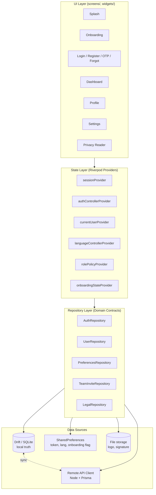
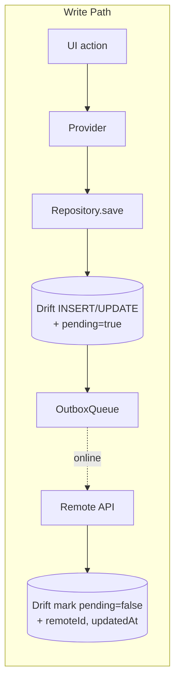
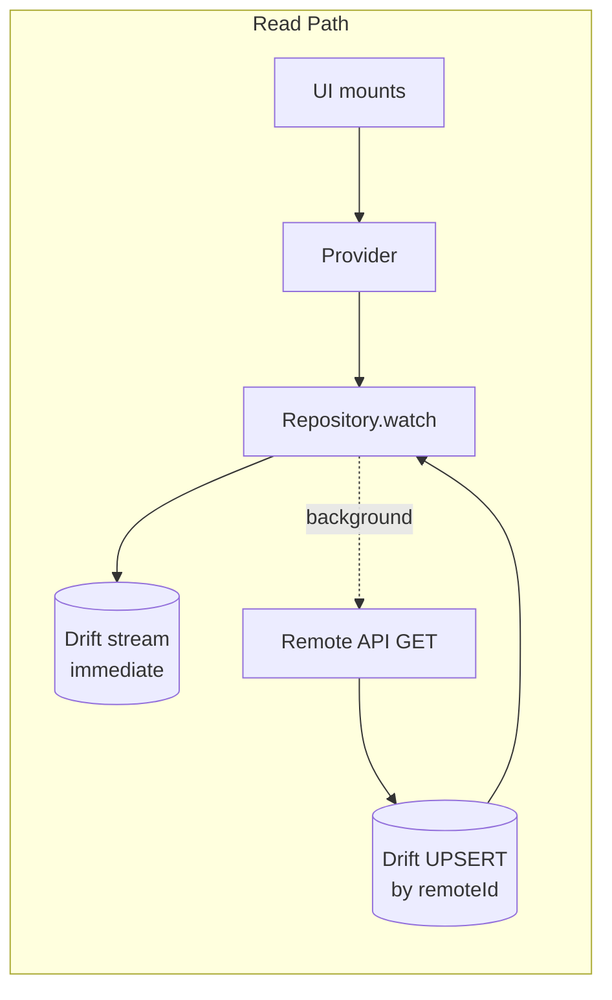
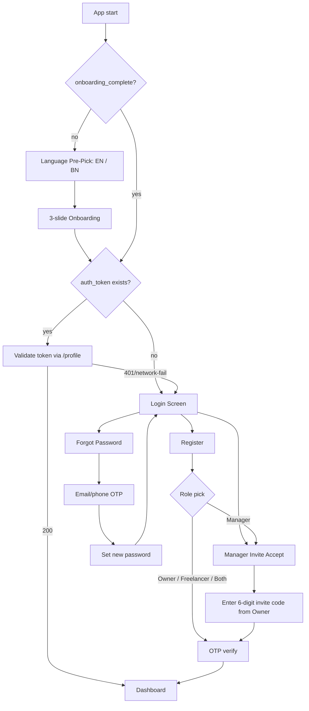
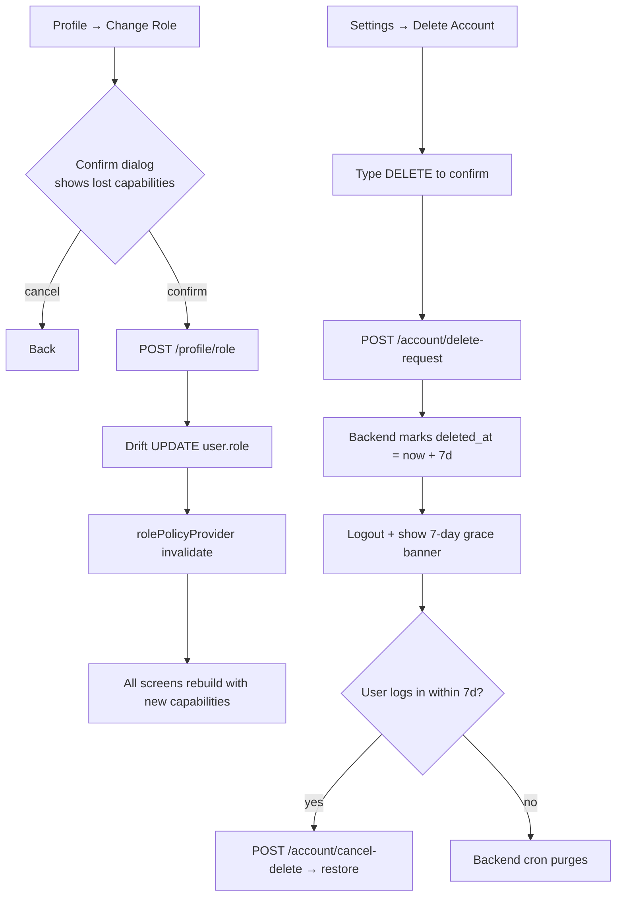
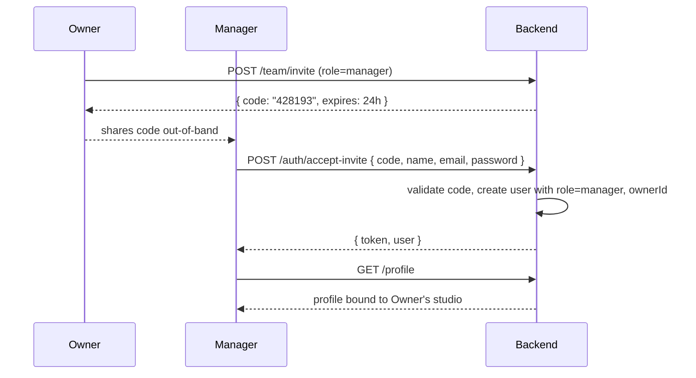

# Design Document: Foundation MVP

> **Spec:** `foundation-mvp` · **Workflow:** Design-First · **Artifacts:** High-Level Design + Low-Level Design
> **Source of truth:** `Clicker_Pro_Architecture_v6_2.html` (Appendix B — Phase 1 Foundation slice)
> **Stack:** Flutter 3.12+ · Dart · Riverpod 2 · Drift (SQLite) · Node.js + Prisma backend
> **Theme contract:** UI is the single source of design tokens. `lib/theme/app_colors.dart` and `lib/theme/app_theme.dart` are not redesigned — only extended.

---

## Overview

The Foundation MVP slice delivers the runtime backbone every later module of Clicker Pro stands on: identity, role-adaptive UI, bilingual rendering, offline-first persistence skeleton, and the Dark Luxury Lens design system. After this slice ships, Phase 2 (Booking, Calendar, Tasks) and Phase 3 (Finance, Reports) can plug into the existing provider tree and repository contracts without rewriting screens.

The slice covers seven architecture modules — **MOD-01 Authentication & Security**, **MOD-02 Splash & Onboarding**, **MOD-03 Profile & Settings**, **MOD-06 Global UI/UX**, **MOD-48 Bilingual System**, **MOD-49 Privacy & Terms**, and the architecture-compliance refresh of already-built **MOD-04 Dashboard** and **MOD-05 Navigation**. The visual design of Login, Dashboard, Profile, and Settings screens is preserved 1:1; only the data wiring, state plumbing, role-adaptive logic, and missing flows (onboarding, OTP, manager invite, role change, account deletion grace, privacy reader, forgot password) are added.

The architecture mandates Drift (SQLite) as the local source of truth and a remote sync target. Because Clicker Pro already runs against a Node.js + Prisma backend, that backend remains the canonical sync target — Firebase is not introduced. The repository layer is designed so the remote implementation could be swapped later without touching UI or providers.

---

# Part A — High-Level Design

## Architecture

### Layered Architecture



**Hard rules:**
- UI never imports a service or HTTP client directly. UI talks to Riverpod providers; providers delegate to repositories; repositories choose between local Drift, remote API, or `SharedPreferences`.
- Repository methods always return from local first, then refresh from remote in the background (read-through cache pattern). Writes commit to local immediately, queue for remote.
- `SharedPreferences` is only used for three things in this slice: `auth_token`, `app_lang`, `onboarding_complete`. Everything else lives in Drift.

### Module Map

| Module | Owns | Status after this slice |
|---|---|---|
| MOD-01 Auth & Security | `features/auth/` — Login, Register, OTP, Forgot, Manager Invite Accept, Role Change | New screens + repository |
| MOD-02 Splash & Onboarding | `features/onboarding/` — Splash, Language pre-pick, 3-slide intro | New |
| MOD-03 Profile & Settings | `features/profile/`, `features/settings/` — wired to real repo, role-adaptive | Refactored from hard-coded |
| MOD-04 Dashboard | `features/dashboard/` — visual identical, real data sources | Wiring only |
| MOD-05 Navigation | `core/navigation/` — 5-tab bottom nav + drawer | Wiring only |
| MOD-06 Global UI/UX | `lib/theme/` — extended, not redesigned | Minimal additions |
| MOD-48 Bilingual | `lib/l10n/` — ARB files, gen_l10n, `AppLocalizations` | New + shim |
| MOD-49 Privacy & Terms | `features/legal/` — in-app reader, consent, delete-account 7-day grace | New |
| MOD-50 Help & Support | `features/help/` — minimal stub screen | Stub |

### Offline-First Skeleton (write/read paths)





**Conflict tiers (placeholder for Phase 2 — Foundation only logs them):**
1. **Server-wins** — read-only data (announcements, weather, lookup tables).
2. **Last-write-wins** — user profile fields, preferences, gear list.
3. **Merge-required** — bookings, finance entries (deferred to Phase 2).

In this slice, the only entities that participate in sync are `User`, `UserPreferences`, `NotificationPreferences`, `GearItem`, `TeamInvite`. Everything else is forward-declared in the schema only.

## Screen Flows

### First-launch & Auth Flow



### Role-Change & Account-Delete Flow



### Manager Invite Branch (unique to MOD-01)

A Manager cannot self-register. The Owner generates a 6-digit invite code from their Profile → Team Management section (full UI lands in Phase 2; this slice exposes the API call and Profile dialog only). The Manager taps "I have an invite code" on Login, enters the code, and the backend binds them to the Owner's studio.



## Components and Interfaces

| Component | Purpose | Key methods (signatures in LLD §8) |
|---|---|---|
| `AuthRepository` | Login, register, OTP, forgot, invite accept, logout, role change, delete request | `login`, `register`, `requestOtp`, `verifyOtp`, `forgotPassword`, `acceptInvite`, `changeRole`, `requestDeleteAccount`, `cancelDeleteAccount`, `logout` |
| `UserRepository` | Current user CRUD, gear list, companies | `watchCurrentUser`, `refreshFromRemote`, `updateProfile`, `addGear`, `removeGear` |
| `PreferencesRepository` | Language, notification prefs, distribution toggle | `getLanguage`, `setLanguage`, `getNotificationPrefs`, `setNotificationPrefs`, `getDistributionEnabled` |
| `TeamInviteRepository` | Generate invite (Owner), accept (Manager) | `generateInvite`, `acceptInvite` |
| `LegalRepository` | Privacy/Terms text bundles, consent stamp, data export | `getPrivacyText`, `getTermsText`, `recordConsent`, `requestDataExport` |
| `RolePolicy` | Single source of role→capability checks | `can(Capability)`, `requireRole(...)` |
| `LanguageController` | Reactive language state, formatter delegation | `setLanguage`, current `Locale`, number/date formatters |
| `SessionController` | Auth state machine, token validation, role-aware route gate | `login`, `logout`, `restore`, exposes `AsyncValue<Session>` |

## Data Models

Foundation slice owns these entities. Detailed Drift schema in §9.

| Entity | Fields (high level) | Sync tier |
|---|---|---|
| `User` | id, remoteId, name, email, phone, role, ownerId (manager only), avatarUrl, bio, specialization, vatBin, studioAddress, whatsapp, bkash, bankDetails, signatureUrl, logoUrl, createdAt, updatedAt, pending | last-write-wins |
| `UserPreferences` | userId, language, distributionEnabled, bengaliNumerals | last-write-wins |
| `NotificationPreferences` | userId, eventReminders, paymentDue, teamMessages, announcements, marketing | last-write-wins |
| `GearItem` | id, userId, name, brand, addedAt, pending | last-write-wins |
| `TeamInvite` | code, ownerId, role, createdAt, expiresAt, consumedAt | server-wins |
| `OutboxItem` | id, entityType, entityId, op (create/update/delete), payloadJson, createdAt, attempts | local-only |
| `LifetimeStats` (read-only cache) | userId, totalEvents, totalRevenue, totalClients, refreshedAt | server-wins |

## Theme & Bilingual Strategy

**Theme:** `app_colors.dart` and `app_theme.dart` are the contract. The only addition this slice makes is a backward-compat alias `AppColors.signalOrange = orange` (one line) so the broken `register_screen.dart` compiles without rewriting the screen. No visual changes anywhere else.

**Bilingual:** Migration from the current map-based `AppStrings.get(key, lang)` to Flutter's standard `flutter_localizations + intl + gen_l10n`:
1. Add `flutter_localizations`, `intl`, and `flutter_gen` config to `pubspec.yaml`.
2. Generate `lib/l10n/app_en.arb` and `lib/l10n/app_bn.arb` populated from the existing `AppStrings` map (every key migrates 1:1).
3. Generated `AppLocalizations` becomes the source of truth.
4. `AppStrings.get(key, lang)` is **kept as a thin shim** that delegates to `AppLocalizations` so existing 200+ callsites in dashboard/profile/settings keep working unchanged. Shim is marked `@Deprecated` so future PRs migrate gradually.
5. `MaterialApp` registers `localizationsDelegates` and `supportedLocales: [en, bn]`; current locale comes from `languageControllerProvider`.
6. Noto Sans Bengali is added to `pubspec.yaml` fonts and applied via `Theme.of(context).textTheme` fallback when locale is `bn`.

## Error & Loading State Strategy

Per MOD-06, every async screen renders one of four states using shared widgets (added in `lib/shared/states/`):

| State | Widget | When |
|---|---|---|
| Loading | `LensLoader` (orange spinner on void background) | Provider is `AsyncLoading` |
| Empty | `EmptyState` (icon + message + optional CTA) | Provider returns empty list |
| Error | `ErrorState` (red icon + message + retry button) | Provider is `AsyncError` |
| Network-offline | `OfflineBanner` (top-of-screen amber strip) | `connectivityProvider` reports offline |

`AsyncValue.when()` is the standard pattern; no screen builds a one-off spinner.

---

# Part B — Low-Level Design

## Proposed File/Folder Structure

The `lib/` folder is reorganized into a feature-first layout. Existing files move; existing screen files are kept (their contents are wired, not rewritten).

```
lib/
├── main.dart                                 (refactored: ProviderScope + Router)
├── app.dart                                  (ClickerProApp widget, MaterialApp config)
├── core/
│   ├── env/
│   │   └── app_config.dart                   (baseUrl per build, dev/prod)
│   ├── network/
│   │   ├── api_client.dart                   (http wrapper, auth header injector, error mapping)
│   │   └── api_exception.dart
│   ├── storage/
│   │   ├── kv_store.dart                     (typed wrapper over SharedPreferences)
│   │   └── secure_store.dart                 (token storage; SharedPreferences for now, swappable)
│   ├── db/
│   │   ├── app_database.dart                 (Drift @DriftDatabase)
│   │   ├── tables/
│   │   │   ├── users_table.dart
│   │   │   ├── user_preferences_table.dart
│   │   │   ├── notification_preferences_table.dart
│   │   │   ├── gear_items_table.dart
│   │   │   ├── team_invites_table.dart
│   │   │   └── outbox_table.dart
│   │   └── daos/                             (one DAO per repository)
│   ├── role/
│   │   ├── capability.dart                   (enum Capability)
│   │   └── role_policy.dart                  (RolePolicy class)
│   ├── sync/
│   │   ├── outbox_worker.dart                (skeleton — Phase 2 makes it real)
│   │   └── connectivity_provider.dart
│   ├── logging/
│   │   └── app_logger.dart                   (replaces print() — debugPrint in dev, no-op in release)
│   └── navigation/
│       ├── app_router.dart                   (route table, auth guard)
│       └── route_names.dart
├── l10n/
│   ├── app_en.arb
│   └── app_bn.arb
├── shared/
│   ├── states/
│   │   ├── lens_loader.dart
│   │   ├── empty_state.dart
│   │   ├── error_state.dart
│   │   └── offline_banner.dart
│   └── widgets/                              (existing widgets/* moves here)
├── theme/                                    (UNCHANGED — single source of design tokens)
│   ├── app_colors.dart                       (+ one-line signalOrange alias)
│   ├── app_theme.dart
│   └── app_strings.dart                      (becomes thin shim → AppLocalizations)
└── features/
    ├── auth/
    │   ├── data/
    │   │   ├── auth_api.dart
    │   │   └── auth_repository_impl.dart
    │   ├── domain/
    │   │   ├── auth_repository.dart
    │   │   └── session.dart
    │   ├── application/
    │   │   ├── session_controller.dart       (Riverpod AsyncNotifier)
    │   │   └── auth_form_controllers.dart
    │   └── presentation/
    │       ├── login_screen.dart             (existing — wired to controller)
    │       ├── register_screen.dart          (BUG-FIXED — see §13)
    │       ├── forgot_password_screen.dart   (NEW)
    │       ├── otp_screen.dart               (NEW)
    │       ├── manager_invite_screen.dart    (NEW)
    │       └── role_change_dialog.dart       (NEW — extracted from profile)
    ├── onboarding/
    │   ├── application/onboarding_controller.dart
    │   └── presentation/
    │       ├── splash_screen.dart            (NEW — animated logo)
    │       ├── language_picker_screen.dart   (NEW)
    │       └── onboarding_screen.dart        (NEW — 3 slides)
    ├── profile/
    │   ├── data/
    │   │   ├── user_api.dart
    │   │   └── user_repository_impl.dart
    │   ├── domain/user_repository.dart
    │   ├── application/profile_controller.dart
    │   └── presentation/
    │       ├── profile_screen.dart           (existing — wired)
    │       ├── add_gear_dialog.dart
    │       └── delete_account_screen.dart    (NEW — 7-day grace)
    ├── settings/
    │   ├── data/preferences_repository_impl.dart
    │   ├── domain/preferences_repository.dart
    │   ├── application/settings_controller.dart
    │   └── presentation/settings_screen.dart (existing — wired)
    ├── dashboard/
    │   └── presentation/dashboard_screen.dart (existing — visual unchanged, wired)
    ├── legal/
    │   ├── data/legal_repository_impl.dart
    │   ├── domain/legal_repository.dart
    │   └── presentation/
    │       ├── privacy_screen.dart
    │       ├── terms_screen.dart
    │       └── data_export_screen.dart
    └── help/
        └── presentation/help_screen.dart     (stub)
```

> **Migration note:** moves are done with IDE refactors so imports auto-update. Existing screens (`login_screen`, `dashboard_screen`, `profile_screen`, `settings_screen`) keep their visual code 1:1 — only their imports and the way they read state change.

## Drift Schema

Foundation slice tables. Drift is added as a dev dependency (`drift: ^2.x`, `drift_flutter`, `build_runner`, `drift_dev`).

```dart
// core/db/tables/users_table.dart
class UsersTable extends Table {
  TextColumn get id => text()();                            // local UUID
  TextColumn get remoteId => text().nullable()();           // server id (set after sync)
  TextColumn get name => text()();
  TextColumn get email => text().unique()();
  TextColumn get phone => text().nullable()();
  TextColumn get role => text()();                          // owner|freelancer|both|manager
  TextColumn get ownerId => text().nullable()();            // for managers — points to Owner
  TextColumn get avatarUrl => text().nullable()();
  TextColumn get bio => text().nullable()();
  TextColumn get specialization => text().nullable()();
  TextColumn get vatBin => text().nullable()();
  TextColumn get studioAddress => text().nullable()();
  TextColumn get whatsapp => text().nullable()();
  TextColumn get bkash => text().nullable()();
  TextColumn get bankDetails => text().nullable()();
  TextColumn get signatureUrl => text().nullable()();
  TextColumn get logoUrl => text().nullable()();
  DateTimeColumn get createdAt => dateTime().withDefault(currentDateAndTime)();
  DateTimeColumn get updatedAt => dateTime().withDefault(currentDateAndTime)();
  BoolColumn get pending => boolean().withDefault(const Constant(false))();
  DateTimeColumn get deletedAt => dateTime().nullable()();  // 7-day grace marker
  @override Set<Column> get primaryKey => {id};
}

// core/db/tables/user_preferences_table.dart
class UserPreferencesTable extends Table {
  TextColumn get userId => text().references(UsersTable, #id)();
  TextColumn get language => text().withDefault(const Constant('en'))();
  BoolColumn get distributionEnabled => boolean().withDefault(const Constant(false))();
  BoolColumn get bengaliNumerals => boolean().withDefault(const Constant(false))();
  DateTimeColumn get updatedAt => dateTime().withDefault(currentDateAndTime)();
  @override Set<Column> get primaryKey => {userId};
}

// core/db/tables/notification_preferences_table.dart
class NotificationPreferencesTable extends Table {
  TextColumn get userId => text().references(UsersTable, #id)();
  BoolColumn get eventReminders => boolean().withDefault(const Constant(true))();
  BoolColumn get paymentDue => boolean().withDefault(const Constant(true))();
  BoolColumn get teamMessages => boolean().withDefault(const Constant(true))();
  BoolColumn get announcements => boolean().withDefault(const Constant(true))();
  BoolColumn get marketing => boolean().withDefault(const Constant(false))();
  @override Set<Column> get primaryKey => {userId};
}

// core/db/tables/gear_items_table.dart
class GearItemsTable extends Table {
  TextColumn get id => text()();
  TextColumn get remoteId => text().nullable()();
  TextColumn get userId => text().references(UsersTable, #id)();
  TextColumn get name => text()();
  TextColumn get brand => text().nullable()();
  DateTimeColumn get addedAt => dateTime().withDefault(currentDateAndTime)();
  BoolColumn get pending => boolean().withDefault(const Constant(false))();
  @override Set<Column> get primaryKey => {id};
}

// core/db/tables/team_invites_table.dart
class TeamInvitesTable extends Table {
  TextColumn get code => text()();                          // 6-digit
  TextColumn get ownerId => text()();
  TextColumn get role => text()();                          // 'manager'
  DateTimeColumn get createdAt => dateTime()();
  DateTimeColumn get expiresAt => dateTime()();
  DateTimeColumn get consumedAt => dateTime().nullable()();
  @override Set<Column> get primaryKey => {code};
}

// core/db/tables/outbox_table.dart  — sync queue (Phase 2 will drain it)
class OutboxTable extends Table {
  IntColumn get id => integer().autoIncrement()();
  TextColumn get entityType => text()();                    // 'user' | 'gear' | 'preferences' …
  TextColumn get entityId => text()();
  TextColumn get op => text()();                            // 'create' | 'update' | 'delete'
  TextColumn get payloadJson => text()();
  DateTimeColumn get createdAt => dateTime().withDefault(currentDateAndTime)();
  IntColumn get attempts => integer().withDefault(const Constant(0))();
}
```

```dart
// core/db/app_database.dart
@DriftDatabase(tables: [
  UsersTable,
  UserPreferencesTable,
  NotificationPreferencesTable,
  GearItemsTable,
  TeamInvitesTable,
  OutboxTable,
])
class AppDatabase extends _$AppDatabase {
  AppDatabase() : super(_openConnection());
  @override int get schemaVersion => 1;
}
```

## Repository Contracts

```dart
// features/auth/domain/auth_repository.dart
abstract class AuthRepository {
  /// Returns Session on success, throws ApiException on failure.
  Future<Session> login({required String email, required String password});

  /// Registers Owner / Freelancer / Both. Manager uses acceptInvite instead.
  Future<Session> register({
    required String name,
    required String email,
    required String phone,
    required String password,
    required UserRole role,            // owner | freelancer | both
  });

  /// Phone or email OTP — backend choice.
  Future<void> requestOtp({required String identifier, required OtpPurpose purpose});
  Future<Session> verifyOtp({required String identifier, required String code, required OtpPurpose purpose});

  Future<void> forgotPassword({required String email});
  Future<void> resetPassword({required String token, required String newPassword});

  /// Manager-only path. Code is generated by Owner via TeamInviteRepository.
  Future<Session> acceptInvite({
    required String code,
    required String name,
    required String email,
    required String password,
  });

  /// Role change for self. Server returns refreshed user.
  Future<UserModel> changeRole(UserRole newRole);

  /// Marks account for deletion 7 days from now.
  Future<DateTime> requestDeleteAccount();
  Future<void> cancelDeleteAccount();

  Future<void> logout();

  /// Reads token from secure store, validates against /profile.
  Future<Session?> restoreSession();
}

enum OtpPurpose { signup, login, forgotPassword }

// features/auth/domain/session.dart
class Session {
  final String token;
  final UserModel user;
  final DateTime issuedAt;
  const Session({required this.token, required this.user, required this.issuedAt});
  bool get isManager => user.role == UserRole.manager;
}
```

```dart
// features/profile/domain/user_repository.dart
abstract class UserRepository {
  Stream<UserModel?> watchCurrentUser();
  Future<UserModel?> getCurrentUser();
  Future<void> refreshFromRemote();
  Future<void> updateProfile(UserModel updated);

  Stream<List<GearItem>> watchGear(String userId);
  Future<void> addGear(GearItem item);
  Future<void> removeGear(String gearId);

  Future<LifetimeStats?> getLifetimeStats();
}
```

```dart
// features/settings/domain/preferences_repository.dart
abstract class PreferencesRepository {
  Future<String> getLanguage();                                   // 'en' | 'bn'
  Future<void> setLanguage(String code);
  Stream<String> watchLanguage();

  Future<NotificationPreferences> getNotificationPrefs(String userId);
  Future<void> setNotificationPrefs(NotificationPreferences prefs);

  Future<bool> getDistributionEnabled(String userId);
  Future<void> setDistributionEnabled(String userId, bool value);

  Future<bool> getBengaliNumerals();
  Future<void> setBengaliNumerals(bool value);
}
```

```dart
// features/auth/domain/team_invite_repository.dart
abstract class TeamInviteRepository {
  /// Owner-only. Returns 6-digit code valid for 24h.
  Future<TeamInvite> generateInvite();

  /// Public (Manager flow). Validates and returns invite metadata before signup.
  Future<TeamInvite> peekInvite(String code);
}
```

```dart
// features/legal/domain/legal_repository.dart
abstract class LegalRepository {
  Future<String> getPrivacyText(String langCode);
  Future<String> getTermsText(String langCode);
  Future<void> recordConsent({required String userId, required String version, required DateTime at});
  Future<String> requestDataExport();        // returns download URL
}
```

## Riverpod Provider Tree

```dart
// features/auth/application/session_controller.dart
final sessionControllerProvider =
    AsyncNotifierProvider<SessionController, Session?>(SessionController.new);

class SessionController extends AsyncNotifier<Session?> {
  @override
  Future<Session?> build() async {
    final repo = ref.read(authRepositoryProvider);
    return repo.restoreSession();
  }

  Future<void> login(String email, String password) async {
    state = const AsyncLoading();
    state = await AsyncValue.guard(
      () => ref.read(authRepositoryProvider).login(email: email, password: password),
    );
  }

  Future<void> logout() async {
    await ref.read(authRepositoryProvider).logout();
    state = const AsyncData(null);
  }

  Future<void> changeRole(UserRole newRole) async {
    final updated = await ref.read(authRepositoryProvider).changeRole(newRole);
    final s = state.value;
    if (s != null) state = AsyncData(Session(token: s.token, user: updated, issuedAt: s.issuedAt));
    ref.invalidate(rolePolicyProvider);          // capability cache flush
  }
}
```

```dart
// features/profile/application/profile_controller.dart
final currentUserProvider = StreamProvider<UserModel?>((ref) {
  return ref.watch(userRepositoryProvider).watchCurrentUser();
});

final gearListProvider = StreamProvider.family<List<GearItem>, String>((ref, userId) {
  return ref.watch(userRepositoryProvider).watchGear(userId);
});
```

```dart
// features/settings/application/settings_controller.dart
final languageControllerProvider =
    AsyncNotifierProvider<LanguageController, String>(LanguageController.new);

class LanguageController extends AsyncNotifier<String> {
  @override
  Future<String> build() async => ref.read(preferencesRepositoryProvider).getLanguage();

  Future<void> setLanguage(String code) async {
    await ref.read(preferencesRepositoryProvider).setLanguage(code);
    state = AsyncData(code);
  }

  Locale get currentLocale =>
      Locale(state.value ?? 'en');
}
```

```dart
// core/role/role_policy.dart
enum Capability {
  // Profile
  editStudioBranding,        // logo + signature + VAT (Owner, Both)
  editGearInventory,         // (Freelancer, Both)
  joinAnotherStudio,         // (Freelancer, Both)
  // Dashboard
  viewFinancials,            // (Owner, Both, Manager-limited)
  viewTeamSection,           // (Owner, Both, Manager)
  // Settings
  toggleDistribution,        // (Owner, Both)
  toggleVat,                 // (Owner, Both)
  // Auth
  changeRole,                // not Manager
  generateTeamInvite,        // (Owner, Both)
  deleteOwnAccount,          // everyone
}

class RolePolicy {
  final UserRole role;
  const RolePolicy(this.role);

  static const _matrix = <Capability, Set<UserRole>>{
    Capability.editStudioBranding:  {UserRole.owner, UserRole.both},
    Capability.editGearInventory:   {UserRole.freelancer, UserRole.both},
    Capability.joinAnotherStudio:   {UserRole.freelancer, UserRole.both},
    Capability.viewFinancials:      {UserRole.owner, UserRole.both, UserRole.manager},
    Capability.viewTeamSection:     {UserRole.owner, UserRole.both, UserRole.manager},
    Capability.toggleDistribution:  {UserRole.owner, UserRole.both},
    Capability.toggleVat:           {UserRole.owner, UserRole.both},
    Capability.changeRole:          {UserRole.owner, UserRole.freelancer, UserRole.both},
    Capability.generateTeamInvite:  {UserRole.owner, UserRole.both},
    Capability.deleteOwnAccount:    {UserRole.owner, UserRole.freelancer, UserRole.both, UserRole.manager},
  };

  bool can(Capability c) => _matrix[c]?.contains(role) ?? false;
}

final rolePolicyProvider = Provider<RolePolicy>((ref) {
  final user = ref.watch(currentUserProvider).value;
  return RolePolicy(user?.role ?? UserRole.owner);
});
```

**Sample usage in a screen (replaces every `if (role == 'Owner')` scattered today):**

```dart
final policy = ref.watch(rolePolicyProvider);
if (policy.can(Capability.editStudioBranding)) {
  // render Studio Logo + Digital Signature + VAT BIN cards
}
```

```dart
// All providers wired in one place
// core/providers.dart
final apiClientProvider = Provider<ApiClient>((ref) => ApiClient(baseUrl: AppConfig.baseUrl));
final secureStoreProvider = Provider<SecureStore>((ref) => SecureStore());
final appDatabaseProvider = Provider<AppDatabase>((ref) => AppDatabase());

final authApiProvider = Provider((ref) => AuthApi(ref.read(apiClientProvider)));
final userApiProvider = Provider((ref) => UserApi(ref.read(apiClientProvider)));
final legalApiProvider = Provider((ref) => LegalApi(ref.read(apiClientProvider)));

final authRepositoryProvider = Provider<AuthRepository>((ref) => AuthRepositoryImpl(
  api: ref.read(authApiProvider),
  db: ref.read(appDatabaseProvider),
  secure: ref.read(secureStoreProvider),
));

final userRepositoryProvider = Provider<UserRepository>((ref) => UserRepositoryImpl(
  api: ref.read(userApiProvider),
  db: ref.read(appDatabaseProvider),
));

final preferencesRepositoryProvider = Provider<PreferencesRepository>(
  (ref) => PreferencesRepositoryImpl(db: ref.read(appDatabaseProvider)),
);

final connectivityProvider = StreamProvider<bool>((ref) =>
    /* connectivity_plus emits when online status changes */ Stream.value(true));
```

## Remote API Contract

Existing endpoints (already in the Node + Prisma backend per the user's note):

| Method | Path | Body | Response |
|---|---|---|---|
| POST | `/api/auth/login` | `{ email, password }` | `200 { token, user }` |
| POST | `/api/auth/register` | `{ name, email, phone, password, role }` | `201 { token, user }` |
| GET | `/api/profile` | — (Bearer) | `200 { user }` |

Endpoints **needed for this slice that may be missing** — flagged so backend is updated alongside the Flutter work:

| Method | Path | Body | Response | Status |
|---|---|---|---|---|
| POST | `/api/auth/otp/request` | `{ identifier, purpose }` | `200 {}` | likely missing |
| POST | `/api/auth/otp/verify` | `{ identifier, code, purpose }` | `200 { token, user }` | likely missing |
| POST | `/api/auth/forgot` | `{ email }` | `200 {}` | likely missing |
| POST | `/api/auth/reset` | `{ token, newPassword }` | `200 {}` | likely missing |
| POST | `/api/team/invite` | — (Bearer; Owner only) | `201 { code, expiresAt }` | likely missing |
| POST | `/api/auth/accept-invite` | `{ code, name, email, password }` | `201 { token, user }` | likely missing |
| PATCH | `/api/profile` | partial user fields | `200 { user }` | likely missing |
| POST | `/api/profile/role` | `{ newRole }` | `200 { user }` | likely missing |
| POST | `/api/account/delete-request` | — (Bearer) | `200 { deletedAt }` | likely missing |
| POST | `/api/account/cancel-delete` | — (Bearer) | `200 { user }` | likely missing |
| GET | `/api/legal/privacy?lang=en` | — | `200 { version, body }` | likely missing |
| GET | `/api/legal/terms?lang=en` | — | `200 { version, body }` | likely missing |
| POST | `/api/legal/consent` | `{ version }` | `200 {}` | likely missing |
| POST | `/api/account/export` | — (Bearer) | `202 { downloadUrl }` | likely missing |

Each is implemented as a method on the corresponding `*Api` class:

```dart
// features/auth/data/auth_api.dart
class AuthApi {
  final ApiClient _client;
  AuthApi(this._client);

  Future<({String token, Map<String, dynamic> user})> login(String email, String password) async {
    final r = await _client.post('/api/auth/login', body: {'email': email, 'password': password});
    return (token: r['token'] as String, user: r['user'] as Map<String, dynamic>);
  }

  Future<({String token, Map<String, dynamic> user})> register({
    required String name, required String email, required String phone,
    required String password, required UserRole role,
  }) async {
    final r = await _client.post('/api/auth/register', body: {
      'name': name, 'email': email, 'phone': phone, 'password': password, 'role': role.name,
    });
    return (token: r['token'] as String, user: r['user'] as Map<String, dynamic>);
  }

  Future<void> requestOtp(String identifier, OtpPurpose purpose) =>
      _client.post('/api/auth/otp/request', body: {'identifier': identifier, 'purpose': purpose.name});

  Future<({String token, Map<String, dynamic> user})> verifyOtp(String id, String code, OtpPurpose p) async {
    final r = await _client.post('/api/auth/otp/verify',
        body: {'identifier': id, 'code': code, 'purpose': p.name});
    return (token: r['token'] as String, user: r['user'] as Map<String, dynamic>);
  }

  Future<void> forgotPassword(String email) =>
      _client.post('/api/auth/forgot', body: {'email': email});

  Future<({String token, Map<String, dynamic> user})> acceptInvite({
    required String code, required String name, required String email, required String password,
  }) async {
    final r = await _client.post('/api/auth/accept-invite',
        body: {'code': code, 'name': name, 'email': email, 'password': password});
    return (token: r['token'] as String, user: r['user'] as Map<String, dynamic>);
  }

  Future<Map<String, dynamic>> changeRole(UserRole newRole) =>
      _client.post('/api/profile/role', body: {'newRole': newRole.name});

  Future<DateTime> requestDeleteAccount() async {
    final r = await _client.post('/api/account/delete-request');
    return DateTime.parse(r['deletedAt'] as String);
  }

  Future<void> cancelDeleteAccount() => _client.post('/api/account/cancel-delete');
}
```

```dart
// core/network/api_client.dart  — replaces direct http calls in services/api_service.dart
class ApiClient {
  final String baseUrl;
  final SecureStore _secure;
  ApiClient({required this.baseUrl, SecureStore? secure}) : _secure = secure ?? SecureStore();

  Future<Map<String, dynamic>> post(String path, {Map<String, dynamic>? body}) async {
    final token = await _secure.readToken();
    final r = await http.post(
      Uri.parse('$baseUrl$path'),
      headers: {
        'Content-Type': 'application/json',
        if (token != null) 'Authorization': 'Bearer $token',
      },
      body: body == null ? null : jsonEncode(body),
    ).timeout(const Duration(seconds: 15));
    return _handle(r);
  }

  Future<Map<String, dynamic>> get(String path) async { /* analogous */ }
  Future<Map<String, dynamic>> patch(String path, {required Map<String, dynamic> body}) async { /* analogous */ }

  Map<String, dynamic> _handle(http.Response r) {
    if (r.statusCode >= 200 && r.statusCode < 300) {
      return jsonDecode(r.body) as Map<String, dynamic>;
    }
    throw ApiException(statusCode: r.statusCode, message: _extractMessage(r));
  }
}
```

## Bug Fix Specification

Each existing defect with file, root cause, and exact fix:

### `register_screen.dart` — 6× `signalOrange` compile error
- **Files:** `lib/screens/register_screen.dart` (lines 49, 60, 71, 81, 105, 117 referencing `AppColors.signalOrange`).
- **Root cause:** `AppColors` defines `orange` and a backward-compat alias `accent`, but no `signalOrange`. `register_screen` was authored against an older naming.
- **Decision:** Add a one-line backward-compat alias in `app_colors.dart` (consistent with how `accent`, `void3`, `error` are already aliased). This preserves existing screens without churn. After adding the alias, `register_screen.dart` compiles unchanged.
  ```dart
  // app_colors.dart — add inside the SIGNAL ORANGE block
  static const Color signalOrange = orange;
  ```
- **Why not rename in register_screen instead?** Because the architecture token name is "Signal Orange", and other future screens may reference it. Aliasing matches existing patterns in the file.

### `register_screen.dart` — uses fake Riverpod `AuthService.signUp` instead of real API
- **Root cause:** `providers/auth_provider.dart::AuthService.signUp` only mutates a `StateProvider`; it never calls the backend, never stores a token. Login worked because it uses `ApiService.login`. Register is broken end-to-end.
- **Fix location:** `features/auth/presentation/register_screen.dart` (after move) — replace the `onPressed` body so it calls `ref.read(sessionControllerProvider.notifier).register(...)` which routes through `AuthRepository.register` → backend → token store → state update.
- **Cleanup:** delete the old `providers/auth_provider.dart` file entirely. The `authProvider` `StateProvider<UserModel?>` is replaced by `sessionControllerProvider` which is the canonical source of truth for the current user.

### `register_screen.dart` — `BuildContext` used across async gap
- **Root cause:** `await AuthService.signUp(...)` is followed by `Navigator.pushReplacement(context, ...)` with no `mounted` guard.
- **Fix:** the new screen is a `ConsumerStatefulWidget` (so `mounted` is available) and the post-await navigation is guarded:
  ```dart
  await ref.read(sessionControllerProvider.notifier).register(...);
  if (!mounted) return;
  Navigator.of(context).pushReplacement(MaterialPageRoute(builder: (_) => const DashboardScreen()));
  ```

### `register_screen.dart` — input fields lack validators and password input
- **Fix:** wrap in a `Form` with `GlobalKey<FormState>`, validators for name/email/phone/password, plus a password field (currently missing — registration cannot work without it).

### `api_service.dart` — three `print()` calls in production code
- **Root cause:** `print` is called on errors. Linter flags it.
- **Fix:** introduce `core/logging/app_logger.dart`:
  ```dart
  class AppLogger {
    static void e(String tag, Object error, [StackTrace? st]) {
      if (kDebugMode) debugPrint('🔥 $tag: $error');
    }
  }
  ```
  All three `print(...)` calls become `AppLogger.e('...', e)`. After the API client refactor, the calls live inside `ApiClient._handle` and exception mapping, not the old `ApiService`.

### `api_service.dart` — hard-coded `http://localhost:5000`
- **Root cause:** breaks on Android emulator (needs `10.0.2.2`) and on physical devices (needs LAN IP) and for production builds.
- **Fix:** `core/env/app_config.dart`:
  ```dart
  class AppConfig {
    static const String baseUrl = String.fromEnvironment(
      'API_BASE_URL',
      defaultValue: 'http://10.0.2.2:5000', // Android emulator default; override per build
    );
  }
  ```
  Builds run with `flutter run --dart-define=API_BASE_URL=https://api.clickerpro.app`.

### `auth_provider.dart` — orphan stub
- **Root cause:** existed before `ApiService.login` worked. Now it's dead code that misleads the register flow.
- **Fix:** delete file. Replace with `sessionControllerProvider` (§11).

### `main.dart` — auth check is a one-shot in `initState`, not reactive
- **Root cause:** if token is invalidated mid-session (401 from a later API call), the app still shows the dashboard until restart.
- **Fix:** `main.dart` switches to a `ConsumerWidget` that watches `sessionControllerProvider` and routes via its `AsyncValue.when`:
  - loading → `SplashScreen`
  - data == null → `LoginScreen`
  - data != null → `DashboardScreen`
  - error → `LoginScreen` with an error banner
  Any 401 from `ApiClient` triggers `sessionControllerProvider.notifier.logout()` so the tree re-renders to Login automatically.

### `profile_screen.dart` — hard-coded "123456" passcode
- **Root cause:** stub demo logic.
- **Fix:** the join-team dialog calls `TeamInviteRepository.peekInvite(code)` then `AuthRepository.acceptInvite(...)`. No client-side passcode comparison.

### `profile_screen.dart` / `settings_screen.dart` — entire state is local `setState` with hard-coded fields
- **Fix:** replace `_name`, `_phone`, etc. local state with `ref.watch(currentUserProvider)`. Edit mode writes via `ref.read(userRepositoryProvider).updateProfile(updated)`.

### `settings_screen.dart` — `_userRole = "Owner"` hard-coded
- **Fix:** read role from `ref.watch(rolePolicyProvider).role`. Business-section visibility comes from `policy.can(Capability.toggleVat)`.

## Bilingual Migration Plan

Step-by-step so the migration ships in a single PR without breaking any screen.

1. **Add deps & config** to `pubspec.yaml`:
   ```yaml
   dependencies:
     flutter_localizations:
       sdk: flutter
     intl: ^0.20.2
   flutter:
     generate: true
   ```
   Plus `l10n.yaml` at project root:
   ```yaml
   arb-dir: lib/l10n
   template-arb-file: app_en.arb
   output-localization-file: app_localizations.dart
   ```

2. **Generate ARBs** by porting every key from `app_strings.dart::translations` into `app_en.arb` and `app_bn.arb`. Each entry follows ARB schema:
   ```json
   {
     "@@locale": "en",
     "login": "Login",
     "@login": { "description": "Login button label" },
     ...
   }
   ```

3. **Wire `MaterialApp`** in `app.dart`:
   ```dart
   MaterialApp(
     locale: ref.watch(languageControllerProvider).maybeWhen(
       data: (code) => Locale(code), orElse: () => const Locale('en'),
     ),
     localizationsDelegates: AppLocalizations.localizationsDelegates,
     supportedLocales: AppLocalizations.supportedLocales,
     theme: AppTheme.dark(),
     home: const RootGate(),
   )
   ```

4. **Keep `AppStrings.get` working as a shim** so existing screens don't break:
   ```dart
   @Deprecated('Use AppLocalizations.of(context). Will be removed after Phase 2.')
   class AppStrings {
     static String get(String key, String lang) {
       // BuildContext-free fallback for legacy callers
       return _legacyMap[lang]?[key] ?? _legacyMap['en']![key] ?? key;
     }
   }
   ```
   `_legacyMap` is the existing translations map, kept verbatim. New code uses `AppLocalizations.of(context)`. Migration to `context`-based lookups happens screen-by-screen in later PRs.

5. **Bengali font:** add Noto Sans Bengali via `google_fonts` (already in deps) — apply only when `Locale == bn`:
   ```dart
   TextStyle bnAware(TextStyle base, BuildContext ctx) =>
       Localizations.localeOf(ctx).languageCode == 'bn'
         ? GoogleFonts.notoSansBengali(textStyle: base)
         : base;
   ```

6. **Number/date formatting:** `intl`'s `NumberFormat` and `DateFormat` are locale-aware out of the box. Bengali numerals are an extra opt-in via `bengaliNumerals` preference; helper:
   ```dart
   String formatNumber(num n, {required String lang, required bool bnNumerals}) {
     final f = NumberFormat.decimalPattern(lang);
     final str = f.format(n);
     if (lang == 'bn' && bnNumerals) {
       return str.replaceAllMapped(RegExp(r'\d'),
         (m) => String.fromCharCode(0x09E6 + int.parse(m[0]!)));
     }
     return str;
   }
   ```

## Onboarding & Splash

```dart
// features/onboarding/application/onboarding_controller.dart
final onboardingCompleteProvider = FutureProvider<bool>((ref) async {
  final kv = ref.read(kvStoreProvider);
  return kv.readBool('onboarding_complete') ?? false;
});

class OnboardingController {
  final KvStore _kv;
  OnboardingController(this._kv);
  Future<void> markComplete() => _kv.writeBool('onboarding_complete', true);
}
```

```dart
// features/onboarding/presentation/splash_screen.dart  (skeleton)
class SplashScreen extends ConsumerStatefulWidget { ... }
class _SplashState extends ConsumerState<SplashScreen> with SingleTickerProviderStateMixin {
  // 1.5s animated logo: orange ring scales in + lens icon fades.
  // After animation completes:
  //   if !onboardingComplete  → LanguagePickerScreen
  //   elif !session           → LoginScreen
  //   else                    → DashboardScreen
}
```

Visual: same brand mark used on Login (`AppColors.accent` ring + camera icon), centered, with a gold underline. No new design tokens.

## Privacy / Terms / Delete-Account

```dart
// features/legal/presentation/privacy_screen.dart
// In-app reader. Markdown body served from /api/legal/privacy?lang=...
// Cached in Drift's not-yet-needed cache table or simply held in memory for slice.

class PrivacyScreen extends ConsumerWidget {
  Widget build(ctx, ref) {
    final lang = ref.watch(languageControllerProvider).value ?? 'en';
    final body = ref.watch(privacyBodyProvider(lang));
    return Scaffold(
      backgroundColor: AppColors.voidBlack,
      appBar: _LensAppBar(title: 'Privacy Policy'),
      body: body.when(
        data: (md) => Markdown(data: md, styleSheet: _lensMarkdown(ctx)),
        loading: () => const LensLoader(),
        error: (e, _) => ErrorState(message: e.toString(),
          onRetry: () => ref.invalidate(privacyBodyProvider)),
      ),
    );
  }
}
```

```dart
// features/profile/presentation/delete_account_screen.dart
// Two-step confirm:
//   1. Read consequences (loses all data after 7 days)
//   2. Type "DELETE" + tap "Request Deletion"
// On success: show grace banner with countdown, force logout to Login.
//
// On next login within 7d: app detects `deletedAt != null` from /profile,
// shows a recovery banner with [Cancel Deletion] button → cancelDeleteAccount().
```

## Existing Dashboard / Navigation Compliance Check

Both are visually compliant. Required wiring changes only:

| Hard-coded today | Replace with |
|---|---|
| `_currentLang` from `LanguageService()` direct call | `ref.watch(languageControllerProvider)` |
| `'Studio · Karim'` subtitle | `ref.watch(currentUserProvider).value?.studioLabel ?? '—'` |
| `'KR'` avatar initials | derived from `currentUserProvider.value!.name` |
| All metric values (`'08'`, `'24'`, `'128'`, `'142'`) | placeholder strings until Phase 2 — wrapped in a `dashboardMetricsProvider` that returns mocked-but-typed `DashboardMetrics` so the swap to real data is one provider impl change |
| Quick actions navigating to `_ComingSoonScreen` | unchanged at this slice; Phase 2 routes them properly |
| Bottom-nav `_onNavTap` raw Navigator.push | routed via `AppRouter.push(context, RouteNames.bookings)` so deep links work in Phase 2 |

The existing 5-tab bottom nav (Home / Booking / FAB / Finance / Settings) and drawer match MOD-05 spec. Center FAB action stays a "New Booking" stub for now.

## Correctness Properties

These are invariants the implementation must uphold; they become test cases in the tasks doc.

### Property 1: Login persists session

After successful login, `sessionControllerProvider.value != null` AND `auth_token` is persisted to secure storage.

**Validates: Requirements 1.1** (MOD-01 Authentication — successful login establishes a persisted session)

### Property 2: Logout clears all session state

After logout, `sessionControllerProvider.value == null` AND `auth_token` is cleared AND the Drift `users` table is cleared for the local-only id.

**Validates: Requirements 1.2** (MOD-01 Authentication — logout fully clears local session state)

### Property 3: 401 force-logout

If `/profile` (or any authenticated endpoint) returns 401, `sessionControllerProvider` transitions to `null` within one frame.

**Validates: Requirements 1.3** (MOD-01 Authentication — server-rejected token forces logout)

### Property 4: Manager registration path is exclusive

A user with `UserRole.manager` can only enter the system via `acceptInvite`; the standard `register` endpoint rejects `role == manager`.

**Validates: Requirements 1.4** (MOD-01 Authentication — Manager onboarding via invite-only path)

### Property 5: RolePolicy matrix soundness

For every `UserRole r` and `Capability c`: `RolePolicy(r).can(c)` is true if and only if the static `_matrix[c]` set contains `r`.

**Validates: Requirements 3.1** (MOD-03 Profile & Settings — role-adaptive UI driven by capability matrix)

### Property 6: Role change invalidates capability cache

After `changeRole(newRole)`, the next read of `rolePolicyProvider` reflects `newRole`.

**Validates: Requirements 3.2** (MOD-03 Profile & Settings — role change updates UI capabilities reactively)

### Property 7: Manager cannot change own role

`RolePolicy(UserRole.manager).can(Capability.changeRole) == false`.

**Validates: Requirements 1.5** (MOD-01 Authentication — Manager role is immutable from client side)

### Property 8: Profile update is reactive

`currentUserProvider` emits a new value within one frame of `UserRepository.updateProfile` completing successfully.

**Validates: Requirements 3.3** (MOD-03 Profile & Settings — profile edits propagate to UI without manual refresh)

### Property 9: Studio branding is Owner/Both only

`Owner.can(editStudioBranding) == true` AND `Both.can(editStudioBranding) == true` AND `Freelancer.can(editStudioBranding) == false` AND `Manager.can(editStudioBranding) == false`.

**Validates: Requirements 3.4** (MOD-03 Profile & Settings — Studio fields visible only to Owner/Both)

### Property 10: Language persistence

Setting language to `'bn'` updates the active `Locale`, persists to `SharedPreferences`, and survives app restart.

**Validates: Requirements 48.1** (MOD-48 Bilingual System — language toggle is durable)

### Property 11: AppStrings shim parity

For every key present in both ARB files, `AppStrings.get(key, lang)` returns the same string as `AppLocalizations.of(ctx).<key>` when `Localizations.localeOf(ctx).languageCode == lang`.

**Validates: Requirements 48.2** (MOD-48 Bilingual System — ARB migration preserves existing translations)

### Property 12: Offline-first write durability

Profile edits commit to Drift before the network call returns; a subsequent network failure does NOT roll back the local write — the change is queued in `OutboxTable` instead.

**Validates: Requirements 6.1** (MOD-06 Global UI/UX + offline-first contract — local write durability)

### Property 13: Offline read survival

On app restart with no network, `currentUserProvider` still emits the last cached `UserModel` from Drift.

**Validates: Requirements 6.2** (MOD-06 Global UI/UX + offline-first contract — last-known data available offline)

### Property 14: Delete request enforces 7-day grace

After `requestDeleteAccount`, the server-returned `deletedAt` equals approximately `now + 7 days` AND the user is logged out locally.

**Validates: Requirements 49.1** (MOD-49 Privacy & Terms — 7-day grace window before purge)

### Property 15: Delete cancellation restores access

After `cancelDeleteAccount` (within the 7-day window), the user's `deletedAt` becomes `null` and the session is restorable on next login.

**Validates: Requirements 49.2** (MOD-49 Privacy & Terms — deletion is reversible during grace)

## Error Handling

| Scenario | Detection | Response | Recovery |
|---|---|---|---|
| Network unreachable | `SocketException` / timeout in `ApiClient` | `OfflineBanner` shown; reads served from Drift | Auto-retry via `OutboxWorker` when connectivity returns |
| 401 Unauthorized | `ApiClient._handle` | Force-logout; route to Login | User logs in again |
| 409 Conflict (duplicate email on register) | `ApiException(statusCode: 409)` | Inline form error "Email already registered" | User uses Forgot Password or different email |
| Invalid invite code | 404 from `peekInvite` | Inline "Invalid or expired code" | User asks Owner for fresh code |
| OTP expired | 410 from `verifyOtp` | "Code expired — request a new one" | Tap "Resend" |
| Profile validation | client-side (`Form.validate`) | Field-level error text | User corrects |
| Drift open failure | rethrow at app boot | Crash-safe `RootGate` shows `ErrorState` with "Reset App Data" button | Uninstall/reinstall — last resort |

## Testing Strategy

**Unit (mandatory at this slice):**
- `RolePolicy` — exhaustive matrix.
- `AuthRepositoryImpl` with a fake `AuthApi` and in-memory Drift — login, register, restoreSession, logout, role change, delete request.
- `PreferencesRepositoryImpl` — language round-trip, default values.
- `formatNumber` Bengali numerals helper.

**Widget:**
- `LoginScreen` golden in EN and BN locales (visual regression on the existing UI).
- `RegisterScreen` post-fix — submits form, verifies repo called with correct args.
- `ProfileScreen` role-adaptive — Owner shows Studio block; Freelancer shows Gear+Companies.

**Property-based (deferred to tasks):**
- Use `glados` or hand-rolled generators for `RolePolicy` matrix exhaustiveness.

**Integration:**
- App-launch happy path: cold start → Splash → Onboarding → Register → Dashboard. Run on Android emulator with backend on `10.0.2.2:5000`.

## Performance Considerations

- Drift queries are small (single-row reads for `User`, `UserPreferences`); no indexing concerns at this slice.
- `currentUserProvider` is a `StreamProvider` over a Drift query — cheap to watch from many widgets.
- ARB lookups are O(1) hash — no measurable cost over the existing map.
- Splash animation uses a single `AnimationController`; total slice memory footprint unchanged.

## Security Considerations

- Token stored in `SharedPreferences` for now (matches today's behavior). Marked **TODO Phase 2:** migrate to `flutter_secure_storage` (uses Keychain/Keystore). Behind `SecureStore` interface so callers don't change.
- All API calls require `Authorization: Bearer <token>`; `ApiClient` injects automatically.
- Passwords never logged. Form fields use `obscureText: true`.
- Invite codes are server-validated; no client-side comparison.
- Delete-account is a server-side soft-delete with a 7-day grace; client cannot hard-delete.
- TLS is mandatory for production builds. Default `defaultValue` for `API_BASE_URL` is dev-only.

## Dependencies

New entries in `pubspec.yaml`:

```yaml
dependencies:
  flutter_localizations:
    sdk: flutter
  intl: ^0.20.2
  drift: ^2.20.0
  drift_flutter: ^0.2.0
  sqlite3_flutter_libs: ^0.5.0
  path_provider: ^2.1.0
  path: ^1.9.0
  connectivity_plus: ^6.0.0
  flutter_markdown: ^0.7.4

dev_dependencies:
  drift_dev: ^2.20.0
  build_runner: ^2.4.0
```

`google_fonts` (already present) provides Noto Sans Bengali. `http`, `shared_preferences`, `flutter_riverpod` stay as-is.

---

## Out of Scope

- Real Booking, Calendar, Tasks (Phase 2 — MOD-07/08/09).
- Finance, Reports, Payments (Phase 3).
- Drift sync worker actually draining the outbox (skeleton only here).
- `flutter_secure_storage` swap (TODO).
- Push notifications, FCM tokens (Phase 4).
- Help & Support full module (only stub here).
- Owner-side Team Management UI (only the API call to generate an invite is exposed in Profile dialog).

This Foundation MVP design is the contract every future Clicker Pro module will plug into.
